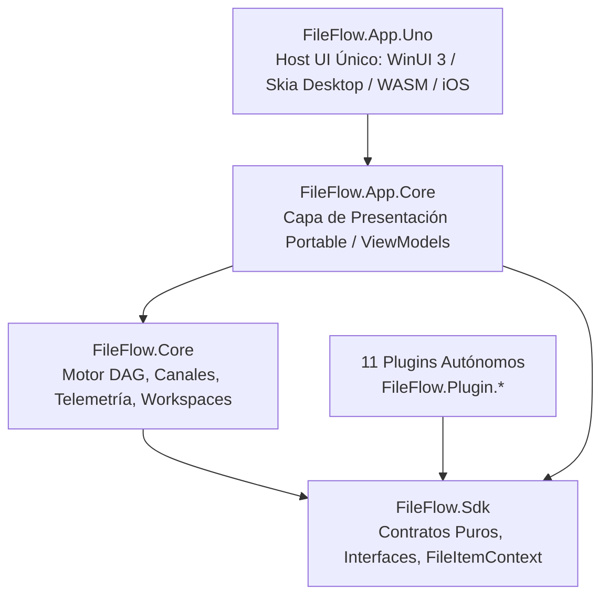

# Arquitectura del Sistema - FileFlow Studio

## 1. Visión General y Topología en Capas
FileFlow Studio es un motor modular de automatización y procesamiento de archivos por lotes (Batch Processing & Workflow Automation) basado en grafos DAG, desarrollado en **C# 14** y **.NET 10 LTS** con arquitectura desacoplada en cuatro capas fundamentales:

---

## 2. Descripción de Capas y Proyectos

1. **`FileFlow.Sdk` (Capa de Contratos Puros)**:
   - Contratos base (`IFlowNode`, `FlowNodeBase`, `IFlowExecutionContext`, `ITempWorkspaceManager`, `IStorageService`, `IOsPlatformService`).
   - Entidad inmutable/transmutable [`FileItemContext`](file:///FileFlow.Sdk/FileItemContext.cs) con clonación profunda y enriquecimiento progresivo de metadatos.
   - Contrato de superficies y modales desacoplados: [`INodeDialogSurfaceProvider`](file:///FileFlow.Sdk/Descriptors/INodeDialogSurfaceProvider.cs), [`UnavailableSurface`](file:///FileFlow.Sdk/Services/UnavailableSurface.cs) y catálogo canónico [`DialogKeys`](file:///FileFlow.Sdk/Services/IWindowService.cs).
   - Motor de resolución de variables y plantillas [`VariableTemplateResolver`](file:///FileFlow.Sdk/TemplateEngine/VariableTemplateResolver.cs).

2. **`FileFlow.Core` (Motor de Ejecución DAG y Servicios de Infraestructura)**:
   - Orquestador de grafos [`WorkflowExecutor`](file:///FileFlow.Core/Engine/WorkflowExecutor.cs) con contrapresión mediante `System.Threading.Channels`, detección de ciclos y paralelismo configurable.
   - Aislador de espacios temporales de ejecución [`WorkflowWorkspaceManager`](file:///FileFlow.Core/Engine/WorkflowWorkspaceManager.cs).
   - Telemetría atómica en tiempo real y almacenamiento de auditoría ultrarrápido [`SqliteLogStore`](file:///FileFlow.Core/Telemetry/SqliteLogStore.cs) (>82.000 logs/s).
   - Carga dinámica y aislada de plugins mediante `PluginAssemblyLoadContext` con auto-descubrimiento y registro de cadenas localizadas.

3. **`FileFlow.App.Core` (Capa de Presentación Portable)**:
   - ViewModels independientes de cualquier framework de interfaz gráfica ([`MainViewModel`](file:///FileFlow.App.Core/ViewModels/MainViewModel.cs), [`EditorViewModel`](file:///FileFlow.App.Core/ViewModels/EditorViewModel.cs), [`NodeViewModel`](file:///FileFlow.App.Core/ViewModels/NodeViewModel.cs), [`ControlBarViewModel`](file:///FileFlow.App.Core/ViewModels/ControlBarViewModel.cs), [`NodeInspectorViewModel`](file:///FileFlow.App.Core/ViewModels/NodeInspectorViewModel.cs), etc.).
   - Abstracciones de interfaz ([`IUiDispatcher`](file:///FileFlow.Sdk/Services/IUiDispatcher.cs), [`IClipboardService`](file:///FileFlow.Sdk/Services/IClipboardService.cs), [`IWindowService`](file:///FileFlow.Sdk/Services/IWindowService.cs)).
   - Motor reactivo de temas visuales ([`ThemeManager`](file:///FileFlow.App.Core/Theming/ThemeManager.cs), [`ThemeHostBridge`](file:///FileFlow.App.Core/Theming/ThemeHostBridge.cs)) y monitor de rendimiento con primitivas atómicas.

4. **`FileFlow.App.Uno` (Host Gráfico Único Multiplataforma)**:
   - Implementado sobre **Uno Platform** con selección explícita de target en compilación (`-p:FileFlowTarget=windows|desktop|wasm|ios`):
     - **Windows (`net10.0-windows10.0.19041.0`)**: WinUI 3 nativo acelerado por GPU.
     - **Desktop Skia (`net10.0-desktop`)**: Linux (X11 / Linux Framebuffer) y macOS vía Skia.
     - **Web (`net10.0-browserwasm`)**: WebAssembly en navegador.
     - **Móvil/Tablet (`net10.0-ios`)**: Soporte para iOS y iPadOS.
   - Lienzo interactivo con cálculo geométrico Bézier directo a anclas de socket, selección mixta de nodos y cables por rectángulo, conmutadores tipo pastilla/pestaña (*Tab Bar*) y modales elásticos redimensionables con captura de rueda de ratón.

---

## 3. Catálogo de Plugins Autónomos (`FileFlow.Plugin.*`)
Cada plugin es 100% autocontenido (código, lógica, vistas modales `UI/`, configuraciones y recursos `Resources/Strings.*.resx`):
- 📁 **`FileSystem`**: Ingesta de carpetas, renombrado avanzado (9 métodos), reubicación, ciclo de vida seguro (`OriginalFileActionNode`), VFS y generador de datos sintéticos.
- 🗜️ **`Archives`**: Descompresión universal (.NET 10, SharpCompress, 7-Zip CLI), Fan-Out y Fan-In.
- 🖼️ **`Images`**: Optimización WebP/PNG/JPEG, redimensionamiento, EXIF y conversión gráfica.
- 🌐 **`Network`**: Transferencia multi-protocolo unificada (HTTP/S, FTP/S, SFTP/SSH, WebDAV, SMB).
- 🤖 **`AI`**: Inferencia local ONNX mediante adaptadores especializados (`IObjectDetectorAdapter`, `IImageClassifierAdapter`, `IVlmAdapter`), OCR Tesseract y modelos multimodales.
- 📄 **`Documents`**: Fusión, división, renderizado y extracción OCR de PDFs (PdfSharp, PdfPig).
- 📊 **`Data`**: Lectura/escritura tabular masiva (MiniExcel, CsvHelper, SQLite).
- ⚙️ **`Logic`**: Enrutamiento condicional, subflujos jerárquicos, control de flujo y buffers por lotes.
- 🔐 **`Hashing`**: Cálculo criptográfico de integridad (SHA-256, MD5) y deduplicación en memoria.
- 📜 **`Scripting`**: Ejecución dinámica de código C# (Roslyn) y JavaScript (Jint).
- 🔌 **`Integrations`**: Procesos CLI externos, Webhooks HTTP y transcodificación FFmpeg.

---

## 4. Principios Clave de Diseño y Resiliencia
1. **Inmutabilidad por Defecto**: Las fuentes originales nunca se destruyen; cualquier modificación sobre el archivo de origen pasa obligatoriamente por `OriginalFileActionNode`.
2. **Localización e Internacionalización (i18n)**: Soporte dinámico para Español (`es-ES`) e Inglés (`en-US`) con refresco reactivo instantáneo.
3. **Patrón de Adaptadores de Modelos de IA**: Zero-assumption en preprocesado y decodificado de tensores para modelos intercambiables.
4. **Desacoplamiento Modal**: Diálogos declarados por contrato (`INodeDialogSurfaceProvider`) y resueltos de forma transparente por el host gráfico.