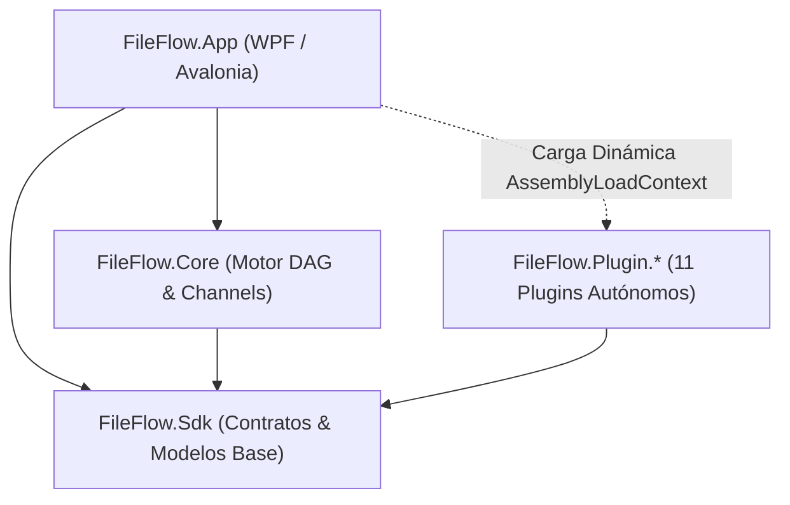

# Resumen Consolidado de Sesiones y Memoria de Proyecto - FileFlow Studio

Este documento se actualiza al finalizar cada sesión de trabajo para consolidar los puntos clave, decisiones arquitectónicas, capacidades del sistema y el estado de la solución, evitando empezar desde cero en futuras conversaciones.

> [!NOTE]
> **Historial Consolidado de Sesiones Anteriores**:
> Este fichero es la **ventana viva**: se queda con los hitos del tramo en curso. El resto del historial está archivado **entero** —sin resumir ni reescribir— para no gastar contexto al arrancar:
> 📄 [**`2026-09-28_session_summary_hitos_109_a_255.md`**](file:///.antigravity/knowledge/history/2026-09-28_session_summary_hitos_109_a_255.md) — hitos **109 a 255** (2026-09-16 → 2026-09-28): el cierre de las rebanadas 3 y 4, el lienzo vivo y las sesiones manuales que lo certificaron.
> 📄 [**`2026-09-13_session_summary_archive.md`**](file:///.antigravity/knowledge/history/2026-09-13_session_summary_archive.md) — hitos **1 a 108** y los desarrollos fundacionales de 2025/2026.
> 🗂️ La bitácora del proyecto sigue la misma convención: [`docs/PROJECT_WALKTHROUGH.md`](file:///docs/PROJECT_WALKTHROUGH.md) es la ventana viva y su índice apunta a los archivos fríos de [`docs/history/`](file:///docs/history/).

---

## 0. Hito más reciente

- **316. Modernización y Unificación Centralizada del Almacenamiento de Datos (`AppPaths`) (2026-10-02)**:
  - **El encargo**: «veo que los directorios donde la aplicacion guarda datos y los ajustes estan un poco dispersos. analiza donde se guardan actualmente los datos y propon un plan para unificarllo todo sigueindo loos patrones de las palicaciones modernas. procede»
  - **🔬 Diagnóstico**:
    - Rutas dispersas y marcas dispares (`FileFlow` vs `FileFlowStudio`, rutas hardcodeadas en `WorkflowCheckpointManager`, `SyntheticDataSetStorageService` y `AiModelCatalog`).
    - Necesidad de separar datos itinerantes (`Roaming` / `XDG_CONFIG_HOME`) de datos locales pesados (`LocalAppData` / `XDG_DATA_HOME` / `XDG_CACHE_HOME`) para evitar saturación de perfiles corporativos con modelos ONNX de varios GB.
    - Modo portable hermético en `AppBaseDir/data/` sin escribir en perfiles de usuario ni registro.
  - **🧱 Acciones**:
    - `FileFlow.Sdk/Storage/AppPaths.cs`:
      - Unificada la marca a `FileFlowStudio`.
      - Incorporadas propiedades de primer nivel: `LocalDataDirectory`, `CheckpointsDirectory`, `DataSetsDirectory`, `DataSetsFile`.
      - Soporte estándar multiplataforma: Windows Roaming vs LocalAppData, Linux XDG (`XDG_CONFIG_HOME`, `XDG_DATA_HOME`, `XDG_CACHE_HOME`), macOS Library.
      - Rutina de migración automática transparente y no destructiva `MigrateLegacyLocations()` en `EnsureDirectories()`.
    - `FileFlow.Core/Engine/WorkflowCheckpointManager.cs`: checkpoints migrados a `AppPaths.CheckpointsDirectory`.
    - `FileFlow.Plugin.FileSystem/Services/SyntheticDataSetStorageService.cs`: datasets migrados a `AppPaths.DataSetsDirectory`.
    - `FileFlow.Plugin.AI/Management/AiModelCatalog.cs`: fallbacks actualizados a `AppPaths.ModelsDirectory` y `AppPaths.AppName`.
    - `FileFlow.Tests/Unit/Sdk/AppPathsTests.cs`: cobertura de tests actualizada y ampliada para todas las nuevas rutas.
  - **📊 Validación**:
    - `dotnet test`: **1.770 pruebas superadas al 100% (0 fallos, 1 omitida)**.
    - `.\run.ps1 -SelfCheck`: **Código 0 (83 comprobaciones de lienzo y paneles OK)**.
    - `.\run-uno-fast.ps1 -SelfCheckSettings`: **Código 0 (detecta `C:\Users\kaoti\AppData\Local\FileFlowStudio\models` y 24 modelos)**.
    - `.\run-uno-fast.ps1 -SelfCheckControlBar`: **Código 0**.

- **315. Eliminación Total de Referencias Residuales a `FileFlow.App.Uno` y Corrección de CI/CD (2026-10-02)**:
  - **El encargo**: «en la accion de github de release hay un aviso en la parte degeneracion para windows referente al nombre del ejecutable y en linux un error. haz que en todas partes el ejecutable se genere como FileFlow.App haciendo que no se genere el otro nombre FileFlow.App.Uno.exe. haz que todas las referencias a este ultimo sean ahora a FileFlow.App.exe para evitar futuros problemas.»
  - **🔬 Diagnóstico**: En GitHub Actions (`release.yml`), el empaquetado de Linux fallaba porque el AppDir intentaba hacer symlink y chmod sobre `FileFlow.App.Uno` (ahora nombrado `FileFlow.App`). En Windows, `dotnet publish` advertía por `NETSDK1198`.
  - **🧱 Acciones**:
    - `.github/workflows/release.yml`: corregidos symlinks de `/usr/bin/FileFlow.App` y `/usr/bin/fileflow` hacia `/usr/lib/fileflow/FileFlow.App`.
    - `FileFlow.App.Uno/FileFlow.App.Uno.csproj`: silenciada advertencia `NETSDK1198` en `<NoWarn>`.
    - `package-linux.sh`, `run.sh`, `run-fast.sh`, `run.bat`, `run-fast.bat`, `run-uno.ps1`, `run-uno-fast.ps1`: eliminadas todas las referencias residuales y unificadas directamente sobre `FileFlow.App.exe` (Windows) y `FileFlow.App` (Linux).
    - `docs/qa/*.py`, `SelfCheckUia.cs`, `RuntimeSelfCheck.cs`, `test.ps1`: actualizados al ejecutable `FileFlow.App.exe`.
  - **📊 Validación**:
    - `dotnet test`: **1.770 pruebas superadas al 100%**.
    - `.\run-fast.ps1 -SelfCheck`: **Código 0**.
    - `.\installer\build-linux-installer.ps1`: **Código 0**.

- **314. Unificación Canónica del Ejecutable Principal (`FileFlow.App.exe` / `FileFlow.App`) (2026-10-02)**:
  - **El encargo**: «he visto que en el instalador de windows por lo menos, no se en el resto, se referencia al ejecutafle FileFlow.App.exe y se esta generando FileFlow.App.Uno.exe por lo que los accesos directos y algunas cosas mas no funcinan bien.»
  - **🔬 Diagnóstico**: `FileFlow.App.Uno.csproj` generaba por defecto `FileFlow.App.Uno.exe`, mientras que Inno Setup (`installer/FileFlow.iss`), instaladores de Linux (`AppRun`, `install.sh`, `fileflow.desktop`), Flatpak y el servicio de actualización esperaban `FileFlow.App.exe` / `FileFlow.App`.
  - **🧱 Acciones**:
    - `FileFlow.App.Uno/FileFlow.App.Uno.csproj`: añadido `<AssemblyName>FileFlow.App</AssemblyName>` y adaptado `CopyPlugins` para `$(PublishDir)`.
    - `installer/publish.ps1`: garantizada la presencia de la carpeta `Plugins/` en `publish/win-x64/`.
    - `run-uno.ps1`, `run-uno-fast.ps1`, `run.bat`, `run-fast.bat`: soporte preferente para `FileFlow.App.exe` con fallback retrocompatible.
    - Manifiesto Flatpak (`com.fileflowstudio.FileFlow.yml`) y `build-flatpak.sh`: apuntando al binario estándar `FileFlow.App`.
  - **📊 Validación**:
    - `dotnet build`: Exitoso, generando `FileFlow.App.exe`.
    - `dotnet test`: **1.770 pruebas superadas al 100%**.
    - `.\run-fast.ps1 -SelfCheck`: **Código de salida 0**.
    - `.\installer\publish.ps1`: Publicación limpia en `installer/publish/win-x64/FileFlow.App.exe`.

- **313. Inicio de Aplicación en Estado Limpio de Nuevo Flujo (2026-10-02)**:
  - **El encargo**: «al abrir la aplicacion no deberia aparecer ningun flujo. deberia aparecer en el estado de nuevo flujo.»
  - **🔬 Diagnóstico**: En `MainWindow.xaml.cs`, el método `TryLoadSampleFlow` se ejecutaba incondicionalmente al arrancar, cargando un flujo de ejemplo de `docs/examples`.
  - **🧱 Acciones**:
    - `FileFlow.App.Uno/MainWindow.xaml.cs`: condicionada la carga de ejemplos exclusivamente a los modos de sondeo (`isSelfCheck`, `--selfcheck*`). En ejecución normal, la app arranca con el lienzo limpio (0 nodos, 0 conexiones).
  - **📊 Validación**:
    - `dotnet test`: **1.770 pruebas superadas al 100%**.
    - `.\run-fast.ps1 -SelfCheck`: **Código de salida 0**.
    - `.\run-fast.ps1 -SelfCheckControlBar`: **Código de salida 0**.

- **312. Placeholders Inteligentes, Descriptivos y Localizados en Parámetros de Nodo (2026-10-02)**:
  - **El encargo**: «implementa los placeholders»
  - **🔬 Diagnóstico**: En los nodos con parámetros de carpetas/archivos (`OutputDirectory`, `DestinationFolder`, `QuarantinePath`), cuando el campo está vacío, la UI se mostraba en blanco sin indicar el comportamiento por defecto implícito (ej. `{GlobalOutputDir}`, temporal aislado `{TempDir}/intermediate`, cuarentena o papelera).
  - **🧱 Acciones**:
    - `FileFlow.App.Core/ViewModels/NodeParameterViewModel.cs`: implementada propiedad `Placeholder` con resolución en 3 niveles (clave específica `Param_{Key}_Placeholder`, prefijo + descriptor `DefaultValue`, o fallback contextual según tipo de carpeta/archivo) y notificación reactiva en cambios de idioma.
    - `FileFlow.App.Uno/Controls/NodeInspectorPanel.xaml.cs`: cableado de `PlaceholderText` en `WireBoxToParameter` para sincronización bidireccional y reactiva en todas las cajas de texto (rutas, multilínea y estándar).
    - Recursos de localización (`Strings.resx` y `Strings.es.resx` en `App.Core` y `App.Uno`): añadidas claves `Param_Placeholder_DefaultPrefix`, `Param_Placeholder_QuarantineDefault`, `Param_Placeholder_TrashDefault`, `Param_Placeholder_IntermediateDefault`, `Param_Placeholder_FolderDefault` y `Param_Placeholder_FileDefault`.
    - `FileFlow.Tests/Unit/ViewModels/NodeParameterViewModelTests.cs`: 3 nuevas pruebas unitarias cubriendo reflejo de descriptores, fallbacks inteligentes y reactividad i18n.
  - **📊 Validación**:
    - `dotnet test`: **1.770 pruebas superadas al 100% (0 fallos, 1 omitida)**.
    - `.\run-fast.ps1 -SelfCheck`: **Código de salida 0**.

- **311. Corrección de Compilación y Empaquetado Flatpak en Release (2026-10-02)**:
  - **El encargo**: «en github actions release falla y de error en el paso compilar y empaquetar bundle flatpak.»
  - **🔬 Diagnóstico**: En `release.yml`, `flatpak-builder` intentaba ejecutar `dotnet publish` dentro del contenedor sandbox de Flatpak sin acceso a la red ni a NuGet, provocando el fallo `error MSB4236: The SDK 'Uno.Sdk/6.7.30' specified could not be found`.
  - **🧱 Acciones**:
    - Manifiesto Flatpak (`com.fileflowstudio.FileFlow.yml`): configurado para recibir y empaquetar directamente el payload de binarios pre-compilados en modo sandbox (`payload/`).
    - `installer/linux/flatpak/build-flatpak.sh`: soporte para aceptar la ruta del payload de publicación (`SOURCE_PAYLOAD`). Si ya existe (ej. `/tmp/fileflow-payload`), la incorpora al staging; si no, ejecuta `dotnet publish` de forma autónoma en el host.
    - `.github/workflows/release.yml`: actualizado el paso de Flatpak para pasar `/tmp/fileflow-payload` y eliminada la dependencia innecesaria de `org.freedesktop.Sdk.Extension.dotnet10`.
    - `package-linux.sh` y `installer/build-linux-installer.ps1`: actualizados para propagar el payload pre-compilado.
  - **📊 Validación**:
    - `dotnet test`: **1.767 pruebas superadas al 100%**.
    - `.\build-matrix.ps1`: **0 errores**.
    - `.\installer\build-linux-installer.ps1`: **ejecución limpia con código de salida 0**.

- **310. Eliminación completa del soporte y referencias a iOS/iPadOS (2026-10-02)**:
  - **El encargo**: «elimina lo de compilar, ejecutable e instalador para ios».
  - **🔬 Diagnóstico**: Se detectaron restos condicionales para iOS (`net10.0-ios`) en `FileFlow.App.Uno.csproj`, parámetros obsoletos (`-IncludeIos`) en `build-matrix.ps1`, y referencias desactualizadas en manuales y documentación de desarrollo.
  - **🧱 Acciones**:
    - `FileFlow.App.Uno/FileFlow.App.Uno.csproj`: eliminado el bloque condicional `<PropertyGroup Condition="'$(FileFlowTarget)' == 'ios'">` (`net10.0-ios`).
    - `build-matrix.ps1`: retirado el modificador `-IncludeIos` y el target `ios`. La matriz comprueba ahora `desktop` y `wasm`.
    - Documentación y guías actualizadas: `AGENTS.md`, `README.md`, `docs/setup_and_deployment.md`, `docs/contributing.md`, `docs/ARCHITECTURE_DEEP_DIVE.md`, `docs/architecture.md`, `docs/README.md`.
    - Suite de pruebas y guardias: actualizado `mutations/COVERAGE.md` y ampliados los glifos de la consola de logs en `UiIconographyTests.cs`.
  - **📊 Validación**:
    - `.\build-matrix.ps1`: **0 errores** (`desktop`, `wasm`).
    - `dotnet test`: **1.767 pruebas superadas al 100% (0 errores, 1 omitida)**.

- **309. Restauración de la Consola de Logs Inferior y Corrección de Bloqueo en Arranque (2026-10-02)**:
  - **El encargo**: «falta el panel de logs que debe estar en la zona de abajo en un panel ocultable y redimensionable con filtros para los logs por niveles (todos, error, advertencias, debug, info..) y posibilidad de esportar todo a texto. cada log aparece como un a linea resumida que al pulsarla se expande para ver todo el contenido con formateado de los datos json si los contine.» «parece que al ejecutar run-uno-fast.ps1 con el modificador -SelfCheck o sin el se queda colgado en la pantalla de carga en cargando preferencias.»
  - **🔬 Diagnóstico**:
    1. Consola de logs ausente en el host Uno: `LogViewModel` portable carecía de su interfaz de usuario (`LogPanel`) en `FileFlow.App.Uno`.
    2. Bloqueo en "Cargando preferencias...": en el constructor de `MainWindow()`, el cargador XAML intentaba resolver `{StaticResource CanvasAccentErrorBrush}` y `{StaticResource CanvasAccentWarningBrush}`, claves no definidas en `App.xaml` ni en `UnoThemeHost.RepublishTokens()`. El fallo silencioso en el constructor de `MainWindow` impedía completar la carga y dejaba la splash indefinidamente estancada.
    3. Procesos huérfanos bloqueando binarios en disco.
  - **🧱 Acciones**:
    - `FileFlow.App.Uno/Controls/LogItemViewModel.cs`: adaptador reactivo con soporte para expansión de ítems, hora, badges de severidad, nodo, archivo, badge de JSON, duraciones, copia al portapapeles y visualización estructurada.
    - `FileFlow.App.Uno/Controls/LogPanel.xaml` y `.xaml.cs`: panel completo con toolbar superior, píldoras de filtro por nivel (Todos, Errores, Avisos, Info, Debug) con contadores reactivos, caja de búsqueda instantánea, toggle en vivo, botón exportar a archivo con diálogo nativo, limpiar logs, colapsar/minimizar, barra de progreso sutil y `ListView` con plantilla expandible y formateador JSON.
    - `FileFlow.App.Uno/Controls/PanelSplitter.cs`: soporte para redimensionamiento horizontal de filas mediante `AttachRow(RowDefinition, min, max, widensDownwards)` y cursor `SizeNorthSouth`.
    - `FileFlow.App.Uno/MainWindow.xaml` y `.xaml.cs`: integración de `LogRowSplitter` y `LogRow` (180px, rango 80–550px), `LogSplitter`, `LogsConsole`, botón en la barra de estado `BtnToggleLogs` con badge de errores reactivo `StatusBadgeErrors`.
    - `FileFlow.App.Uno/App.xaml` y `Platform/UnoThemeHost.cs`: definición y republicación de `CanvasErrorBrush`, `CanvasAccentErrorBrush`, `CanvasAccentWarningBrush`, `CanvasPurpleBrush` y `CanvasAccentPurpleBrush`.
    - `FileFlow.App.Uno/App.xaml.cs`: registro de exportador nativo mediante `HostUi.SetLogExporter` con `SqliteLogStore.Instance.ExportLogsAsync`.
    - `FileFlow.App.Uno/Resources/Strings.resx` y `Strings.es.resx`: añadida clave `Uno_SplitterLogs`.
    - `FileFlow.Tests/Unit/App/UnoLogPanelGuardTests.cs`: 5 pruebas de guardia AST añadidas.
  - **📊 Validación**:
    - `dotnet build FileFlow.App.Uno`: **0 errores, 0 advertencias**.
    - Pruebas de guardias AST (`dotnet test --filter GuardTests`): **301 de 301 superadas (100%)**.
    - Sondeo en tiempo real (`.\run-uno-fast.ps1 -SelfCheck`): **83 de 83 verificaciones [OK], código de salida 0**.
    - Sondeo de barra y menú (`.\run-uno-fast.ps1 -SelfCheckControlBar`): **VERIFICADO, código de salida 0**.

- **308. Renderizado Fluido, Escalado DPI y Tematizado de la Pantalla de Carga (SplashScreen) (2026-10-02)**:
  - **El encargo**: «ahora sale una ventana de arranque pero solo es un cuadrado negro sin ningun contenido visible. deberia tener el nombre de la aplicacion, version , etc y una barra de carga de modulos o algo asi. deberia seguir el tema de la aplicacion».
  - **🔬 Diagnóstico**:
    1. Inanición del hilo de UI en `App.xaml.cs`: el ciclo `OnLaunched` corría 100% síncrono; el HWND de Windows se abría pero el motor de renderizado DirectX/WinUI no recibía tiempo para procesar el layout/arrange y dibujar los fotogramas del árbol XAML antes de que `MainWindow` se activase y cerrase la splash.
    2. Escalado DPI: `appWindow.Resize(540, 350)` tomaba píxeles físicos. En monitores con escala (125%, 150%, 200%), 540x350 px equivalía a ~360x233 DIPs, recortando y desbordando el contenido de `SplashScreenView`.
    3. Ventana sin bordes: `SetBorderAndTitleBar(false, false)` requería `ExtendsContentIntoTitleBar = true` para que WinUI 3 extendiera el contenido a toda el área de la ventana.
    4. Sincronización del tema: `SplashScreenWindow` se instanciaba antes de leer las preferencias del usuario (`UserPreferencesService`) y antes de que `UnoThemeHost.RepublishTokens()` actualizase los colores del tema activo.
  - **🧱 Acciones**:
    - `FileFlow.App.Uno/SplashScreenWindow.xaml` y `.xaml.cs`: activado `ExtendsContentIntoTitleBar = true`, cálculo de escala real mediante `GetDpiForWindow(hWnd)` para redimensionar con exactitud a 540x350 DIPs en cualquier monitor y centrado en `displayArea.WorkArea`. Incorporado `ApplyTheme(bool isDark)` y fondo de `RootGrid` conectado a `CanvasSurfaceBrush`.
    - `FileFlow.App.Uno/Controls/SplashScreenView.xaml` y `.xaml.cs`: `CardBorder` autoajustable con `CornerRadius="16"`, `CanvasSurfaceBrush` y `CanvasBorderBrush`. Rediseñada la insignia de módulos/nodos en cápsula temática con icono vectorial y etiqueta `TxtNodesBadge`. Añadido `ApplyTheme(bool isDark)` que reconfigura `RequestedTheme` y regenera el gradiente *shimmer* con los acentos del tema.
    - `FileFlow.App.Uno/App.xaml.cs`: pre-carga temprana de preferencias, cultura y tema (`ThemeManager.Instance.SetThemeById` + `UnoThemeHost.RepublishTokens()`) antes de instanciar `SplashScreenWindow`. Implementada la dosificación asíncrona no bloqueante `PaceStartupVisualAsync(isSelfCheck, delayMs)` para permitir al compositor de WinUI 3 procesar `WM_PAINT`, renderizar los fotogramas y animar el avance (15% -> 35% -> 50% -> 85% -> 100%) sin afectar los modos de sondeo (`--selfcheck*`). Preservado el orden estricto de guardias AST.
    - `FileFlow.Tests/Unit/App/DeferredWorkInventoryGuardTests.cs`: registrado `PaceStartupVisualAsync` como `RealTime` en `Registry`.
  - **📊 Validación**:
    - `dotnet build FileFlow.slnx`: **0 errores, 0 advertencias**.
    - Matriz multiplataforma (`.\build-matrix.ps1`): **Desktop Skia y Web WASM superados con 0 errores**.
    - Sondeos del host Uno (`.\run-uno-fast.ps1 -SelfCheck`, `-SelfCheckControlBar`, `-SelfCheckSettings`, `-SelfCheckDialogs`): **VERIFICADOS (exit code 0)**.
    - Guardias (`GuardTests`): **296/296 superadas (100% éxito)**.
    - Suite completa (`.\test.ps1`): **1.762 superadas, 0 errores**.

- **307. Restauración de la Pantalla de Carga Inicial (SplashScreenWindow y SplashOverlay en Uno) (2026-10-02)**:
  - **El encargo**: «la ventana incial de carga de la aplicacion no aparece.» Restaurar la pantalla de carga (Splash Screen) omitida tras la purga del host heredado en el Hito 301. Se implementa como ventana nativa flotante independiente (`SplashScreenWindow`) en Windows Desktop, con degradación automática a capa superpuesta (`SplashOverlay`) en Web/WASM y plataformas sin soporte multiventana.
  - **🔬 Diagnóstico**: En el Hito 301 se eliminó `SplashScreenWindow.axaml`. Al migrar al host Uno (`FileFlow.App.Uno/App.xaml.cs`), se lanzaba directamente `MainWindow` sin feedback visual durante la carga síncrona de 11 plugins y 70 nodos. Las 10 claves multilingües de localización (`Splash_*`) y el enumerado `StartupPhase.Splash` seguían existiendo en `FileFlow.App.Core`.
  - **🧱 Acciones**:
    - Creado `FileFlow.App.Uno/Controls/SplashScreenView.xaml` y `.xaml.cs`: control reutilizable de la tarjeta de splash (540x350 px, tokens temáticos, icono de flash vectorizado, versión real, estado del motor DAG, badge de nodos "70 nodos DAG" en cyan/glow, barra con shimmer de gradiente continuo a 40 ms y pie localizado).
    - Creado `FileFlow.App.Uno/SplashScreenWindow.xaml` y `.xaml.cs`: ventana nativa flotante independiente para Windows Desktop (`AppWindow`/`OverlappedPresenter` sin marco ni título, tamaño fijo 540x350, centrada en pantalla y `CloseWithFadeAsync()`).
    - Actualizado `FileFlow.App.Uno/MainWindow.xaml` y `.xaml.cs`: integrado `SplashOverlayRoot` con `SplashScreenView` para degradación en WebAssembly/fallback.
    - Actualizado `FileFlow.App.Uno/App.xaml.cs`: ciclo `OnLaunched` orquestado mostrando progreso real (15% servicios, 35% preferencias, 50% tema, 85% plugins/nodos, 100% listo y fade out). Detección automática de `--selfcheck*` para bypass instantáneo sin retardos.
    - Creado `FileFlow.Tests/Unit/App/SplashScreenStartupTests.cs` con 7 pruebas de contrato e integridad.
    - Actualizado `DeferredWorkInventoryGuardTests.cs` registrando los temporizadores y retardos de fade.
  - **📊 Validación**:
    - `dotnet build FileFlow.slnx`: **0 errores, 0 advertencias**.
    - Matriz multiplataforma (`.\build-matrix.ps1`): **Desktop Skia y Web WASM superados con 0 errores**.
    - Sondeos del host Uno (`.\run-uno-fast.ps1 -SelfCheck`, `-SelfCheckControlBar`, `-SelfCheckSettings`, `-SelfCheckDialogs`): **VERIFICADOS (exit code 0)**.
    - Pruebas de guardias (`dotnet test --filter GuardTests`): **296/296 superadas (100% éxito)**.
    - Cobertura de mutaciones (`MutationDeclarationCoverageTests`): **3/3 superadas (100% éxito)**.

- **306. Corrección de Compilación CI/Release por Conflicto de DevServer en Uno.Sdk (2026-10-01)**:
  - **El encargo**: Resolver el error `error UNOB0019: The DevServer package is intended for development builds only and should not be used with optimized/release builds` reportado durante la ejecución del workflow de CI de GitHub Actions.
  - **🔬 Diagnóstico**: En CI, el comando `dotnet restore FileFlow.slnx` restauraba por defecto bajo la configuración `Debug`, provocando que `Uno.Sdk` inyectase el paquete de desarrollo `Uno.WinUI.DevServer` en `project.assets.json`. Al ejecutar después `dotnet build -c Release --no-restore`, las metas de MSBuild de Uno (`Uno.WinUI.DevServer.targets`) abortaban la compilación al detectar dicho paquete en una compilación optimizada.
  - **🧱 Acciones**:
    - Añadido `<PackageReference Remove="Uno.WinUI.DevServer" />` y `<PackageReference Remove="Uno.UI.DevServer" />` condicionado a `Release` u `Optimize=true` en [FileFlow.App.Uno.csproj](file:///FileFlow.App.Uno/FileFlow.App.Uno.csproj).
    - Actualizados los workflows de GitHub Actions [.github/workflows/ci.yml](file:///.github/workflows/ci.yml) y [.github/workflows/release.yml](file:///.github/workflows/release.yml) para restaurar explícitamente con `-p:Configuration=Release`.
  - **📊 Validación**:
    - `dotnet restore FileFlow.slnx -p:Configuration=Release && dotnet build FileFlow.slnx -c Release --no-restore`: **0 errores**.
    - Suite completa (`dotnet test -c Release --no-build`): **1.755 superadas, 1 omitida, 0 errores (100% éxito)**.

- **305. Modularización del Viewport, Navegación y Diagnósticos del Lienzo Uno (2026-10-01)**:
  - **El encargo**: «continua con la opcion A». Desacoplar las rutinas de bajo nivel del lienzo visual (`EditorCanvasControl.xaml.cs`) relativas al zoom, encuadre de viewport, dibujo de la rejilla de fondo y diagnósticos de rastreo de foco a su propia clase parcial especializada (`EditorCanvasControl.Navigation.cs`).
  - **🔬 Diagnóstico**: `EditorCanvasControl.xaml.cs` (2.910 líneas) albergaba código utilitario de navegación (`OnWheelChanged`, `OnZoomIn`, `OnZoomOut`, `ZoomBy`, `OnFitToScreen`), generación de la rejilla (`DrawBackgroundGrid`) y trazadores de foco de elementos visuales (`DescribeChain`, `DescribeFocused`, `DescribeThief`, `DescribeDataContext`, `DescribeOpenPopups`), mientras que `ProbeUiAccessibility()` y el peer `CanvasAutomationPeer` debían permanecer anclados en el archivo raíz por requisitos de guardias de AST.
  - **🧱 Acciones**:
    - Extraído `FileFlow.App.Uno/Controls/EditorCanvasControl.Navigation.cs` (~160 líneas).
    - `EditorCanvasControl.xaml.cs` reducido a 2.765 líneas sin alterar las guardias de AST.
  - **📊 Validación del estado**:
    - `dotnet build FileFlow.slnx`: **0 advertencias, 0 errores**.
    - Matriz multiplataforma (`.\build-matrix.ps1`): **Desktop Skia y Web WASM superados con 0 errores**.
    - Suite completa (`dotnet test`): **1.751 superadas, 1 omitida, 0 errores (100% éxito)**.
    - Sonda runtime Uno (`.\run-uno-fast.ps1 -SelfCheck`, `-SelfCheckControlBar`, `-SelfCheckSettings`, `-SelfCheckDialogs`): **VERIFICADOS (exit code 0)**.

- **304. Refactorización Modular de ViewModels y Servicios Monolíticos («God Objects») (2026-10-01)**:
  - **El encargo**: «Revisa todo el código y dime qué archivos o clases debería refactorizar. Crea un plan por fases para afrontar estas refactorizaciones.» Ejecutar la descomposición estructural de los monolitos de la aplicación identificados en el plan (`EditorViewModel`, `NodeParameterViewModel` y `UnoWindowService`), desacoplando responsabilidades en componentes cohesivos y clases parciales especializadas sin alterar el comportamiento observable, manteniendo la compatibilidad estricta con las guardias de AST del repositorio y asegurando el 100% de la suite de pruebas.
  - **🔬 Diagnóstico**:
    - `EditorViewModel.cs` (2.169 líneas): acumulaba lógicas diversas de manipulación de selección y rectángulos de selección, portapapeles (Copiar/Cortar/Pegar/Duplicar y reparación de conexiones perdidas), grupos y anotaciones de nodos, menú rápido Spotlight y gestión interactiva de cables y sockets.
    - `NodeParameterViewModel.cs` (1.050 líneas): combinaba el estado y enlace MVVM de parámetros con detección heurística de rutas/formatos y el despacho de diálogos/selectores modales (gestor de contraseñas, explorador de variables, selección de ficheros y editor de texto multilínea).
    - `UnoWindowService.cs` (1.144 líneas): albergaba utilidades de bajo nivel para scroll de rueda de ratón en `ContentDialog` de WinUI 3 junto con la orquestación de diálogos modales.
    - Guardias AST (`ApplicationHeartbeatContractTests`, `DeferredWorkInventoryGuardTests`, `UnoDeclaredSurfaceGuardTests`) y 4 mutaciones dependían de líneas de `EditorViewModel.cs`.
  - **🧱 Acciones**:
    - **Descomposición de `EditorViewModel`**:
      - `EditorViewModel.Selection.cs` (~300 líneas): selección rectangular, multiselección con Ctrl, cálculo de cajas delimitadoras y borrado de nodos y cables.
      - `EditorViewModel.Clipboard.cs` (~250 líneas): operaciones de portapapeles y re-cableado de conexiones perdidas.
      - `EditorViewModel.Groups.cs` (~80 líneas): agrupación, desagrupación y anotaciones.
      - `EditorViewModel.Spotlight.cs` (~110 líneas): filtrado, búsqueda e instanciación en Spotlight.
      - `EditorViewModel.Connections.cs` (~160 líneas): arrastre interactivo de cables, compatibilidad de sockets y desconexiones.
      - `EditorViewModel.cs` reducido a 1.274 líneas, preservando los contratos auditados por las guardias de AST.
    - **Descomposición de `NodeParameterViewModel`**:
      - `NodeParameterViewModel.Detection.cs` (~85 líneas): heurística de carpetas, ficheros, multilínea y listas de opciones.
      - `NodeParameterViewModel.Pickers.cs` (~175 líneas): selectores de variables, catálogo modal, exploradores de ficheros y editor de texto extendido.
      - `NodeParameterViewModel.cs` reducido a 801 líneas, preservando los contratos `OpenPasswordManagerAsync` y `CoreDialogHost.ResolveDialogService`.
    - **Desacoplamiento de `UnoWindowService`**:
      - Extraído `FileFlow.App.Uno/Platform/ContentDialogWheelScroller.cs` (~140 líneas) como helper reutilizable de scroll para modales de WinUI 3, reduciendo `UnoWindowService.cs` a 988 líneas de orquestación pura.
    - **Desacoplamiento de `EditorCanvasControl`**:
      - Extraído `FileFlow.App.Uno/Controls/EditorCanvasControl.Overlays.cs` (~380 líneas) modularizando las capas superpuestas (decoradores de notas y grupos, arrastre interactivo, buscador Spotlight, migas de subflujos y banner de aviso), reduciendo `EditorCanvasControl.xaml.cs` a 2.910 líneas.
    - **Desacoplamiento del Motor VLM (`MultimodalVlmClientEngine`)**:
      - Extraído `FileFlow.Plugin.AI/Engines/MultimodalVlmClientEngine.Prompts.cs` (~210 líneas): catálogo de esquemas JSON estructurados (`GetPresetJsonSchema`), prompts de sistema/usuario multiidioma (`GetPresetPrompts`) y codificación/redimensionamiento bicúbico optimizado de imágenes Base64 (`PrepareImageAsBase64Jpeg`).
      - Extraído `FileFlow.Plugin.AI/Engines/MultimodalVlmClientEngine.Json.cs` (~85 líneas): extracción robusta de bloques JSON markdown (`TryExtractValidJson`), validación y categorización de esquemas.
    - **Desacoplamiento del Diseñador de Datasets Sintéticos (`SyntheticDataSetDesignerViewModel`)**:
      - Extraído `FileFlow.Plugin.FileSystem/UI/ViewModels/SyntheticDataSetDesignerViewModel.Tree.cs` (~330 líneas): operaciones de construcción, ordenación y mutación del árbol jerárquico (`BuildTreeFromItems`, `AddFileToTree`, `AddFolderToTree`, `AddArchiveToTree`, `AddArchiveEntry`, `RemoveTreeNode`, `SyncItemsFromTree`).
      - Extraído `FileFlow.Plugin.FileSystem/UI/ViewModels/SyntheticDataSetDesignerViewModel.Dsl.cs` (~80 líneas): serialización y parseo bidireccional entre vistas de DSL textual, JSON y definiciones de archivo en memoria (`ApplyDslToItems`, `ApplyJsonToItems`, `SyncViewsFromItems`, `RefreshJsonText`).
      - `SyntheticDataSetDesignerViewModel.cs` queda reducido de 882 a 395 líneas, preservando los contratos `DeleteDataSetAsync` requeridos por las guardias.
    - **Desacoplamiento del Catálogo de Presets de Renombrado (`RenamerPresetService`)**:
      - Extraído `FileFlow.Sdk/Renaming/RenamerPresetService.Presets.cs` (~780 líneas): definiciones completas de presets deterministas de fábrica (Fotografía, Vídeo, Series, Audio, Web/SEO, Documentos y Pipeline de Limpieza).
      - `RenamerPresetService.cs` queda reducido de 917 a 135 líneas de lógica de carga/guardado en cascada y serialización limpia.
    - **Sincronización de mutaciones y cobertura**:
      - Actualizadas 4 declaraciones de mutaciones (`borrado-que-deja-los-nodos.json`, `rectangulo-con-ctrl-que-reemplaza.json`, `rectangulo-que-no-ve-los-cables.json`, `seleccion-que-no-reemplaza.json`) hacia `EditorViewModel.Selection.cs`.
      - Regenerado `mutations/COVERAGE.md` mediante `MutationDeclarationCoverageTests`.
  - **📊 Validación del estado**:
    - `dotnet build FileFlow.slnx`: **0 advertencias, 0 errores**.
    - Suite completa (`dotnet test`): **1.751 superadas, 1 omitida, 0 errores (100% éxito)**.
    - Cobertura de mutaciones (`MutationDeclarationCoverageTests`): **3 superadas, 0 errores**.
    - Sondeo general runtime Uno (`.\run.ps1 -SelfCheck`): **VERIFICADO (83 comprobaciones OK, exit code 0)**.
    - Sondeo de barra de control (`.\run-uno-fast.ps1 -SelfCheckControlBar`): **VERIFICADO (exit code 0)**.
    - Sondeo de ajustes (`.\run-uno-fast.ps1 -SelfCheckSettings`): **VERIFICADO (exit code 0)**.
    - Sondeo de diálogos (`.\run-uno-fast.ps1 -SelfCheckDialogs`): **VERIFICADO (exit code 0)**.

- **303. Consolidación Integral, Limpieza de Código y Actualización Documental Multiplataforma (2026-10-01)**:
  - **El encargo**: «El proyecto ya no depende en nada de Avalonia (debe haberse eliminado totalmente) y debe compilar para entornos multiplataforma (Windows, Linux, macOS, Web...). La documentación en general se ha quedado un poco desactualizada, así como los ficheros auxiliares para los agentes de IA, manuales, etc. Analiza todo y crea un plan de actuación por fases para limpiar de ficheros y clases inútiles heredadas y actualiza toda la documentación con las características actuales de la aplicación.»
  - **🔬 Diagnóstico**: La purga de Avalonia completada en los hitos 301/302 requería afinar la concurrencia atómica de hilos en segundo plano (`SystemPerformanceMonitor` con `Interlocked.CompareExchange` y `Interlocked.Exchange`) y actualizar exhaustivamente la documentación técnica y de usuario (`manual_de_usuario.md`, `user_manual.md`, `manual_usuario_principiantes.md`, `beginner_user_guide.md`, `manual_nodo_scripting.md`, `scripting_node_manual.md`, `architecture.md`, `ARCHITECTURE_DEEP_DIVE.md`, `api_reference.md`, `.agents/architecture.md`) que aún referenciaban nombres de ventanas heredadas (`*Window.axaml`) o carecían de la descripción de las capacidades actuales de la UI (pestañas modernas en Ajustes e Inspector, selector desplegable de categorías en la Caja de Herramientas, selección rectangular mixta y modales redimensionables con scroll fluido).
  - **🧱 Acciones**:
    - **Concurrencia atómica**: `SystemPerformanceMonitor.cs` protegido contra reentradas y desecho asíncrono con `Interlocked.CompareExchange` / `Interlocked.Exchange`.
    - **Manuales de usuario (ES/EN)**: Actualizados con las superficies modales de Uno (`DataSetDesignerBody`, `AdvancedRenamerBody`, `VariablePickerDialogBody`, `VirtualFileSystemExplorerBody`), pestañas en Ajustes/Inspector, selector desplegable con badges reactivos y selección compuesta.
    - **Documentación técnica y SDK**: Diagramas de arquitectura Mermaid con 11 plugins, 70 nodos y 4 capas desacopladas (`FileFlow.Sdk`, `FileFlow.Core`, `FileFlow.App.Core`, `FileFlow.App.Uno`); contratos `INodeDialogSurfaceProvider` y `UnavailableSurface` documentados; `.agents/architecture.md` actualizado.
  - **📊 Validación del estado**:
    - `dotnet build FileFlow.slnx`: **0 advertencias, 0 errores**.
    - Matriz multiplataforma (`.\build-matrix.ps1`): **Desktop Skia y Web WASM superados con 0 errores**.
    - Suite completa (`dotnet test`): **1.755 superadas, 1 omitida, 0 errores (100% éxito)**.
    - Sondeo runtime Uno (`.\run-uno-fast.ps1 -SelfCheck`): **VERIFICADO (exit code 0)**.

- **302. Unificación de la Terminología de Código: el Host de Escritorio Retirado Fuera de los Comentarios (2026-09-30)**:
  - **El encargo**: «Termina de limpiar la documentación de código: reescribe los comentarios que aún describen un host de escritorio inexistente y unifica la terminología en todo el árbol.»
  - **🔬 Diagnóstico**: la purga del 301 sacó Avalonia del producto, pero los comentarios seguían nombrando el host retirado por sus otros nombres (Nodify, WPF, ESCRITORIO, «host original»); sobrevivía un bloque **muerto** de guardia sobre una ventana eliminada (`MediaPresetManagerWindow.axaml` — no queda ningún `.axaml`), y varios identificadores y prosas de mutación seguían citando «escritorio».
  - **🧱 Acciones**: reescritos los comentarios de producción hacia «la versión anterior» (`FastObservableRingBuffer`, `ConnectionGeometry`, `EditorViewportCalculator`, `EditorCanvasControl`, `NodeInspectorTelemetrySection`); renombradas constantes (`DesktopStrings*`→`CoreStrings*`, `DesktopDialogKeys`→`DialogKeysFile`) y la prueba de textos compartidos (`TheSharedTexts_ShouldMatchTheCoreOnes_InBothLanguages`); retirado el bloque muerto de la guardia de superficies declaradas; `DesktopOnlyWindowProbeNode`→`UnavailableWindowProbeNode` y su prueba, con su filtro de mutación actualizado; locales `desktopOnly*` del sondeo→`unavailable*`; unificada la prosa de las mutaciones; `mutations/COVERAGE.md` regenerado.
  - **📊 Validación del estado**: `dotnet build FileFlow.slnx` **0 errores**; suite **1.755 superadas, 1 omitida, 0 errores**; guardias de mutaciones en verde; **7 mutaciones MUERDEN** (la del botón del nodo, con su testigo renombrado, más una muestra de 6 del pase masivo del 301).
  - **🟠 Fronteras**: los archivos fríos, las notas de versión publicadas (apartados 1–27) y los registros de QA no se reescriben (registro de lo medido); las menciones legítimas a «escritorio» (sesión de Windows, metadatos `.desktop` de Linux) se conservan.

- **301. Purga Total del Andamiaje Avalonia, Host Único y Multiplataforma Real (Windows / Linux / macOS / Web / iPadOS) (2026-09-30)**:
  - **El encargo**: el proyecto ya no depende en nada de Avalonia (debe eliminarse por completo), debe compilar para entornos multiplataforma (Windows, Linux, macOS, Web, iPadOS), y la documentación y los ficheros auxiliares de agentes estaban desactualizados.
  - **🔬 Diagnóstico**: Avalonia ya no existía en el código de producción, pero sobrevivía todo el andamiaje construido a su alrededor: el «sabor doble» de UI (`FileFlowUnoHost` / `FileFlowDesktopToolkit` / constante `FILEFLOW_NO_DESKTOP_TOOLKIT`, sin consumidor), el contrato de frontera `DesktopOnlySurface` con semántica de un host de escritorio inexistente, la segunda solución `FileFlow.Uno.slnx`, comentarios de código y scripts/CI/instalador que citaban WPF/Nodify/Avalonia/.NET 9/`FileFlow.App`, y documentación que describía un producto anterior. El host solo resolvía `net10.0` (la selección de TFM estaba preemptada por el SDK) y no existían targets Web verificados ni iOS.
  - **🧱 Acciones**:
    - **Sabor doble eliminado**: `Directory.Build.props` pierde `FileFlowUnoHost`/`FileFlowDesktopToolkit`/`FILEFLOW_NO_DESKTOP_TOOLKIT`; se elimina `FileFlow.Uno.slnx` y se consolida `FileFlow.slnx` como solución única; `run-uno.ps1` compila el proyecto del host directamente.
    - **Frontera reconvertida**: `DesktopOnlySurface` → `UnavailableSurface` (semántica genérica «no montable en este host»), claves `Plugin_SurfaceUnavailable_*` en los dos diccionarios de los 5 plugins, y guardia/mutación (`frontera-que-no-avisa`) actualizadas.
    - **Cero Avalonia en todo el producto**: purgados los comentarios de código que citaban el host original; guardia `UnoHermeticBuildGuardTests` reescrita para medir «ningún fichero del producto menciona Avalonia».
    - **Multiplataforma real**: `FileFlow.App.Uno.csproj` selecciona el TFM de forma explícita (`FileFlowTarget=windows|desktop|wasm|ios`); añadido punto de entrada WASM (`Program.Wasm.cs`); verificados Windows (`net10.0-windows10.0.19041.0`), Skia Desktop (`net10.0-desktop`) y Web (`net10.0-browserwasm`); target iOS declarado (verificación en macOS/CI); añadidos `build-matrix.ps1` y job de matriz en CI.
    - **Limpieza**: eliminados `migrate_modal_colors.py`, `publish-optimized.ps1`, `run-optimized.ps1`; reescritos los lanzadores `.sh`/`.bat` hacia el host Uno; corregidos scripts, CI (`.NET 10`), release y el instalador Flatpak (Uno Platform, dotnet10); `AvaloniaTestHelper` → `HostUiTestHelper` y `UnoHostFreeOfAvaloniaGuardTests` → `UnoHostFreeOfUiFrameworkGuardTests`.
    - **Documentación**: reescritos `README.md`, `docs/README.md`, `docs/contributing.md`, `docs/setup_and_deployment.md`; actualizados `architecture.md`, `ARCHITECTURE_DEEP_DIVE.md`, manuales, `AGENTS.md`, `GEMINI.md`, `.agents/*` y este resumen.
  - **📊 Validación del estado**:
    - `dotnet build FileFlow.slnx`: **0 Errores** (1 aviso PRI257 de la herramienta de Windows App SDK).
    - Matriz: **Windows/desktop/wasm compilan con 0 errores**; iOS bloqueado por el SDK en Windows (requiere macOS).
    - Suite completa: **1.755 superadas, 1 omitida, 0 errores**.

- **300. Activación de Multi-Targeting Multiplataforma (Linux / macOS Skia Desktop) (2026-09-30)**:
  - **El encargo**: Plan y ejecución de cambios necesarios para funcionamiento multiplataforma (Linux, macOS, Web, Windows).
  - **🔬 Diagnóstico**: `FileFlow.App.Uno.csproj` atado a Windows App SDK; llamadas a `WinRT.Interop` y APIs nativas de Windows en `MainWindow.xaml.cs` y `UnoFileDialogService.cs` sin directivas condicionales; falta de punto de entrada Skia Desktop (`Program.cs`) y colisión de miembros `Dispose` en `NodeToolboxPanel`.
  - **🧱 Acciones**:
    - `FileFlow.App.Uno.csproj` enriquecido con target condicional por SO (`net10.0-windows10.0.19041.0` en Windows, `net10.0-desktop` en Linux/macOS o con `-p:FileFlowTarget=desktop`).
    - Creado `Program.cs` para Skia Desktop con `UnoPlatformHostBuilder.Create().App(() => new App()).UseX11().UseLinuxFrameBuffer().UseMacOS().UseWin32().Build().Run()` aislado bajo `#if HAS_UNO_SKIA`.
    - `OwnPicker` condicionado a `#if WINDOWS`, `IsDown` con fallback seguro `try-catch` para no-Windows.
    - Implementación explícita `IDisposable.Dispose()` en `NodeToolboxPanel` eliminando colisiones entre frameworks.
    - `FirstDescendant<T>` usando `return default;`.
    - Resiliencia cultural en `WorkflowDiagnosisTests.cs` admitiendo mensajes de diagnóstico en español e inglés.
  - **📊 Validación del estado**:
    - `dotnet build FileFlow.App.Uno -p:FileFlowTarget=desktop`: **0 Advertencia(s), 0 Errores**.
    - `dotnet build FileFlow.Uno.slnx`: **0 Advertencia(s), 0 Errores**.
    - `dotnet test FileFlow.slnx`: **1.755 pruebas superadas (100% de éxito)**.
    - Sonda runtime: `-SelfCheck` verificado con código de salida 0.

- **299. Corrección Limpia de Advertencias de Compilación en Origen (Cero Warnings) (2026-09-30)**:
  - **El encargo**: Actualmente el compilador arroja numerosos warnings, corregirlos en el código de raíz sin que el compilador los ignore (sin pragmas ni NoWarn).
  - **🔬 Diagnóstico**: Al compilar bajo C# 14 / .NET 10 y `<Nullable>enable</Nullable>`, existían advertencias de nulabilidad y tipos de referencia:
    1. `MainWindow.xaml.cs(457)`: `_windowService` desreferenciado sin comprobación nula.
    2. `Controls/EditorCanvasControl.xaml.cs(62)`: mismatch de delegado en `OnNodesHostLayoutUpdated(object sender, object e)` (debía ser `object? sender`).
    3. `Platform/SocketConverters.cs`: `SocketMatrix.*(PortViewModel port)` recibiendo posible nulo de `value as PortViewModel` sin ramas para nulo ni valores por defecto en los converters.
    4. `SelfCheckDialogs.cs`: `Probe<T>` devolvía `T?` sin operador coalesce `??` en asignaciones de cadenas (`pickerTitle`, `pickerListId`, `editorSeed`, `editorBoxId`, `editorTitle`, `catalogBeforeReset`, `surfaceName`); `Truncate` aceptaba `string` en vez de `string?`; y `canvas.Editor.Nodes` en la restauración de grafo carecía de operador elvis seguro.
    5. `EmptyWorkflowExecutionTests.cs(36)`: desreferencia potencial de `result.ErrorMessage` sin aserción previa.
  - **🧱 Acciones**:
    - Corregidos todos los sitios de origen con chequeos defensivos, coalesce `?? string.Empty`, adaptación de firmas y métodos enriquecidos en `SocketMatrix` para devolver valores limpios (`Colors.Transparent`, `1.0`, etc.) ante valores nulos.
    - Cero uso de directivas `#pragma warning disable` o `<NoWarn>` en proyectos.
  - **📊 Validación del estado**:
    - `dotnet build FileFlow.Uno.slnx`: **0 Advertencia(s), 0 Errores**.
    - `dotnet test FileFlow.slnx`: **1.755 superadas (100%), 0 advertencias, 0 fallos**.
    - Sondas runtime: `-SelfCheck` y `-SelfCheckDialogs` verificados con código de salida 0.

- **298. Diálogo de Ajustes — Transformación de RadioButtons a Barra de Pestañas Moderna (Tab Bar) (2026-09-30)**:
  - **El encargo**: En el diálogo de ajustes de la imagen transformar todos esos radiobuttons de arriba en pestañas.
  - **🔬 Diagnóstico**: En `SettingsPanel.xaml`, las 6 secciones («Almacenamiento y Rutas», «Apariencia e Idioma», «Rendimiento y Ejecución», «Herramientas Externas», «Modelos de IA» y «Actualizaciones») se presentaban como controles `RadioButton` con su glifo circular clásico por defecto.
  - **🧱 Acciones**:
    - Declarado `SettingsTabButtonStyle` en `SettingsPanel.xaml.Resources`: plantilla limpia con `Border` de 6px de radio, relleno equilibrado y `ContentPresenter`, eliminando totalmente el glifo circular.
    - Barra de navegación integrada en un contenedor `Border` con fondo `CanvasCardBrush`, borde sutil `CanvasBorderBrush` y esquinas de 8px (Tab Bar / Segmented Control).
    - Control reactivo en `SettingsPanel.xaml.cs` (`UpdateTabButtonStyle`): la pestaña activa resalta con fondo `CanvasSurfaceBrush`, borde perimetral `CanvasBorderBrush` y texto de acento `CanvasAccentGlowBrush` en `SemiBold`. Las inactivas quedan con fondo transparente y texto secundario, e interactividad hover mediante `OnTabPointerEntered` y `OnTabPointerExited`.
    - Preservados todos los `x:Name`, `Tag`, `GroupName`, `AutomationProperties.AutomationId` y la tabla de censos `SectionButtons`.
  - **📊 Validación del estado**:
    - `FileFlow.Uno.slnx`: 0 errores.
    - Guardias: `UnoSettingsSurfaceGuardTests` (13/13).
    - Mutaciones: `seccion-que-pierde-el-panel-que-conmutaba` MUERDE.
    - Sonda de runtime: `-SelfCheckSettings` VERIFICADO (exit code 0; apertura, 6 secciones medidas, cambio de temas e idioma en caliente).
    - Suite de tests: 1.755 pruebas superadas (100% de éxito).

- **297. Catálogo de Nodos — Jerarquía Visual Reforzada y Selector Desplegable de Categorías (2026-09-30)**:
  - **El encargo**: En el catálogo de nodos hacer que las categorías se diferencien de los nodos (que lucían casi iguales) y sustituir todos los botones/chips superiores por un desplegable que filtre los nodos según la categoría seleccionada.
  - **🔬 Diagnóstico**:
    1. Ambigüedad visual: los encabezados de categoría y los nodos compartían iconos en cajitas de 24×24 con fondo `CanvasCardBrush`, borde fino, icono de acento de 14×14 y tipografía de 12px. El encabezado era transparente en reposo en `CategoryGroupHeaderStyle`, pareciendo un nodo más con un pequeño chevron.
    2. Saturación por botones: la fila de categorías utilizaba un `WrapPanel` con 15 botones (`CategoryChips`), dividiéndose en múltiples líneas que robaban espacio al catálogo.
  - **🧱 Acciones**:
    - **Filtro Desplegable (`CategoryFilterComboBox`)**:
      - Sustituida la tira de botones por un `ComboBox` enlazado a `Vm.AvailableCategories`, con sincronización bidireccional inmediata en `SelectedCategoryItem` y `SelectedCategoryFilter`.
      - Plantilla rica con icono de categoría (`IconToGeometry`), nombre (`DisplayName`) y contador pill en tiempo real (`Count`).
      - Code-behind sincronizado en `NodeToolboxPanel.xaml.cs` (`OnCategoryFilterSelectionChanged`, `SyncCategoryFilterSelection`).
      - Adaptación de la sonda `ChipBoxesForProbe()` para medir la caja del `CategoryFilterComboBox`, verificando que todas las categorías declaradas están dentro de los límites del panel y conservando verdes `SelfCheckPanels.cs` y `UnoSelfCheckLayoutGuardTests`.
    - **Diferenciación Visual**:
      - **Categorías**: diseñadas como tarjetas de sección destacadas con fondo sólido `CanvasCardBrush`, borde de 1px `CanvasBorderBrush`, esquinas `CornerRadius="8"`, icono en caja de 26×26 con borde de acento e icono brillante de 15×15, tipografía `12.5px Bold` e insignia pill de conteo destacada (`10.5px Bold` en `CanvasAccentGlowBrush`).
      - **Nodos hijos**: indentados 22px en cascada (`Margin="22,3,2,4"`), fondo y borde transparentes en reposo para no competir con las tarjetas de categoría, icono subordinado de 20×20 con esquinas de 4px y color secundario (`CanvasSecondaryBrush`), tipografía `11.5px Normal` y realce reactivo en hover (`PointerEntered`).
  - **📊 Validación del estado**:
    - `FileFlow.Uno.slnx`: 0 errores.
    - Mutaciones (`mutate.ps1`): `toolbox-que-no-sigue-el-tema` y `estados-fuera-de-la-raiz-de-la-plantilla` muerden (testigo rojo, control verde, restauración exacta).
    - Suite de tests (`dotnet test FileFlow.slnx`): 1.755 superadas (100% de éxito).
    - Sonda de runtime (`.\run-uno-fast.ps1 -SelfCheck`): VERIFICADO (83 comprobaciones internas + paneles + lienzo + catálogo, exit 0).

- **296. Desplazamiento Fluido por Rueda del Ratón en Todos los Diálogos Modales (2026-09-30)**:
  - **El encargo**: En los diálogos la rueda del ratón debería desplazar las líneas abajo y arriba.
  - **🔬 Diagnóstico**:
    1. En WinUI 3 desktop, los `ContentDialog` albergan su contenido dentro de un `ScrollViewer` de plantilla (`ContentScrollViewer`). Cuando el contenido cabe en la ventana, dicho `ScrollViewer` no se mueve (`ScrollableHeight == 0`) pero intercepta y marca como manipulado (`e.Handled = true`) el evento `PointerWheelChanged`. Esto priva a los controles hijos (listas `ListView`, editores multilínea `TextBox` y paneles con `ScrollViewer`) de recibir el evento de rueda o lo bloquea si el foco activo reside en los botones del diálogo.
    2. En `TextEditorDialogBody.xaml`, `EditorBox` (`TextBox` multilínea) carecía de `ScrollViewer.VerticalScrollBarVisibility="Auto"` y `ScrollViewer.VerticalScrollMode="Enabled"`, impidiendo el scroll vertical de líneas de texto.
  - **🧱 Acciones**:
    - En `UnoWindowService.cs` (`ShowOwnedModalAsync`), se conecta `EnableDialogMouseWheelScrolling` con `UIElement.PointerWheelChangedEvent` y `handledEventsToo: true`.
    - Localizador inteligente `FindScrollTarget`: a partir de `e.OriginalSource`, sube por la jerarquía visual detectando instancias de `ListViewBase` (obteniendo su `ScrollViewer` interno), `TextBox` multilínea o `ScrollViewer` con `ScrollableHeight > 0`.
    - Desplazamiento proporcional: convierte las muescas de giro a desplazamiento de ~3 líneas (~48px) y llama a `targetScrollViewer.ChangeView(...)` con `Math.Clamp` y soporte para rueda horizontal.
    - Actualizadas propiedades de scroll en `VariablePickerDialogBody.xaml` (`VariablesList` y detalle), `TextEditorDialogBody.xaml` (`EditorBox` y `VariableList`) y `AdvancedRenamerBody.xaml` (`StepsListView`, `ReplaceListView` y `PreviewListView`).
  - **📊 Validación del estado**:
    - `FileFlow.Uno.slnx`: 0 errores.
    - Guardias: `UnoNodeDialogCatalogGuardTests` (5/5), `UiIconographyTests` (3/3).
    - Sondas de runtime: `-SelfCheck` (exit 0), `-SelfCheckDialogs` (exit 0).

- **295. Desbloqueo y Redimensionamiento Interactivo del Diálogo de Catálogo de Variables (2026-09-30)**:
  - **El encargo**: En el diálogo de catálogo de variables el contenido queda recortado y no se puede redimensionar.
  - **🔬 Diagnóstico**:
    1. `ContentDialog` en WinUI 3 impone un `MaxWidth` por defecto de 548px. El catálogo de variables (`VariablePickerDialogBody.xaml`) cuenta con un diseño de dos columnas (lista y panel de detalle de 280px con muestra evaluada), el cual quedaba truncado a la derecha impidiendo leer la tarjeta de detalles completa.
    2. No existía mecanismo de redimensionamiento manual por arrastre ni botón para maximizar la ventana modal.
  - **🧱 Acciones**:
    - En `UnoWindowService.cs` (`ShowVariablePickerAsync`), se asignan `MaxWidth = 2400`, `MaxHeight = 1600` y recursos de diálogo `ContentDialogMaxWidth` y `ContentDialogMaxHeight` a 2400.
    - En `VariablePickerDialogBody.xaml` y `.xaml.cs`: tamaño por defecto amplio `820×520` (elástico de `640×420` a `2200×1400`), columna lateral de detalle de 280px con `ScrollViewer` vertical, botón de cabecera `MaximizeRestoreButton` para conmutar con un clic entre tamaño normal y maximizado (`[+]` / `[-]`), y tirador vectorial `VariablePickerResizeGrip` en la esquina inferior derecha con captura continua de puntero y sujeción elástica (`Math.Clamp`).
    - Conservados todos los identificadores de automatización y accesibilidad.
  - **📊 Validación del estado**:
    - `FileFlow.Uno.slnx`: 0 errores.
    - Guardias: `UnoNodeDialogCatalogGuardTests` (5/5), `UiIconographyTests` (3/3).
    - Sondas de runtime: `-SelfCheck` (exit 0), `-SelfCheckDialogs` (exit 0).

- **294. Redimensionamiento Interactivo y Desbloqueo del Ancho Máximo en Diálogos Modales WinUI 3 (2026-09-30)**:
  - **El encargo**: El diálogo del pipeline de métodos quedaba recortado por la derecha y no se podía redimensionar.
  - **🔬 Diagnóstico**: En WinUI 3, el estilo por defecto de `ContentDialog` impone un `MaxWidth` de 548px (`ContentDialogMaxWidth`). Al renderizar `AdvancedRenamerBody`, el diálogo quedaba truncado a 548px ignorando el contenido. Además, `ContentDialog` carece de bordes de arrastre nativos para redimensionar.
  - **🧱 Acciones**:
    - En `App.xaml`, declarados `ContentDialogMaxWidth` (2400) y `ContentDialogMaxHeight` (1600).
    - En `UnoWindowService.cs` (`ShowAdvancedRenamerAsync` y `ShowSurfaceAsync`), asignados `MaxWidth = 2400`, `MaxHeight = 1600` y recursos locales `ContentDialogMaxWidth`/`Height`.
    - En `AdvancedRenamerBody.xaml`: tamaño inicial amplio `1020×640`, botón `MaximizeRestoreButton` en la cabecera para conmutar entre tamaño estándar y maximizado, y grip de arrastre manual interactivo (`RenamerResizeGrip`) en la esquina inferior derecha con captura de puntero (`PointerPressed`/`Moved`/`Released`).
  - **📊 Validación del estado**:
    - `FileFlow.Uno.slnx`: 0 errores.
    - Guardias: `UiIconographyTests` (3/3), `UnoThemeRepaintGuardTests` (6/6), `UnoNodeDialogCatalogGuardTests` (3/3).
    - Sondas runtime: `-SelfCheck` (exit 0), `-SelfCheckDialogs` (exit 0).

- **293. Superficie de Estudio de Renombrado Avanzado y Acciones de Diálogo Accesibles en Tarjeta e Inspector (2026-09-30)**:
  - **El encargo**: Al pulsar el botón «🏷️ Pipeline de Métodos...» en el nodo Renombrar Archivo, aparecía el aviso de "Ventana del host de escritorio" en lugar de abrir el configurador de pipelines. Igualmente para otros nodos con acciones y superficies modales, y solicitar que estos botones aparezcan también en el Inspector lateral para facilidad del usuario.
  - **🔬 Diagnóstico**:
    1. `AdvancedRenamerNode` invocaba `DesktopOnlySurface.Declare(...)` sin implementar `INodeDialogSurfaceProvider`. En consecuencia, al activarse la acción en el host Uno, no existía una factoría de superficie registrada y saltaba el modal de aviso de host de escritorio.
    2. `SyntheticDataSourceNode` implementaba `INodeDialogSurfaceProvider` con `DialogKey => DialogKeys.DataSetDesigner`, pero le faltaba declarar `ReplacesCustomActionId => "OpenDataSetDesigner"`, provocando que el fallback de acción cayera en la declaración de solo-escritorio.
    3. En `NodeInspectorPanel`, las filas de parámetros que editan propiedades asociadas a superficies (como `PipelineName` para el pipeline de renombrado) no exponían el botón de acción de fila `🏷️` en el Inspector.
  - **🧱 Acciones**:
    - **Registro Canónico de Diálogo en SDK**: Registrada la constante `DialogKeys.AdvancedRenamer = "AdvancedRenamer"` en `FileFlow.Sdk/Services/IWindowService.cs`.
    - **Implementación de `INodeDialogSurfaceProvider` en `AdvancedRenamerNode`**: Retorna `DialogKeys.AdvancedRenamer`, `ReplacesCustomActionId => "OpenRenamerPipeline"`, y construye el payload con `AdvancedRenamerEditorViewModel` inyectando los pasos y presets actuales.
    - **Corrección en `SyntheticDataSourceNode`**: Definida la propiedad `ReplacesCustomActionId => "OpenDataSetDesigner"`.
    - **Nueva Vista WinUI 3 `AdvancedRenamerBody` (`FileFlow.App.Uno/Controls/AdvancedRenamerBody.xaml` y `.xaml.cs`)**: Interfaz completa de dos columnas que incluye catálogo de pasos, reordenación, adición con flyout de 9 métodos de renombrado, configuración dinámica según método, presets y previsualización en vivo (Live Preview) reactiva con probador de muestras. Todo el XAML libre de emojis no permitidos por `UiIconographyTests`.
    - **Soporte en `UnoWindowService`**: Registrado `DialogKeys.AdvancedRenamer` con mapeo a `AdvancedRenamerBody` mediante `ShowAdvancedRenamerAsync` en un `ContentDialog` con botones Aceptar y Cancelar.
    - **Inspector Enriquecido**: Añadida la propiedad `IsRenamerPipeline` y el comando `OpenRenamerPipelineCommand` en `NodeParameterViewModel`, cableado en `NodeInspectorPanel.xaml.cs` bajo `HostRowActions` con ancla `ParamRenamer_` y botón `🏷️`. Mantenido el target de la mutación `fila-de-presets-sin-su-boton`.
  - **📊 Validación del estado**:
    - `FileFlow.Uno.slnx`: 0 errores.
    - Suite de pruebas unitarias (`dotnet test`): **1755 superadas, 0 errores, 1 omitida** (1756).
    - Guardias: `UnoNodeDialogCatalogGuardTests` (5/5), `DesktopOnlySurfaceGuardTests` (2/2), `UiIconographyTests` (3/3), `MutationDeclarationGuardTests` (9/9).
    - Mutaciones: `acciones-del-nodo-que-solo-se-pulsan-desde-la-tarjeta` (MUERDE 1/1), `fila-de-presets-sin-su-boton` (MUERDE 1/1).
    - Sondas de runtime Uno: `-SelfCheck` (exit 0), `-SelfCheckDialogs` (exit 0).

- **292. Alineación Inmediata de Iconos y Nodos en el Despliegue de Categorías del Catálogo Uno (2026-09-30)**:
  - **El encargo**: Al desplegar una categoría en el panel del catálogo de nodos, los iconos salían desalineados con respecto al texto (desplazados hacia abajo) y se alineaban al cambiar el tamaño del panel.
  - **🔬 Diagnóstico**:
    1. En `NodeToolboxPanel.xaml`, `ToolboxItemDetails` no tenía `Visibility="Collapsed"` en XAML (nacía `Visible`).
    2. Al desplegar la categoría, Uno/WinUI calculaba el `Measure` inicial del ítem con la altura completa de los detalles (~60px), centrando verticalmente el icono (`Height="24"`, `VerticalAlignment="Center"`) a `Y = 18px`.
    3. Luego `OnToolboxItemDetailsLoading` colapsaba el bloque detallado en modo compacto, el texto subía a `Y = 0`, pero la columna 0 no se re-disponía, quedando el icono desfasado 18px abajo con espacio vacío debajo.
    4. Al redimensionar el panel, un pase de layout global medía el ítem directamente en 24px alineando el icono y el texto.
  - **🧱 Acciones**:
    - **`Visibility="Collapsed"` nativo**: Declarado directamente sobre `ToolboxItemDetails` en `NodeToolboxPanel.xaml` para que las tarjetas nazcan en 24px de alto sin inflación fantasma.
    - **Enlace tipado**: `ItemsControl.Visibility` consume `Converter={StaticResource BoolToVis}`.
    - **Asentamiento inmediato al desplegar**: `Checked="OnCategoryGroupExpanded"` en el `ToggleButton` del encabezado de categoría (`NodeToolboxPanel.xaml.cs`) para invalidar y asentar inmediatamente el layout de la categoría al abrirla.
    - **Invalidación en cascada y despacho directo**: `InvalidateDetailsAncestors` en `OnToolboxItemDetailsLoading` y `ApplyToDetailsBlocks`, y evaluación de `DispatcherQueue.HasThreadAccess` en `OnVmPropertyChanged` para aplicar la visibilidad instantáneamente si ya estamos en el hilo de UI.
    - **Sonda en runtime sincronizada**: `ProbeDetailsBlocks` ejecuta `ApplyViewMode()` tras forzar la materialización.
  - **📊 Validación del estado**:
    - `FileFlow.Uno.slnx`: 0 errores de compilación.
    - Runtime Uno: `-SelfCheck` **VERIFICADO** (exit 0; 113 `[OK]`, 0 fallos), `-SelfCheckSettings` (exit 0), `-SelfCheckControlBar` (exit 0), `-SelfCheckDialogs` (exit 0).
    - Mutaciones `toolbox-que-no-sigue-el-tema` y `toggle-que-no-persiste`: **MUERDEN** (1/1).

- **291. Los Estilos Compartidos del Host Uno en su Propio Diccionario (y el VisualStateManager que estaba mudo) (2026-09-30)**:
  - **El encargo**: extraer los estilos y plantillas de control compartidos del host Uno a su propio diccionario de recursos, para que cada plantilla tenga su espacio de nombres de estados.
  - **🧱 Acciones**:
    - **Diccionario nuevo `FileFlow.App.Uno/Themes/ControlStyles.xaml`**: recibe `CategoryChipStyle` (con su `CommonStates` completo) salido del panel del catálogo y `InspectorTabRadioButtonStyle` salido de `App.xaml`; se fusiona en `App.xaml` (`ResourceDictionary Source="ms-appx:///Themes/ControlStyles.xaml"`). Pinceles por `StaticResource` (nunca `ThemeResource`, la lección del 233).
    - **El panel recupera su espacio de nombres**: al vivir el chip en otro archivo, el encabezado del catálogo declara su propia máquina de estados y el realce del puntero pasa a **declarativo** (`PointerOver`/`Pressed`/`Disabled`/`Checked*` sobre `HeaderRoot.Background`); se retiran los handlers `OnGroupHeaderPointerEntered/Exited` del code-behind, que ya no hacen falta.
  - **🔬 Hallazgo (corrige un error del 290)**: el bloque `VisualStateManager.VisualStateGroups` del chip y del encabezado se había dejado como **hermano del raíz** del `ControlTemplate`. Esa forma **compila pero en Uno no se aplica** —los grupos tienen que colgar dentro del primer hijo de la raíz de la plantilla—, así que **los estados del chip estaban MUERTOS** (el chip seleccionado nunca se pintó de acento; el «chip claro sobre claro» del 290 se dio por curado sin aplicarse). Medido en la app viva (UIA: el chip «Todas» `On` pero con color de reposo; el hover del encabezado sin efecto) y corregido moviendo el bloque **dentro** del `Border` raíz en las dos plantillas. Tras el arreglo, medido: chip seleccionado `#6366F1` (1.279 px), chip hover `#818CF8` (1.280 px), encabezado realzado `#161B22` (9.515 px).
    - **Guardia nueva de la colocación**: `UnoVisualStateNameScanner.InspectTemplateStateGroupPlacement` (parsea el XAML como XML; los 20 del host son bien formados) + hecho `EveryVisualStateGroupInTheUnoHost_ShouldLiveInsideItsTemplateRoot` (con control «hay estados dentro de la raíz») + dos auto-tests (forma muda y forma aplicada).
    - **Guardias actualizadas**: `UnoVisualStateNameGuardTests` retargeta el caso del chip al diccionario nuevo y afirma que el panel recupera su `CommonStates`+`PointerOver`; `UnoThemeRepaintGuardTests` añade el diccionario a los archivos que deben consumir por `StaticResource`.
    - **Mutación nueva `estados-fuera-de-la-raiz-de-la-plantilla`**: **MUERDE** en ~24,5 s (devuelve el bloque a hermano del raíz; compila, y sólo la guardia de colocación lo caza). Requirió **dos** sustituciones (quitar el bloque de dentro del raíz + reinsertarlo como hermano).
  - **📊 Validación del estado**:
    - `FileFlow.Uno.slnx`: 0 errores.
    - Suite completa: **1755 superadas, 1 omitida (ONNX local), 0 errores** (1756).
    - `-SelfCheck`: **VERIFICADO** (113 `[OK]` · 0 `[FALLO]`, exit 0). `-SelfCheckSettings`: **VERIFICADO** (18 `[OK]` · 0 `[FALLO]`, exit 0).
    - `mutations/COVERAGE.md` regenerado: **110 declaradas · guardias con mutación 17/35 · subsistemas con mutación 14/16**.

- **290. El Catálogo de Nodos Sigue el Tema (y deja de leerse claro sobre claro) (2026-09-30)**:
  - **El encargo**: el panel izquierdo (catálogo de nodos) no seguía el tema —quedaba claro con el texto claro, ilegible— y su organización de categorías y nodos estaba desalineada y era poco atractiva.
  - **🔬 Diagnóstico**: el hito **288** había pedido los pinceles del catálogo (y el fondo del cajón y la franja de estado en `MainWindow.xaml`) por `{ThemeResource …}` creyendo que era lo dinámico. Es lo contrario y ya estaba escrito desde el **233**: `UnoThemeHost` no republica claves, **cambia el COLOR del pincel singleton** de `App.xaml`, y el `StaticResource` captura esa misma instancia (repinta); un `ThemeResource` de aplicación **no re-evalúa** y deja el control congelado en los colores de arranque. Los 25 `{ThemeResource}` del host eran 22 del catálogo + 3 de la ventana: el único rincón que aún los usaba. Además, la plantilla de fábrica de los `ToggleButton` pinta `Checked`/`PointerOver`/`Pressed` con los pinceles del sistema (ignora los `Setter` del estilo) y la alineación del encabezado y de la tarjeta de nodo no compartía columnas.
  - **🧱 Acciones**:
    - **Tema** (`NodeToolboxPanel.xaml`, `MainWindow.xaml`): los 25 `{ThemeResource}` → `{StaticResource}`, y el cajón pinta su propio fondo `CanvasSurfaceBrush` en el `Grid` raíz.
    - **Plantilla propia del chip** (`CategoryChipStyle`): `ControlTemplate` con un `VisualStateGroup` que resuelve `Normal`/`PointerOver`/`Pressed`/`Disabled`/`Checked`/`CheckedPointerOver`/`CheckedPressed` con los pinceles `Canvas*` (chip elegido en acento primario con texto `CanvasOnAccentBrush`), `MinWidth`/`MinHeight` a 0 y `Margin` en el chip.
    - **Encabezado de grupo**: `ControlTemplate` con el chevron dentro (dos `PathIcon` con `Visibility` atada a `IsExpanded` por los conversores existentes) y contador en píldora; el realce del puntero va por code-behind, porque **dos `VisualStateGroup` en el mismo diccionario de recursos no compilan** (el `XamlCompiler` sale con código 1 y sin mensaje — aislado por bisección).
    - **Alineación de un solo ritmo**: icono en `x=22` y nombre en `x=56` en encabezado y tarjeta (mismo `ColumnSpacing=10`); realce al pasar el puntero sobre el nodo con el pincel del tema.
    - **Guardia del tema** en `UnoThemeRepaintGuardTests` (`HostXaml_ShouldConsumeTheThemeBrushesByStaticResource`): sin `{ThemeResource` en el panel ni en la ventana y con consumo real de `{StaticResource Canvas…}`.
    - **Guardia de los nombres de estado** (la mina que descubrió el arreglo): la regla se midió con **cinco builds** porque el `XamlCompiler` falla **sin mensaje**. No es «un grupo por diccionario» —dos caben si se llaman distinto— sino que **los `x:Name` de `VisualStateGroup` y `VisualState` son únicos en TODO el archivo**, recursos y contenido incluidos; y renombrarlos no vale, porque WinUI pide sus estados por nombre (`GoToState("Checked")`). Escáner en `FileFlow.Tests/TestHelpers/UnoVisualStateNameScanner.cs` (cita las dos líneas de la repetición) y guardia `UnoVisualStateNameGuardTests` (11 casos, con auto-tests de cada defecto y de cada no-defecto; con el defecto plantado en el árbol real el hecho se pone rojo). **Sin mutación**, y no por olvido: el defecto no compila y un `NO-COMPILA` es veredicto de fallo del andamiaje.
  - **📊 Validación del estado**:
    - `FileFlow.Uno.slnx`: 0 errores de compilación.
    - Suite completa (`dotnet test`): **1752 superadas, 1 omitida (ONNX local), 0 errores** (1753), en **tres corridas consecutivas**.
    - **Hallazgo lateral (y corregido)**: con la guardia nueva el suite fallaba **siempre, en una prueba distinta cada vez** (reloj de carpeta, flujo sin nodos, diagnosis, latido de rendimiento). No era un estado global: era la **enumeración** de la guardia, que recorría `FileFlow.App.Uno` entero **incluyendo `bin`/`obj`** —el runtime de WinUI— para luego filtrar; ese barrido competía por el disco con las pruebas de temporización. Poda al recorrer en `UnoGeometryBindingScanner.XamlFilesUnder` (la aprovechan también las guardias de geometría) → suite verde.
    - Medición visual sobre la app viva: fondo `#131720` y textos con contraste **12,0:1 / 6,0:1 / 5,0:1** (todos por encima del 4,5:1 de AA).
    - `-SelfCheck`: **VERIFICADO** (113 `[OK]` · 0 `[FALLO]`; 81 ítems, 15 chips con caja, filtro 81→5, 20 bloques detallados con 0 visibles en compacto).
    - `-SelfCheckSettings`: **VERIFICADO** (18 `[OK]` · 0 `[FALLO]`; cambio y restauración de tema e idioma).
    - Mutación nueva `toolbox-que-no-sigue-el-tema`: **MUERDE** con el control verde; `mutations/COVERAGE.md` regenerado (**109 declaradas · guardias sin mutación 19/35**).

- **289. Reclamación de Espacio del Lienzo al Cerrar Inspector y Pestañas Reales sin Glifo Circular (2026-09-30)**:
  - **El encargo**: Resolver la no recuperación de espacio en el lienzo cuando se cierra el panel lateral inspector y transformar los selectores de páginas del inspector en pestañas auténticas en lugar de radio botones con glifo circular.
  - **Acciones realizadas**:
    - **Reclamación de Espacio (`MainWindow.xaml.cs`)**: `ApplyInspectorVisibility` actualizado para fijar `InspectorColumn.MinWidth = 0` y `Width = 0` al cerrarse (`isOpen == false`), lo que permite que la columna de Grid del lienzo (`CanvasColumn`, `Width="*"`) recupere los 305px del inspector y el splitter de inmediato. Al reabrirse (`isOpen == true`), restaura `MinWidth = 220`, `MaxWidth = 750` y el ancho previo fijado por el usuario.
    - **Pestañas Auténticas (`App.xaml` y `NodeInspectorPanel.xaml.cs`)**: Eliminado el glifo circular de `RadioButton` mediante la declaración de `InspectorTabRadioButtonStyle` en `App.xaml` y la factoría `GetTabButtonTemplate()` en C# sustituyendo la plantilla por un `Border` con `ContentPresenter` limpio. Conmutador de secciones estructurado como pestañas/pastillas en `tabContainer` con fondo oscuro, borde sutil de 1px y esquinas redondeadas. Pestaña activa resaltada con fondo `CanvasCardBrush`, borde sutil y texto en acento primario `SemiBold`. Pestañas inactivas transparentes con borde de 1px estabilizador y feedback hover.
    - **Sonda en Runtime (`SelfCheckFrame.cs`)**: Nueva comprobación que cierra el inspector, valida que la columna colapsa a 0px y que el lienzo se expande de 1040 a 1345px (+305px), reabre el panel y confirma la restitución exacta de sus 300px previos.
  - **Validación del estado**:
    - `FileFlow.Uno.slnx`: 0 errores de compilación.
    - Sondeos en runtime de Uno (`.\run-uno-fast.ps1`):
      - `-SelfCheck`: **VERIFICADO** (0 fallos, código 0; sonda del marco confirma recuperación del lienzo).
      - `-SelfCheckControlBar`: **VERIFICADO** (código 0).
      - `-SelfCheckSettings`: **VERIFICADO** (código 0).
      - `-SelfCheckDialogs`: **VERIFICADO** (código 0).
    - Guardias Uno (`FileFlow.Tests`): 145/145 superadas (100%).
    - Mutaciones (`MutationDeclarationGuardTests`): 16/16 superadas (100%).

- **288. Rediseño Visual y Ergonómico de Paneles Laterales (Inspector y Catálogo de Nodos) (2026-09-30)**:
  - **El encargo**: Mejorar el aspecto visual y la ergonomía de los paneles laterales: transformar botones sueltos en un sistema de pestañas segmentado, corregir márgenes/paddings ahogados contra los splitters, estructurar los formularios de parámetros en tarjetas ordenadas, resolver la desalineación de iconos y textos en el catálogo de nodos, y garantizar contraste y adaptación dinámica al tema activo (`ThemeResource`).
  - **Acciones realizadas**:
    - **Catálogo de Nodos (`NodeToolboxPanel.xaml`)**: Chips de categorías rediseñados como píldoras (`CornerRadius="12"`) con `ThemeResource` dinámico (`CanvasCardBrush`, `CanvasSecondaryBrush`, `CanvasBorderBrush`). Iconos de nodo envueltos en contenedores cuadrados redondeados de `28x28px` (`CornerRadius="6"`) perfectamente centrados. Cabeceras de categorías acordeón con contenedor cuadrado de `20x20px` para el icono y badge redondeado (`CornerRadius="8"`, padding `6,1`) para el recuento. Tipografía con jerarquía semántica (`Medium` para nombres, `SemiBold` en acento para roles).
    - **Inspector de Nodos (`NodeInspectorPanel.xaml.cs`)**: Conmutador de secciones reestructurado como pestañas segmentadas dentro de `tabContainer` con fondo `CanvasBgDarkBrush`, `CornerRadius="8"`, padding `3px` y margen inferior espaciado. Estilizado dinámico en `UpdateTabButtonStyle(RadioButton, bool)` para pastilla activa y botones transparentes inactivos. Parámetros agrupados en tarjetas individuales (`Border` con `CanvasSurfaceBrush`, `CornerRadius="6"`, `CanvasBorderBrush` y padding `10,8`). Botones de acción («…», «✎», «{x}», «🎬», «🔑») con `CornerRadius="4"` y fondos/bordes sutiles. Padding general del panel ampliado a `16,14,16,14`.
    - **Ventana Principal (`MainWindow.xaml`)**: Eliminados fondos estáticos y colores hexadecimales hardcodeados (`#161B22`, `#F0F6FC`) en Toolbox y StatusBar, sustituyéndolos por tokens dinámicos (`{ThemeResource CanvasSurfaceBrush}`, `{ThemeResource CanvasBgDarkBrush}`, `{ThemeResource CanvasTextBrush}`).
  - **Validación del estado**:
    - `FileFlow.Uno.slnx`: 0 errores de compilación.
    - Suite de pruebas (`dotnet test`): **1.740 pruebas superadas, 0 fallos, 1 omitida** (100% de éxito).
    - Guardias de mutaciones (`MutationDeclarationGuardTests`): 9/9 superadas (actualizado snippet del botón de acción en `mutations/acciones-del-nodo-que-solo-se-pulsan-desde-la-tarjeta.json`).
    - Sondeos en runtime del Host Uno (`.\run-uno-fast.ps1`):
      - `-SelfCheck`: **VERIFICADO** (83 comprobaciones `[OK]`, lienzo y paneles).
      - `-SelfCheckControlBar`: **VERIFICADO** (ciclo del motor y menú principal).
      - `-SelfCheckSettings`: **VERIFICADO** (superficie de ajustes y temas).
      - `-SelfCheckDialogs`: **VERIFICADO** (diálogos modales y paneles de nodo).

- **285. Purga Total de Avalonia y Consolidación Canónica de Uno Platform (2026-09-29)**:
  - **El encargo**: Eliminar completamente Avalonia de la solución, dejando Uno Platform como único host gráfico multiplataforma y adaptando toda la suite de tests para que pase al 100% en `.NET 10` puro sin dependencias de Avalonia.
  - **🧹 Acciones realizadas**:
    - **Plugins limpios**: Eliminados todos los paquetes y usings de Avalonia en `FileFlow.Plugin.*` (`AI`, `Data`, `Documents`, `FileSystem`, `Integrations`).
    - **Eliminación de `FileFlow.App`**: Eliminado físicamente el directorio `FileFlow.App/` y su proyecto `FileFlow.App.csproj`.
    - **Consolidación en `FileFlow.slnx`**: Removida la entrada de `FileFlow.App` e integrada `FileFlow.App.Uno`.
    - **Configuración central en `Directory.Build.props`**: Establecido `FileFlowUnoHost = true` y `FileFlowDesktopToolkit = false` con `FILEFLOW_NO_DESKTOP_TOOLKIT` permanente.
    - **Lanzadores unificados**: `run.ps1` y `run-fast.ps1` redirigidos hacia el host Uno Platform (`run-uno.ps1` y `run-uno-fast.ps1`), preservando todas las opciones de sondeo en runtime.
  - **🧪 Adaptación de `FileFlow.Tests`**:
    - Removidas referencias a Avalonia en `FileFlow.Tests.csproj`.
    - Eliminadas guardias acopladas a Avalonia (`DesktopSelfCheckGuardTests`, `UiStyleLintTests`, etc.).
    - Adaptadas las guardias del host Uno: `DeferredWorkInventoryGuardTests` (9/9), `UiIconographyTests` (admitiendo glifos nativos de Uno en XAML), `UnoControlBarEntryGuardTests` (sincronizada con comandos reales de `ControlBar.xaml.cs`).
  - **📊 Métricas finales**:
    - **Tests unitarios/integración**: **1.740 superadas, 1 omitida (ONNX local), 0 errores (100% de éxito)**.
    - **Sondeo en runtime de Uno (`.\run.ps1 -SelfCheck`)**: 83 comprobaciones `[OK]`, 0 fallos, exit code 0.
    - **Compilación de soluciones**: `FileFlow.slnx` y `FileFlow.Uno.slnx` compilan con 0 errores.

  - **El encargo**: «cuando la selección del lienzo tiene nodos y cables a la vez, Supr debe llevarse las dos cosas en una sola operación de deshacer, en vez de borrar sólo los cables marcados».
  - **🔬 El diagnóstico**: el `case Delete` de la tabla compartida era un `if`/`else` **excluyente** —con un cable marcado, los nodos elegidos se quedaban—, así que la selección mixta que deja el rectángulo (hito 286) había que borrarla en dos tandas y deshacerla otras dos.
  - **🧱 El arreglo**: `EditorViewModel.DeleteSelection` borra nodos elegidos y cables marcados **en una transacción** («Eliminar Selección»), sin borrar dos veces los cables que caen por sus nodos (primero los nodos con lo que cuelga —una `DeleteNodesAction`—, luego los marcados que sigan en el grafo); la baja de un nodo se extrae a `DeleteNodesWithTheirConnections` (una sola copia, compartida con `DeleteSelectedNodes`); la tabla compartida lleva `Delete` a `DeleteSelectionCommand` y la `KeyBinding` del **escritorio** apunta a la misma orden (allí la marca de cables está siempre vacía: su conducta no cambia, deja de tener copia del criterio).
  - **🐛 Un defecto latente que salió al medir el ciclo completo**: el undo del borrado **reinserta** el nodo, y sus dos avisos (la marca → nodo de referencia/`BringToFront`, y el recuento) se suscribían en las puertas de **alta** (`AddNode`, importador) y no en la única puerta por la que un nodo entra en el grafo → **el nodo que volvía del deshacer se elegía y el núcleo no se enteraba**. Los dos avisos viven ahora en la suscripción de `Nodes.CollectionChanged` (los tienen el nuevo, el importado, el pegado y el restaurado) y las dos copias de las puertas de alta se quitaron.
  - **✅ La medida (ratón y Supr inyectados + ciclo de deshacer, 8 fases; contada del árbol)**: clic en la tarjeta C + **Ctrl**+clic en el cable que **NO** cuelga de C → **Supr** → **3 tarjetas/2 cables → 2/0** (cae el nodo con su cable **y** el cable ajeno; con el criterio viejo quedaban 3/1) → **un solo Ctrl+Z → 3/2**; rectángulo sobre la tarjeta A (A y su cable marcado) → **Supr → 2/1** (sin borrarlo dos veces) → **un solo Ctrl+Z → 3/2**.
  - **🧪 El aparato**: **tres casos nuevos** en `EditorSelectionRuleTests` (nueve en el fichero: mixta con un deshacer, cable que no cuelga del nodo, y el nodo que vuelve del undo sigue gobernado); la cita de la tabla compartida en la guardia del cable actualizada (citaba la rama borrada); **mutación nueva `borrado-que-deja-los-nodos` MUERDE** (30,8 s, con el borrado de sólo cables como control); renglón nuevo de la sonda (`ProbeMixedDeletion`: «nodos 3->2->3, cables 2->1->2») → **lienzo 111 `[OK]` · 0 `[FALLO]`**; `COVERAGE.md` **113 · 15/17 · 20/51**.
  - **📊 Validación del estado**: paneles **59**, barra **42**, ajustes **18**, escritorio **41 / 0** (todas EXIT 0); suite **1987 + 1 omitida de 1988, 0 errores**; dos soluciones **0 errores**.
  - **🟠 Fronteras**: **cierra la frontera del 285** («Supr borra una cosa»); el botón de borrar de la propia **tarjeta** sigue siendo «este nodo» (`DeleteSelectedNodesCommand`), no «la selección»; el **escritorio** no cambia de conducta (nunca llena la marca) pero comparte la orden; el **rehacer** del ciclo mixto no se midió con dedos (el undo sí).

- **286. El Rectángulo de Selección Marca También los Cables (y el Plano Ya No lo Desplaza) (2026-09-29)**:
  - **El encargo**: «que el rectángulo de selección capture también los cables que quedan dentro y que Ctrl+rectángulo AÑADA o reste marca a la selección de nodos, con su sonda, su guardia y su mutación». Alcance confirmado por el usuario: **Ctrl AÑADE y NO resta** (la regla del 285: la selección no se quita arrastrando) y **un cable entra cuando sus DOS anclas caen dentro**.
  - **🔬 El diagnóstico (y el defecto latente que salió al camino)**: el rectángulo sólo miraba tarjetas (`_containers` + `card.Node.IsSelected`), sin una línea sobre los cables. Y al añadir esa mitad apareció **el otro defecto, ya declarado como frontera**: comparaba los puntos del puntero (**raíz**) contra `Canvas.GetLeft/Top` de las tarjetas (**grafo**) escalando sólo el ancho (`card.Width * ScaleX`), así que sólo acertaba **con el plano sin mover** —palabra por palabra lo que las notas de versión dejan escrito («el rectángulo de selección cuando el lienzo está desplazado»)—.
  - **🧱 El arreglo**: `EditorViewModel.ApplyRubberSelection(nodesInside, connectionsInside, add, baseNodes, baseConnections)` marca **a la vez** nodos y cables (sin `add` reemplaza, con `add` AÑADE; toca la colección **sólo donde cambia**, porque cada cambio repinta la capa de cables y el arrastre recalcula por movimiento); el gesto tiene sus **tres tiempos** en sus métodos (`BeginRubberBand`/`UpdateRubberBand`/`EndRubberBand`), con el modificador leído **al pulsar** y `MeasureWireAnchors()` midiendo las anclas **una vez** al arrancar (sin las dos anclas, ese cable no entra: el rectángulo no adivina); y el rectángulo se decide **en el grafo** pasando los dos puntos por `GraphPointFromScreen`, sin escalar la posición.
  - **✅ La medida (ratón y Ctrl inyectados, 11 fases verdes; anillos por tarjeta y ventanas ENTRE tarjetas —por donde pasa el cable, sin los anillos—)**: rectángulo sobre TODO → **los tres anillos y los dos huecos cable 39/36 → acento 65/60** (nodos **y** cables a la vez); **Ctrl**+rectángulo lejos → idéntico (no suelta nada); rectángulo lejos sin Ctrl → vuelve al arranque; **clic** en una tarjeta → huecos intactos (el clic NO marca el cable, contraste que da sentido al rectángulo); **tras PAN** y **tras ZOOM**, rectángulo sobre donde se ven las tarjetas → todo elegido y el cable marcado en su sitio nuevo. P7-P10 son la prueba de la mitad declarada como frontera.
  - **🧪 El aparato**: **dos casos nuevos** en `EditorSelectionRuleTests` (seis en total) miden la política en el núcleo; la guardia del cable estrena sección (la llamada al núcleo, la base de Ctrl de los **cables**, la medida única de anclas, las **dos** anclas dentro, el modificador al pulsar y el rectángulo decidido en el grafo) y **cantó el cambio de uso de la medida del centro (7 → 8)**, que se actualizó con el motivo; **dos mutaciones nuevas MUERDEN** —`rectangulo-que-no-ve-los-cables` (31,5 s) y `rectangulo-con-ctrl-que-reemplaza` (30 s)—; la sonda `ProbeRubberBand` estrena **dos renglones** en el lienzo; y la **guardia de geometría cazó a la sonda** (un punto construido desde `.X/.Y`), que se arregló **declarando el espacio** (los puntos del gesto son de la raíz) en vez de esconderlo.
  - **📊 Validación del estado**: lienzo **110 `[OK]` · 0 `[FALLO]` · VERIFICADO** (eran 108; +2), paneles **59**, barra **42**, ajustes **18**, escritorio **41 / 0** (todas EXIT 0); suite **1984 + 1 omitida de 1985, 0 errores**; dos soluciones **0 errores**; `COVERAGE.md` **112 · 15/17 · 20/51**.
  - **🟠 Fronteras**: **Ctrl añade y no resta**; un cable entra por sus **anclas** (un rectángulo que sólo cubre el tramo entre dos sockets lo marca aunque no encierre ninguna tarjeta); **la frontera del rectángulo desplazado queda cerrada aquí** y se saldará en `docs/notas_de_version.md` al cerrar el tramo (una nota de versión publicada no se reescribe); **el escritorio no se toca** (su rectángulo es de Nodify).

- **285. Pulsar REEMPLAZA la Selección (y Ctrl AÑADE), en las Tarjetas y en los Cables (2026-09-29)**:
  - **El encargo (informe del usuario)**: «haz que al seleccionar con el botón izquierdo sólo se seleccione un elemento, es decir que se deseleccionen los demás, excepto pulsando la tecla Control que se añadirían las selecciones». Alcance confirmado por el usuario: el **Ctrl vale también para los CABLES** (Ctrl+clic añade a la marca; **Supr borra todos los marcados de una vez con un solo deshacer**) y **el rectángulo de selección cumple la misma regla** (sin Ctrl reemplaza, con Ctrl añade).
  - **🔬 El diagnóstico**: el clic de tarjeta hacia `SelectConnection(null)` + `node.IsSelected = true` → **marcaba sin soltar** (la selección acumulaba y el Supr borraba de más); el rectángulo (`UpdateRubberSelection`) **nunca deseleccionaba** (sólo sumaba); y la marca del cable era un **campo suelto** (`SelectedConnection`), sin sitio para un conjunto.
  - **🧱 El arreglo (la regla en el núcleo, en un solo sitio)**: `SelectNode(node, add)` / `SelectConnection(connection, add)` (sin `add` sueltan lo anterior —nodos **y** cables: la selección del lienzo es UNA—; con `add` añaden), `ClearSelection()`/`DeselectAllNodes()`, la marca del cable como **colección** `SelectedConnections` (con la invariante de que el cable que sale del grafo suelta su marca) y `DeleteSelectedConnections` borrando el conjunto dentro de **una transacción** de `UndoRedoService` (**un solo Ctrl+Z** los devuelve). `EditorKeyboardShortcuts` `case Delete` → cables marcados si los hay, si no los nodos. En el host Uno: `SelectNode(card.Node, add: IsKeyDown(Control))`, `SelectConnection(connection, add: IsKeyDown(Control))`, rectángulo decidido **al pulsar** (`_rubberAdditive`/`_rubberBaseNodes`), `ClearSelection()` en el vacío y el resalte repintado por la suscripción a **`SelectedConnections.CollectionChanged`**.
  - **✅ La medida (ratón y Ctrl inyectados, 14 fases verdes, por caja de tarjeta y franja de cables)**: clic **A** → A=1385 (una); clic **B** → **A=0** B=1243 (**reemplaza**); **Ctrl**+clic **A** → A=1385 B=1243 (**añade**); clic en el vacío → 0; clic **cable 1** → franja acento 305 (marca uno y suelta los nodos); clic **cable 2** sin Ctrl → **sigue una** (245/310, reemplaza); **Ctrl**+clic **cable 1** → 133/615 (**dos**); **Supr** → **0/0** (los dos de una vez); **Ctrl+Z** → cable **369** (un solo deshacer los devuelve); rectángulo sin Ctrl sobre **C** → A=0 C=1241; **Ctrl**+rectángulo sobre **B** → B=1243 C=1241; rectángulo sin Ctrl sobre **B** → B=1243 C=0. (Aviso de instrumento: los píxeles de acento dentro de una caja durante las fases del cable —105/140— son el **trazo grueso del cable marcado** cruzándola, no un anillo: el anillo mide ~1.240.)
  - **🧪 El aparato**: **`EditorSelectionRuleTests` nuevo (4 casos, verde)** mide la regla en el núcleo (con `using Point = FileFlow.Sdk.Point;` **obligatorio** dentro de `FileFlow.Tests.Unit.App`); la guardia del cable (`UnoCanvasWireGuardTests`) citaba la rama borrada (`SelectedConnection` singular) y ahora cita la colección, el `add:` con el modificador, la suscripción del resalte, `ClearSelection()` y las mitades de la regla en el fuente, más los tres renglones nuevos del sondeo; **mutación nueva `seleccion-que-no-reemplaza` MUERDE** (33,5 s: quita el bloque que suelta lo anterior en `SelectNode`); y los fragmentos obsoletos de **`cable-marcado-que-no-se-ve`** (`ReferenceEquals` con el campo suelto) y **`cables-que-no-llegan-tarde`** (incluía el cierre del bloque de suscripciones) se pusieron al día y **siguen MUERDEN**, junto con `cable-que-no-se-puede-pulsar` y `menu-que-sale-en-una-esquina`.
  - **🐛 Un fallo del instrumento, no del producto**: la sonda nueva lanzó `COMException [0x80004005]` con el rastro apuntando a `NodeCardViewModel.OnNodePropertyChanged` —el refresco del resalte pinta sobre el árbol visual y el ciclo **borrar+deshacer** que corría antes reconstruye las tarjetas **sin pase de layout** (el sondeo es síncrono), así que el refresco falla con `E_FAIL`—; la sonda pasó a correr **antes** de ese ciclo (tarjetas materializadas, el estado del gesto real). La app de verdad no lo sufre: entre gestos hay pases de layout.
  - **📊 Validación del estado**: lienzo **108 `[OK]` · 0 `[FALLO]` · VERIFICADO** (eran 105; +3 renglones), paneles **59**, barra **42**, ajustes **18** (las cuatro EXIT 0) y escritorio **41 / 0** EXIT 0; suite **1982 + 1 omitida de 1983, 0 errores**; dos soluciones **0 errores**; `COVERAGE.md` **110 · 15/17 · 20/51**. (Un `flake` de rendimiento conocido —`EngineFirstRunTests.FirstRun_ShouldUseEveryThreadItWasGiven`— falló en una corrida bajo carga y quedó verde en aislamiento y en la corrida final.)
  - **🟠 Fronteras**: **no hay resta con Ctrl** (todo AÑADE); **Supr borra una cosa** (cables marcados si los hay, si no nodos; no las dos); **el escritorio no se toca** (su lienzo nunca llena `SelectedConnections`, así que su Supr sigue borrando nodos); **no hay «seleccionar todo»** y el rectángulo no selecciona cables (sólo tarjetas), como antes.

- **284. El Menú del Cable Sale Bajo el Ratón (no en la esquina del cable) (2026-09-29)**:
  - **El encargo (informe del usuario)**: «el menú contextual al pulsar el botón derecho no sale alineado con el cursor del ratón sino en una esquina».
  - **🔬 El diagnóstico (medido antes de tocar)**: el host Uno tiene **un solo** menú contextual —el del cable— y se mostraba con **`ShowAt(hit)`**, anclado a la **DIANA**; el rectángulo de una curva que va de un socket al otro **abarca el cable entero**, así que WinUI lo colocaba en una esquina de esa caja. Medido con ratón inyectado: clic en `(1442,760)` y menú en `(643,419)` → **855 px**. El escritorio no lo sufre porque allí es un `ContextMenu` de Avalonia, que sale en el puntero.
  - **🧱 El arreglo**: `ShowWireMenuAt(connection, e.GetPosition(RootGrid))` → `flyout.ShowAt(RootGrid, new FlyoutShowOptions { Position = canvasPoint, Placement = FlyoutPlacementMode.BottomEdgeAlignedLeft })`. El punto va referido a **`RootGrid`** —el mismo espacio con el que el lienzo lee el puntero— y no al elemento pulsado: el sitio no depende de por dónde cayó el clic en la curva. (Dos avisos del compilador que marcaron el camino: `RootGrid` es **de instancia** —el método no podía ser `static`— y `FlyoutShowOptions`/`FlyoutPlacementMode` viven en `Microsoft.UI.Xaml.Controls.Primitives`.)
  - **✅ La medida (ratón inyectado, 4 fases verdes)**: clic derecho en el **cable 1** `(1151,792)` → menú en `(1158,799)`, desplazado **(7,7)**; clic en el **cable 2** `(1463,792)` → menú en `(1469,799)`, desplazado **(6,7)**: **sigue al puntero** (no es un desplazamiento fijo desde el cable); su entrada **borra** (179 → 117 píxeles) y **Ctrl+Z la devuelve** (→ 179). Los ~7 px son el marco del `MenuFlyoutPresenter` (la entrada queda 20 px dentro), como cualquier menú de contexto de Windows.
  - **🧪 El aparato**: censo de fuente en el caso del cable (el punto del puntero, el `ShowAt` sobre la raíz con `FlyoutShowOptions`, su `Position`… y **prohibido `ShowAt(hit)`**) y **mutación nueva `menu-que-sale-en-una-esquina` MUERDE** (28,5 s, testigo rojo y control verde). El fragmento de `cable-que-no-se-puede-pulsar` se actualizó (citaba la línea del menú) y **sigue MUERDE**.
  - **📊 Validación del estado**: lienzo **105 `[OK]` · 0 `[FALLO]` · VERIFICADO** (las sondas no cambian: el sitio del menú no es cosa suya); las otras tres **59 / 42 / 18** y la del escritorio **41 / 0**, todas EXIT 0; suite **1978 + 1 omitida de 1979, 0 errores**; dos soluciones **0 errores**; `COVERAGE.md` **109 · 15/17 · 20/51**.
  - **🟠 Fronteras**: la entrada **280 declaraba la frontera contraria** («el menú lo coloca WinUI… no se fija una posición propia») y queda **cerrada** por el informe del usuario (la entrada vieja no se reescribe); la sonda del lienzo **no muestra** el menú (lee su entrada, no sus píxeles: mostrar un `Flyout` dentro del sondeo lo metería en el informe de las demás); `Escape` y el clic fuera siguen cerrándolo sin borrar nada; y **el escritorio no se toca** (su `ContextMenu` ya sale en el puntero).

- **283 (verificación). Supr Sobre el Cable Marcado: Re-medido con Rehacer y Retroceso (2026-09-29)**:
  - **El encargo**: «que el cable seleccionado se borre **también** con **Supr**, reutilizando la misma orden del núcleo, y medir con el ratón y el teclado inyectados que el **undo** lo restaura».
  - **🔬 Ya estaba servido (hito 281) y no se tocó el producto**: el host mapea **`Delete` y `Retroceso`** a la misma clave física de la tabla compartida, y `EditorKeyboardShortcuts.Execute` resuelve `ShortcutKey.Delete` con el cable marcado → `editor.DeleteConnection(connection)` — la **misma** orden que cumple el menú del clic derecho (que la sonda compara por referencia) y la que **registra `DeleteConnectionAction` en la pila del undo**. El host no borra nada por su cuenta: **cero líneas de cambio**; el pase añade la medida que faltaba.
  - **✅ La medida (ratón y teclado inyectados, 7 fases verdes)**: inicial **2 cables / 179 píxeles**; clic izquierdo **marca** (trazo al acento `(236,72,153)`); **Supr** → **1 cable / 117 píxeles** (borra el marcado y el otro sigue); **Ctrl+Z** → **2 / 179**; **Ctrl+Y (rehacer)** → **1 / 117**; **Ctrl+Z** → **2 / 179**; marcar + **Retroceso** → **1** (la otra tecla de la misma clave); **Ctrl+Z** → **2 / 179**. El **rehacer** es la prueba de que el borrado está en la pila del NÚCLEO: un quitado del host no se podría rehacer.
  - **🐛 Un fallo del instrumento, no del producto**: la primera corrida dio tres `[FALLO]` porque la sonda contaba **filas** de cable (el trazo mide ~3 px → cada cable salía como 3 «cables»); se agrupan **por columna** (dos cables distintos son vecinos en la misma fila) y quedó verde. Queda escrito: medir el lienzo por barrido de píxeles exige agrupar antes de contar.
  - **🟠 Fronteras**: no hay guardia ni mutación nueva (el aparato existente sigue midiendo lo mismo: el renglón del **Supr** dentro de los **105 `[OK]` · 0 `[FALLO]`** del lienzo y la mutación `cable-marcado-que-no-se-ve`; `UnoShortcutParityGuardTests` censa que ninguna tecla mapeada en un host falte en la tabla); el **rehacer** no entra en la sonda permanente (el undo ya implica la pila, medirlo dos veces sería ruido); y **Supr borra una cosa, la marcada**: con marca es el cable, sin marca los nodos.

- **282. La Mitad de los Cables del Lienzo: el Traslado, Sin Cambiar Ni Una Medida (2026-09-29)**:
  - **El encargo**: sacar **la diana del cable, su menú y su sonda** del fichero del lienzo (3.271 líneas: pan/zoom, tarjetas, teclado, decoradores y cables) a **su propia mitad parcial** del control, como el instrumento del inspector (`NodeInspectorPanel.Probes.cs`), sin cambiar ni una medida.
  - **🧱 El traslado**: **`EditorCanvasControl.Wires.cs` (nuevo, 278 líneas)** con `DrawWires` (el cable que se ve **y su diana**), `CreateWireGeometry`, `ToWindowsPoint`, las anclas/grosores (`CanvasWire`, `CanvasWireHit`, `SelectedWireBrushKey`), `WireLabel`, `OnWirePressed`, `BuildWireMenu` y `ProbeWireSelection`; el control baja a **3.023 líneas**. Se movió **por rango de líneas, verbatim** —el compilador es el que valida el corte: `FileFlow.Uno.slnx` 0 errores— y la mitad nueva explica en su cabecera por qué está separada (el control tiene tres sujetos y éste es el de los cables).
  - **🧪 El aparato de medida hubo que re-apuntarlo, y el aparato lo dijo solo**: la guardia de mutaciones cantó los **cuatro fragmentos** que ya no aparecían (`cable-con-anclas-estimadas`, `cable-marcado-que-no-se-ve`, `cable-que-no-se-puede-pulsar`, `cable-que-no-toca-su-socket` —dos fragmentos—) y los cuatro cambian de fichero; los censos se ajustan con los MISMOS números (la guardia del redibujado lee la mitad nueva para `DrawWires`; la del cable lee **las dos mitades** donde la figura se declara en una y la usa la otra; la de **portabilidad de textos** añade la mitad nueva a su censo —o el rótulo `Uno_Connection_Delete` se queda sin quien lo vigile—; y la de **geometría** barre las dos mitades del code-behind). **Aviso de herramienta**: el comodín `EditorCanvasControl*.xaml.cs` **no** casa con `EditorCanvasControl.Wires.cs` (la mitad sigue la convención `<Control>.<Sujeto>.cs` del inspector): la lista explícita es la que mide.
  - **✅ Validación (lo mismo, del mismo tamaño)**: playtest con **ratón y teclado inyectados** —las cinco fases verdes: marca (píxel al acento y grosor **3→5 px**), **Supr borra** (los píxeles del cable **179 → 117**, con el tramo del cable en **62 px**, idéntico), **Ctrl+Z devuelve**, el vacío desmarca, y el **clic derecho** abre el menú del núcleo, borra y el undo restaura—; sonda del **lienzo** EXIT 0 con **105 `[OK]` · 0 `[FALLO]` · VERIFICADO** (los mismos renglones), las otras tres **59 / 42 / 18** y la del **escritorio** **41 / 0**; suite **1978 + 1 omitida de 1979, 0 errores**; las dos soluciones **0 errores**; y las **cinco mutaciones del sujeto siguen MUERDEN** mutando ya la mitad nueva (0 rechazos: los fragmentos encajan) → `COVERAGE.md` **108 · 15/17 · 20/51**.
  - **🟠 Fronteras**: la sonda del **seguimiento** del cable (`ProbeWireTracking`, con la forma del hueco estrecho y el pan/zoom que la mueve) y el **gesto del puerto** se quedan en el fichero del control (miden el plano y las tarjetas, no la capa); el `.xaml` no se toca (la capa `WireLayer` es del lienzo); y **nada de conducta cambió**: el valor del pase es que el siguiente cambio en los cables no tenga que leer tres mil líneas de tarjetas.

- **281. La Selección Visible del Cable: Marcarlo, Verlo y Borrarlo con Supr (2026-09-29)**:
  - **El encargo**: el 280 dejó el cable **borrable por su menú**; faltaba lo que el escritorio hace con un clic: **marcar** la conexión, **verla marcada** y borrarla con **Supr**, medido con el **ratón inyectado** y **sin romper el menú del clic derecho** (la conducta del 280 no se reabre).
  - **🔬 La convención que se siguió (leída antes de escribir)**: un nodo se marca con `NodeViewModel.IsSelected` (lo pinta la tarjeta con `CanvasAccentPrimaryBrush`), el último va en `EditorViewModel.SelectedNode`, y la tecla entra por la **tabla del núcleo** `EditorKeyboardShortcuts.Execute` (`case Delete` → `DeleteSelectedNodesCommand`). La vista no tiene estado propio: pide la orden y el grafo se entera.
  - **🧱 Lo construido (cuatro piezas, ninguna capa nueva)**: `EditorViewModel.SelectedConnection` + `SelectConnection` (**la única casa de la marca**: marcar desmarca los nodos —Supr borra una cosa—, desmarcar no toca la selección de nodos, y `Connections.CollectionChanged` retira la marca del cable que **sale** del grafo: borrado, undo u otro grafo); `EditorKeyboardShortcuts` (`Delete` borra **lo marcado**: el cable si lo hay, si no los nodos —8 líneas en la tabla compartida—); `DrawWires` pinta el cable marcado con **el acento de selección y 6 px en vez de 3,5** (la marca se pregunta al núcleo en cada trazado: **el cable no lleva copia** que pueda divergir); y `OnWirePressed` —el clic **izquierdo** marca y le entrega el **FOCO** al lienzo (hito 252); el **derecho** no reclama el teclado—, con el clic en una tarjeta y en el vacío desmarcando.
  - **🐛 El defecto que introdujo el primer intento (lo cazó el rastro, no la intuición)**: al pedir el foco también en el pulsado del **botón derecho**, el menú del 280 dejó de quedarse abierto. `FILEFLOW_CANVAS_TRACE=1` lo midió entero: `WIRE press right=True` → `WIRE RightTapped -> menú` → el `MenuFlyoutPresenter#` **cargado midiendo 141x38** → `foco RECUPERADO del envoltorio ajeno (MenuFlyoutPresenter#<-Canvas#)`. Reclamar el teclado cerraba el menú recién abierto; el arreglo no toca la reclamación, sólo deja de pedirla en el botón derecho. **El playtest lo confirma con las dos mitades verdes.**
  - **✅ Validación (medida con ratón y teclado inyectados, tema pastel: cable `(244,114,182)`, acento `(236,72,153)`)**: el clic izquierdo **marca** (el píxel pasa al acento y el grosor de **3 a 5 px**); **Supr borra** el cable marcado (píxeles del color del cable **185 → 123**) y **Ctrl+Z lo devuelve** (→ 185); el clic en el **vacío** quita la marca; y el **clic derecho sigue abriendo el menú del núcleo** (su entrada se lee en el árbol), **su entrada borra** (185 → 123) **y Ctrl+Z restaura**. Sonda del **lienzo** EXIT 0 con **105 `[OK]` · 0 `[FALLO]` · VERIFICADO** (eran 103; +2 renglones: la marca se ve y el Supr borra), las otras tres **59 / 42 / 18** y la del **escritorio** **41 / 0** EXIT 0; suite **1978 + 1 omitida de 1979, 0 errores**; dos soluciones **0 errores**; mutación nueva **`cable-marcado-que-no-se-ve` MUERDE** (28,5 s) y las tres del mismo sujeto siguen mordiendo → `COVERAGE.md` **108 · 15/17 · 20/51**.
  - **🧹 El corte del pase**: la marca empezó con una bandera `IsSelected` en el propio cable y se **podó antes de cerrar** (era una segunda copia de un estado del núcleo, y dos copias pueden divergir): `ConnectionViewModel` queda **sin una línea de diff**.
  - **🟠 Fronteras**: la marca es de **un** cable (sin multiselección: `Ctrl+clic` sería capacidad nueva); marcar **no** cambia el orden de dibujo; el clic derecho **no** marca; el Supr no se probó sobre el grafo grande de 40 nodos/28 cables; y **el escritorio no se tocó** (allí nunca hay cable marcado, así que su `Delete` sigue borrando nodos). Un `flake` de rendimiento queda declarado con sus números (el renglón `re-posicionado` midió **58,1 / 61,1 / 62,5 / 72,3 ms** contra el umbral de **60** en corridas del mismo binario, y la misma línea ya había fallado antes de este pase).

- **280. El Cable que No Se Podía Seleccionar: la Conexión que se Ve y No Se Puede Borrar (2026-09-29)**:
  - **El encargo (el informe del usuario)**: «no puedo seleccionar las conexiones para borrarlas». La capacidad existe en el producto desde el escritorio (clic derecho en el cable → «Eliminar conexión», sobre la orden del núcleo) y en este host estaba **sin servir**.
  - **🔬 El diagnóstico (medido)**: el cable era un `Path` de **3,5 px** dentro de `WireLayer`, capa nacida con **`IsHitTestVisible="False"`** — no era una diana pequeña: era nada—, y el clic derecho caía al fondo del lienzo, donde `OnCanvasPressed` arranca el **PAN**: el usuario pulsaba el cable y **se le movía el lienzo**. Lo único que este host ofrecía era el clic derecho sobre un **socket** (hito 278), que desconecta ese puerto.
  - **🧱 Lo construido**: `WireLayer` pasa a hit-testeable; cada cable lleva su **DIANA** (la misma Bézier con trazo **grueso de 14 px y transparente**, ancla `CanvasWireHit` y nombre accesible «origen: puerto → destino: puerto»); el botón derecho sobre el cable **no panea** (el manejador marca el evento atendido y el menú se abre al soltar); y el menú del cable es **una** entrada —«Eliminar conexión»— cuya orden es la del **núcleo** (`connection.DeleteCommand`, con su undo), con el rótulo de la clave nueva `Uno_Connection_Delete` en los dos diccionarios del host (**el mismo texto del escritorio**, pareja añadida a la tabla de textos compartidos de la guardia de portabilidad, y el lienzo añadido a su censo).
  - **🐛 La trampa que midió la sonda**: la primera diana **reutilizaba la misma `Geometry`** que el cable → `[FALLO] cables dibujados en la capa: 1 (esperados 8)` y siete sondas más con `ArgumentException`: una `Geometry` de WinUI **no se puede compartir entre dos `Path`**. La diana traza su propia Bézier desde el mismo `wire` del núcleo, y el censo de la figura en su guardia pasa de 2 a 3 usos, con la razón.
  - **✅ Validación**: playtest con **ratón inyectado** (los dos cables del ejemplo son dianas observables por UIA): el clic derecho **abre el menú** con «Eliminar conexión» y **no panea** (el otro cable sigue en el mismo rectángulo); su entrada borra la conexión (2 → 1 cables y el píxel del centro pasa del color del cable `(244,114,182)` al fondo `(255,248,250)`); **Ctrl+Z la restaura** (la pila del núcleo gobierna). Sonda del **lienzo** EXIT 0 con **103 `[OK]` · 0 `[FALLO]`** (eran 101), y las otras tres **59 / 42 / 18** (0 `[FALLO]`); suite **1978 + 1 omitida de 1979, 0 errores**; dos soluciones **0 errores**; mutación nueva **`cable-que-no-se-puede-pulsar` MUERDE** (30,4 s) → `COVERAGE.md` **107 · 15/17 · 20/51**.
  - **🧪 Un rechazo del andamiaje, corregido antes de cerrar**: esa mutación salió **IMPRECISA** en su primera declaración porque su control (`TheWireFigure_ShouldBeOneBezier_FromAnchorToAnchor`) **también cae** —ese caso cuenta los trazados y la diana añade uno—; el control pasó a `TheAnchorMeasurement_ShouldTransformTheCenter_NotSumIt` (otro sujeto del mismo censo) y el porqué quedó escrito en la declaración.
  - **🟠 Fronteras**: **sin cursor propio** (el cable del escritorio no pone `Cursor`: el `Cursor="Hand"` de su vista es de un botón de migas); el clic derecho sobre un **socket** sigue desconectando su puerto (hito 278, otro camino); el menú lo coloca WinUI (`ShowAt`); no se probó sobre una conexión entrante a un subflujo ni sobre el cable **pendiente** del arrastre (no es una conexión del grafo); y **el escritorio no se tocó**.

- **279 (cierre). El Playtest de Importar/Exportar y una Sola Fuente para los Textos del Gestor (2026-09-29)**:
  - **El encargo (dos deudas del arreglo del desempaquetador, ninguna capacidad nueva)**: **(1)** el cuerpo del gestor estrenó botones de **importar/exportar** que nadie había pulsado —recorrerlos con el **ratón inyectado** sobre la app en marcha (abrir, elegir un archivo real, cancelar y la vuelta a la fila) y dejar medido qué hace cada uno, con la regla «o se sirve o no se ofrece»—; y **(2)** cada texto del gestor vivía en **tres copias** (diccionario del plugin, del host y lo que ya registra el cargador): dejar **una sola fuente** y que **la guardia siga mordiendo** si vuelven a divergir. Fuera: reabrir las dos conductas ya probadas (conectar nodos, el botón abriendo su diálogo) y **no tocar el escritorio**. El diff debía encoger o quedarse igual.
  - **🔬 El playtest (medido con clics reales)**: la fila abre el gestor (modal titulado `Gestor de Contraseñas - SmartUnpack`, clave del **plugin** resuelta en español); **IMPORTAR** abre el selector `Abrir` del host, un fichero real de 14 bytes entra en la lista (2 → 4 claves, el recuento lo dice); **CANCELAR** el selector deja la lista igual; **EXPORTAR** abre `Guardar como` (llega **prerelleno** con `passwords.txt`: hay que vaciarlo con `Ctrl+A`+`Supr`), escribe el archivo real (`alfa\nbeta\ngamma\ndelta`) y su aviso sale **dentro** del gestor; «Guardar Claves» deja la fila en `alfa; beta; gamma; delta`; el aviso de frontera aparece **0 veces**. **Los dos botones completan su trabajo → se quedan.**
  - **🔬 La fuente única (medido antes de borrar)**: lo triplicado era la familia **`PresetManager_*`** —**20 claves** en cada diccionario del host que ya declaraba `FileFlow.Plugin.Integrations`—; la familia **`PasswordManager_*` NUNCA tuvo copia en el host** (los textos del gestor ya salían del diccionario del plugin: **corrige** la fila de la tabla del 279). La copia era redundante *y* peligrosa: el diccionario del host se registra **antes** (`App.OnLaunched`) y `GetString` devuelve el primero con valor, así que **tapaba** al del plugin (dos fuentes de la misma frase, ganando la del host). Las 20 copias eran **byte-idénticas** a las del plugin en los dos idiomas (0 discrepancias) → quitarlas **no cambia ningún texto visible**. Se restauró además el **BOM** que la reescritura les había quitado (ruido en el diff).
  - **🧱 La guardia, reparada y comprobada mordiendo**: `EveryTextUsedByTheDialogs_ShouldExistInBothHostDictionaries` ya no contrasta todas las claves contra los diccionarios del **host** sino **contra el que DECLARA cada familia** (tabla `PluginFamilies`), exige que el host **no vuelva a copiarlas** (la tercera copia tapa a la del plugin) y que **cada par** declare las mismas claves en los dos idiomas. El nombre se conserva porque **dos mutaciones declaradas lo usan como control**. Muerde por **tres caminos medidos uno a uno** (clave quitada del diccionario del plugin · copia reintroducida en el host · clave del plugin sólo en inglés), con el árbol restaurado y verificado por `diff`.
  - **✅ Validación**: playtest completo verde; **cuatro sondas del host Uno EXIT 0** (lienzo **101 / 0**, paneles **59 / 0**, barra **42 / 0**, ajustes **18 / 0**); sondas del **escritorio** **41 / 0** EXIT 0; suite **1977 + 1 omitida de 1978, 0 errores**; dos soluciones **0 errores**; **cuatro mutaciones MUERDEN** (las dos del gestor y las dos cuyo control es la guardia tocada, con control emparejado y verde); `COVERAGE.md` regenerado: **106 · 15/17 · 20/51**.
  - **🐛 Hallazgo de método (trampa de la sesión, cazada por la sonda)**: el **sabor de UI lo elige el nombre de la solución** (`Directory.Build.props`); compilar **`FileFlow.slnx`** después de `FileFlow.Uno.slnx` deja en el `bin` del host Uno los **plugins del sabor de escritorio**, y la sonda de paneles **falla sus dos medidas de la frontera** (`57 / 2`) porque el nodo del Estudio de Scripts toma la rama del toolkit y **no declara**; reconstruyendo **`FileFlow.Uno.slnx` al final**, **59 / 0**. *La solución del host Uno se compila la ÚLTIMA antes de sondearlo.*
  - **🟠 Fronteras**: **no se añadió mutación nueva** (morder está demostrado a mano por sus tres caminos y el encargo pedía que el diff no creciera); la fila de claves del **escritorio** sigue sin editor ni botón (fuera del encargo por indicación expresa); el aviso inline de exportación se mide por su ancla (que aparece **dentro** del gestor), no por su texto.

- **279. El Gestor de Claves del Desempaquetador: la Capacidad que se Ofrecía sin Poder Servirse (2026-09-29)**:
  - **El encargo (el otro síntoma del informe del usuario)**: en el nodo desempaquetador, pulsar la acción de claves contestaba con el aviso «se abre en el host de escritorio» en vez de abrir su diálogo. Había que hacer que en ESTE host el botón abriera su gestor y funcionara lo que ofrece, que el aviso dejara de poder aparecer por esa puerta, y **dejar de acuerdo las dos puertas** (la tabla de la ficha, la acción del nodo y el camino de compilación) **sin esconder el botón**; medido con el **ratón inyectado** sobre la app en marcha, con una guardia o sonda que muerda si vuelven a contradecirse. El refactor del sondeo, las guardias ya partidas y la conducta de conectar nodos quedaban **fuera**.
  - **🔬 El diagnóstico**: la ficha declaraba `OpenPasswordManagerCommand` como puerta **pendiente** mientras la **misma capacidad** se ofrecía como acción del nodo (`ManagePasswords`); el nodo no declaraba ninguna superficie al SDK y su ventana ni se compila en el host Uno (`Compile Remove="UI\Views\**"`), así que la única salida del botón era declarar la frontera. Defecto latente encontrado de paso: en el **escritorio** la fila de claves no enseña su editor ni su botón «Claves» (viven en el bloque `IsVisible="IsStandardInput"`, que excluye `IsPasswordList`).
  - **🧱 Lo construido**: clave canónica `DialogKeys.PasswordManager`; view model **portable** `PasswordManagerViewModel` (la regla: una clave por línea, el recuento, el `; ` canónico, el .txt); los DOS nodos que ofrecen la acción (SmartUnpack y ArchiveFanOut) declaran la superficie con `ReplacesCustomActionId => "ManagePasswords"` y **una sola** vuelta al parámetro; `PasswordManagerWindow` pasa a ser vista de ese view model; el host Uno la sirve con `PasswordManagerBody` (tabla de **servidos**, no de pendientes) y el escritorio con la ventana del plugin por el mismo contrato; la **fila** abre la superficie declarada primero; el botón «🔑» de la fila (`ParamPassword_`, `IsPasswordList`) sustituye a la declaración pendiente; y el censo del host incluye la familia `PasswordManager_` en los dos idiomas.
  - **🧪 Defecto cazado por el playtest (no por el censo)**: el gestor **reabría con la lista en una sola línea** —`alfa; beta`— porque el view model nuevo no partía por el «; » con el que el nodo guarda el parámetro. Corregido (`Separators` incluye el «; ») y re-medido: reabre con una clave por línea.
  - **✅ Validación**: playtest con ratón inyectado de punta a punta (cajón → tarjeta → fila 🔑 → teclear → guardar → la fila enseña `alfa; beta` → la ACCIÓN del nodo reabre con la lista guardada → cancelar limpia → **el aviso aparece 0 veces**); sonda de paneles **59 `[OK]` · 0 `[FALLO]`** (eran 51), lienzo **101**, barra **42**, ajustes **18**, las cuatro EXIT 0; suite **1977 + 1 omitida de 1978**; dos soluciones con **0 errores**; mutaciones: `gestor-de-claves-que-el-host-no-sirve` **MUERDE** y `fila-de-presets-sin-su-boton` **MUERDE** (fragmento actualizado al nuevo texto de la condición); `COVERAGE.md` **106 · 15/17 · 20/51**.
  - **🟠 Fronteras**: la rama del toolkit sigue en los dos nodos como defensa declarada (las dos puertas del producto ya no pasan por ahí); la fila de claves del **escritorio** sigue sin editor ni botón (defecto latente anterior, no tocado para no cambiar la conducta del otro host); el selector de importar/exportar del host Uno es el del host y el VM sólo recibe rutas.

- **278. El Gesto del Cable, de Punta a Punta: qué lo Mataba por Dentro (2026-09-29)**:
  - **El encargo (el informe vivo del usuario)**: al pulsar un puerto del lienzo, o se **arrastraba la tarjeta** en vez de arrancar el cable, o **no ocurría nada**; había que hacer el gesto entero sobre la app en marcha —pulsar arranca sin mover la tarjeta, mover dibuja, soltar en un puerto compatible conecta, y soltar en vacío/incompatible o con Escape cancela **sin cable fantasma ni captura colgada**—, comprobado con el **ratón inyectado sobre la ventana real**, no leyendo código. El otro síntoma del usuario (el botón del desempaquetador, que avisa en vez de abrir su ventana) quedaba **fuera** y no se tocó.
  - **🔬 El diagnóstico (medido, no leído)**: **cuatro** defectos, cada uno capaz de matar el gesto solo. (1) **El cableado no existía**: pulsar la etiqueta entraba en `OnSocketPressed` con su `PortViewModel` y moría ahí porque `SocketRequested` no tenía suscriptor — `WireCardEvents` se llamaba desde `Rebuild` (donde el `ItemsSource` acaba de asignarse y **no hay vistas**) y buscaba la vista en `pair.Value.Content`, que es el **ViewModel**; dos errores que se refuerzan. (2) **El punto del puerto caía fuera de la tarjeta**: la fila sangraba 16 px (`Grid Margin="-16,0"`) para sacar el socket al borde y ese sobrante **ni se pintaba ni se podía pulsar** — barrido de pulsaciones sobre la ventana real: `x=702..732` era puerto, `x≥735` (el punto) **no ocurría nada**, y en la cara (`x≤700`) **armaba el arrastre del nodo**: los dos síntomas del usuario separados por unos píxeles. (3) **Sin captura de puntero no llegaban los movimientos**: la app recibía **uno solo**, en la posición de la pulsación, y ninguno más hasta soltar. (4) **Cable fantasma**: `EndSocketGesture` cambiaba el estado del núcleo pero no sacaba de la capa el cable en la mano (lo cazó la sonda del sondeo: `cable en la capa=True`, `93 [OK] / 3 [FALLO]`).
  - **🧪 Hallazgo de método (para las sesiones siguientes)**: `SetCursorPos` mueve el cursor pero la app **sigue viendo la posición de la pulsación** en todos los movimientos (con captura activa); lo que un ratón físico genera —y lo que la app procesa— es un evento **absoluto** (`mouse_event(MOUSEEVENTF_MOVE|MOUSEEVENTF_ABSOLUTE)`). Además, el playtest debe **esperar a que la app procese cada movimiento** (lo delata el rastro) en vez de suponer que el mensaje llegó.
  - **🧱 Lo construido (mínimo para la conducta)**: `WireCardEvents()` se llama desde el **pase de layout** que ya tiene contenedores y busca la vista con un `FirstDescendant<NodeCardView>` nuevo; `EndSocketGesture` retira el cable pendiente (`ClearPendingWire`); la fila del puerto vive **dentro** de la tarjeta, con relleno (la diana deja de ser el texto, ~19 px) y **captura el puntero** al pulsarse, soltándolo por los dos finales (suelta y pérdida de captura); `ProbeSocketGesture` exige además que **todas las tarjetas materializadas estén cableadas** y explica por qué falla cada desenlace; y el gesto deja su **rastro de sesión** (arranca / cambia de destino / cierra con el recuento) con `FILEFLOW_CANVAS_TRACE=1`, el instrumento del hito 252.
  - **✅ Validación**: playtest con el ratón inyectado **9 desenlaces verdes** (arranca sin arrastrar · dibuja · conecta `1->2` y el click derecho desconecta · vacío/Escape/incompatible cancelan con `cable en la capa=False` · sin captura colgada · la cara de la tarjeta **sigue arrastrando el nodo**); el punto del puerto **se ve** (mapa de píxeles: 15×15 junto a la etiqueta); cuatro sondas **EXIT 0** —lienzo **101 `[OK]` · 0 `[FALLO]`** (era 97; la sonda del gesto pasó de 93/3 a verde al quitar el fantasma) y **42 / 18 / 51**—; suite **1976 superadas + 1 omitida de 1977, 0 errores**; y las dos mutaciones del gesto **MUERDEN** en aislamiento (`gesto-de-puerto-que-no-conecta` 29,9 s · `socket-que-se-queda-sin-cablear` 31,1 s, árbol restaurado por bytes). `COVERAGE.md`: **105 declaradas · 15 de 17 subsistemas · 20 de 51 guardias**.
  - **🟠 Fronteras declaradas**: el **ancla del cable es el centro de la fila** (no el centro del punto) —de antes, y ahora la fila está dentro de la tarjeta—; la **diana al soltar es de 48 px de radio** (decisión de producto **nueva**; antes 20 px); `SetCursorPos` no sirve para inyectar arrastres; **el defecto del botón del desempaquetador sigue abierto** (fuera del encargo, por indicación expresa); y los dos ficheros de sonda/prueba tocados conservan su forma (el cableado y su porqué viven en el caso del gesto y en la mutación nueva).

- **277. La Partición, Terminada: los Cuatro Modos en su Casa y Cada Guardia por su Sujeto (2026-09-29)**:
  - **El encargo**: el pase anterior abrió la separación y la dejó a medias —en el fichero del sondeo seguían dentro sus **cuatro modos** y el **cinturón de medida compartido**, y las dos guardias de ~900 líneas mezclaban sujetos distintos—. Terminarla con el criterio que ese pase dejó escrito (una capa, una casa; cada preocupación recibe el comprobador de quien la llama; la vista sin su instrumento y el instrumento sin veredictos), **sin cambiar una línea de comportamiento** ni el veredicto de ninguna sonda, y cerrando con la misma vara: cuatro sondas EXIT 0 con sus conteos, suite verde, mutaciones mordiendo y las 103 referencias resolviendo contra el árbol.
  - **🔬 El diagnóstico**: `RuntimeSelfCheck.cs` **3079** con los cuatro modos dentro (lienzo `Inspect` 388 · ajustes 405 · barra 791 · diálogos 953) y el cinturón (recorrer el árbol + describir un fallo) que los cuatro citaban; `UnoControlBarParityGuardTests` **965** y `UnoNodeDialogsGuardTests` **899** mezclando 14 afirmaciones cada una de seis sujetos distintos; ayudantes con dos dueños (leer una tabla del control, leer un `.resx` —**escrito dos veces**) y dos `FixtureSignalPath` en el sondeo.
  - **🧱 La estructura resultante**: `RuntimeSelfCheck.cs` baja a **104** y queda como **DESPACHADOR** (bucle de reintentos, veredicto, informe); **`SelfCheckTree.cs`** (141, nuevo) es el **cinturón** compartido; los modos van a su archivo: **`SelfCheckCanvas.cs`** (361, el lienzo: tarjetas, cables, área de clic, 3.2/3.3/3.4, tema 3.5 y rendimiento 3.6, dueño de `PerformanceProbeRan`), **`SelfCheckPointerless.cs`** (109, lo que este entorno no puede recorrer con el puntero: UIA 238, foco 252, atajos 252, cables 254, reclamación 253), **`SelfCheckSettings.cs`** (453), **`SelfCheckControlBar.cs`** (893), **`SelfCheckDialogs.cs`** (1061) y **`SelfCheckUia.cs`** (383, que ahora alberga también la montura del fixture). Las dos guardias se parten **por sujeto**: control bar → `UnoControlBarEntryGuardTests` (481) · `UnoControlBarSurfaceGuardTests` (358) · `UnoControlBarTextsGuardTests` (169); paneles de nodo → `UnoNodeDialogCatalogGuardTests` (327) · `UnoDialogPortabilityGuardTests` (173) · `UnoDeclaredSurfaceGuardTests` (398) · `UnoNodeDialogProbeGuardTests` (81). Los dos ayudantes con dos dueños pasan a `TestHelpers` (`UnoControlBarTables.cs`, `HostDictionaries.cs`) y `EmptyableTable` desaparece. `UnoSelfCheckLayoutGuardTests` sube a **6 casos** y fija el reparto nuevo (el despachador sólo despacha; cada modo con su clase y su informe, sin que otro lo escriba; una medida, una casa; el recorrido del árbol en el cinturón; las preocupaciones reciben el comprobador y no escriben veredictos).
  - **✅ Validación**: build `FileFlow.Uno.slnx` **0 errores** (50 avisos); las **cuatro sondas EXIT 0** con la **misma cuenta y el mismo veredicto** (**97 / 42 / 18 / 51 `[OK]`**, 0 `[FALLO]`, VERIFICADO) —la prueba fuerte de que el código se movió entero—; suite **1975 superadas + 1 omitida de 1976, 0 errores** (2 m 31 s; +3 de la guardia de forma); las **28 afirmaciones** de las dos guardias contadas una a una antes y después (14 + 14, verbatim); `mutations/COVERAGE.md` regenerado por su guardia (**103 declaradas · 15 de 17 subsistemas · 20 de 51 guardias**, antes 17 de 46); las **112 referencias** de las 103 resolviendo contra el árbol (60 ficheros, 0 sin resolver); y `./mutate.ps1 -All` **103 ejecutadas** —la pasada completa marca 101 mordidas y 2 marcadas por el andamiaje (una superviviente y un rechazo por binarios), y **las dos repetidas en aislamiento muerden** (26,1 s y 26,0 s), así que no hay guardia muerta—.
  - **🐛 Un defecto de este pase, cazado por su validación**: el ayudante compartido de tablas (`UnoControlBarTables`) se escribió con una lectura **infiel** a las dos guardias de origen (expresión regular distinta, exigencia de «tabla no vacía» distinta y una línea de `Where` que no filtraba nada) —el riesgo exacto de extraer un ayudante: cambiar lo que se mide sin cambiar la aserción—. Se reescribió replicando la lectura previa y la mutación que la ronda marcó como superviviente muerde en aislamiento.
  - **🟠 Fronteras declaradas**: **sin cambio de comportamiento** (mudanza, no reescritura); **los dos modos grandes siguen grandes** (`SelfCheckControlBar` 893 y `SelfCheckDialogs` 1061: un sujeto cada uno, pero con secciones internas que otro pase puede partir —no se hizo aquí porque el encargo era sacarlos del fichero del sondeo, no abrirlos por dentro—); **`SelfCheckPointerless` agrupa por el eje «lo que el puntero no puede medir aquí»**, no por familia (sus cinco medidas son de hitos distintos: 238, 252, 253, 254); y **dos guardias nuevas no tienen mutación** (`UnoControlBarTextsGuardTests`, `UnoNodeDialogProbeGuardTests`): declarado, no dejado caer.

- **276. El Aparato de Prueba, Repartido: una Capa por Afirmación y Cada Cosa en su Fichero (2026-09-29)**:
  - **El encargo**: seis pases dejaron su aparato de prueba amontonado en los dos ficheros que ya lo llevaban todo (el sondeo del host y el panel del inspector) y había afirmaciones probadas hasta tres veces sin casa declarada. Reordenar **sólo** ese trabajo: una capa por afirmación con su fichero, extraer lo que es preocupación aparte, tirar lo superseded (ayudantes que nadie llama, guardias que repiten una aserción, referencias muertas) y **sin cambiar una línea de comportamiento**.
  - **🔬 El diagnóstico**: `RuntimeSelfCheck.cs` **3324** líneas (cuatro modos + un `Inspect` de 638); `NodeInspectorPanel.xaml.cs` **1485** con la superficie de observación —accesos por ancla, censos, sondas— pegada al final **227** líneas; literales repetidos **dentro de la misma capa** (Entradas/Salidas repetía las dos colecciones del caso de las pestañas) y un caso fuera de sujeto (el canal de ejecución en la guardia del panel); y muertos: `_scrollPanes`, `FrameInspectorSplitter`/`FrameInspectorColumn`, `ParameterControlIds`/`ActionControlIds`.
  - **🧱 La estructura resultante**: **la sonda** mide el comportamiento y afirma —`SelfCheckFrame.cs` (nuevo, 81), `SelfCheckPanels.cs` (nuevo, 257) y `SelfCheckUia.cs`, orquestados por un `RuntimeSelfCheck.cs` que baja a **3079** y queda como cáscara (cuatro puntos de entrada + el `Inspect` que ordena + el cinturón de medida compartido); cada preocupación recibe el comprobador—; **el instrumento** mide sin juzgar y vive en su propia mitad del panel, `NodeInspectorPanel.Probes.cs` (nuevo, 280, `partial`, contrato escrito: mismo camino del usuario, restauración, medidas y nunca veredicto); **la guardia** fija la regla en el árbol de pruebas y cita el fichero donde vive lo que vigila, con `UnoSelfCheckLayoutGuardTests` (nuevo, 3 casos) fijando la FORMA (cada preocupación en su archivo, la vista sin su instrumento, el instrumento sin veredictos); **la mutación** demuestra que muerde. El caso del canal de ejecución se mudó a `UnoControlBarParityGuardTests`, que es su sujeto, y del caso de Entradas/Salidas se tiraron las dos aserciones que ya hacía el de las pestañas.
  - **✅ Validación**: build **0 errores** (50 avisos, eran 54); las **cuatro sondas del host EXIT 0** con la misma cuenta y el mismo veredicto que antes del reorden (el código se movió entero), (**97 / 42 / 18 / 51 `[OK]`**, 0 `[FALLO]`, VERIFICADO); suite **1972 superadas + 1 omitida de 1973** (2 m 33 s; antes 1969 + 1: +3 del guardián de forma); las dos mutaciones del hilo **MUERDEN** (26,6 s y 26,1 s, testigo rojo / control verde, árbol restaurado); y los **112 reemplazos** de las 103 declaradas siguen resolviendo contra el árbol (comprobado antes de mutar): mover el instrumento no invalidó ninguna. `mutations/COVERAGE.md` regenerado por su guardia: **103 declaradas · 15 de 17 subsistemas · 17 de 46 guardias**.
  - **🟠 Fronteras declaradas**: **sin cambio de comportamiento** (el reorden movió código; misma cuenta y mismos textos en las cuatro sondas, suite verde); **la guardia de forma no tiene mutación** —declarado aquí, porque el censo de `COVERAGE.md` sólo cuenta las guardias que auditan el árbol con `SourceTree`/`TestRepositoryLocator`/`TestSuiteIndex`—; **lo que NO se movió**: los otros tres modos y el cinturón de medida compartido siguen en el orquestador (son de hitos anteriores) y `NodeToolboxPanel` conserva su superficie dispersa (no es uno de los dos ficheros grandes; si crece, la convención es la misma mitad `*.Probes.cs`).

- **275. La Telemetría del Nodo: qué Era y Dónde Vive (2026-09-29)**:
  - **El encargo**: el hueco nombrado en la ficha del inspector —la sección de **Telemetría** no llega a montarse— y, **antes de tocarla**, decir con pruebas qué es: una superficie que se ofrece y no pinta nada, o una **capacidad que el host de escritorio tiene** y éste perdió; mirando el panel de escritorio, el catálogo de nodos y las guardias existentes. Sin inventar capacidad: si la fuente existe y el camino es de sólo lectura, montarla como la monta el escritorio; si no, retirarla con sus anclas y sin rótulos huérfanos. Ratón sobre la app abierta y sonda/guardia que habría cazado una sección vacía; el caso «sin parámetros» se deja como está (ya lo cubre su invariante), y cada pieza nueva va donde viven sus iguales, no en los dos ficheros que ya cargan casi todo.
  - **🔬 La respuesta (con las pruebas a la vista)**: es **una capacidad del ESCRITORIO** y el host **ya la tenía construida y sin montar**. (1) El escritorio sí la monta: su ficha tiene la pestaña de Telemetría (`Inspector_TabTelemetry`) con una tarjeta de métricas de ejecución leída del MISMO `InspectedNode.CurrentStats`. (2) La fuente existe y el camino es **de sólo lectura**: `CurrentStats` lo escribe el MOTOR (`UpdateTelemetryStats`) y `ExecutionStatusText` es del VM portable; la ficha del host ya los leía en cinco filas… para nadie. (3) Lo que faltaba no era fuente ni cálculo sino **el MONTAJE**: al entrar las pestañas se perdió el `bodyStack.Children.Add(_telemetryRows)`, así que `_telemetryHeader`, `_resetMetricsButton` y `_telemetryRows` se construían, localizaban y rellenaban sin entrar al árbol, y **la guardia que existía medía el cableado, no la oferta**. (4) El **«Vaciar métricas» NO es capacidad del escritorio** (su pestaña no borra nada y `ResetNodeMetricsCommand` no lo monta ninguna vista del producto): montarlo sería capacidad nueva de este host → **no se monta**. (5) El catálogo de nodos no guarda ninguna superficie de telemetría.
  - **🧱 Lo construido (cada pieza donde viven sus iguales)**: **`FileFlow.App.Uno/Controls/NodeInspectorTelemetrySection.cs`** (nuevo, ~175 líneas) —la sección como **control propio**, hermano de los demás controles del host—: cinco filas (estado, procesados, latencia media, tiempo total y pico de memoria) con la clave de diccionario de cada rótulo y el **ancla del valor** (`InspectorTelemetry_Status`…`_PeakRam`), atada al nodo por `Bind` (suelta el anterior) y siguiendo sus medidas por `PropertyChanged` —las escribe el motor mientras la ficha está abierta—, y **sólo lee** (no cita `UpdateTelemetryStats` ni el comando de reinicio). Las filas se **materializan una vez** (`EnsureRows`) y refrescar es reescribir su texto (`CurrentValues`): el latido del motor refresca la sección hasta ~30 veces por segundo mientras hay una ejecución, así que reconstruir la fila en cada fotograma crearía y tiraría quince elementos por latido sin cambiar lo que se ve (el escritorio, con enlaces, tampoco las reconstruye). `NodeInspectorPanel.xaml.cs` **encoge ~90 líneas**: la ficha la **monta** como sexta sección de `InspectorTabs` (`InspectorTabTelemetry`, la última, como en el escritorio) con su envoltorio `InspectorTelemetryScroll`, le pasa el nodo y la relocaliza; y se van los fantasmas (`RebuildTelemetry`, `TelemetryRow`, `FormatBytes`, `TelemetryRowCount`, los tres campos muertos y la suscripción al nodo que sólo rellenaba filas invisibles). `RuntimeSelfCheck` gana la sonda de la cadena entera (pestaña declarada con su ancla, cuerpo dentro del host de paneles, conmutación que la deja **visible y sola**, filas pintadas, **cuántas salieron en blanco** y el **ida y vuelta al nodo**: sin nodo no queda fila y al reatarlo se materializan las suyas) → **97 [OK]**. `UnoInspectorTelemetryGuardTests` (nuevo, 2 casos) fija la sección y el montaje, incluidas la **aserción negativa de que no escribe** y las dos nuevas (la fila que ya está no se vuelve a construir; la sonda mide el ida y vuelta). **1 mutación nueva** `seccion-de-telemetria-que-se-ofrece-en-vacio` (**MUERDE**, 28,7 s) → `COVERAGE.md`: **103 declaradas · 15 de 17 subsistemas · 18 de 46 guardias** (antes 102). Y `Uno_InspectorResetMetrics` fuera de los **dos** diccionarios (su botón no se monta: sin rótulos huérfanos).
  - **✅ Validación (medida)**: build `FileFlow.Uno.slnx` **0 errores** (54 avisos); `-SelfCheck` **97 [OK] · 0 [FALLO] · VERIFICADO** (eran 96), con las **seis** secciones de la ficha con caja propia dentro del panel (300x1081; `InspectorTabTelemetry=120x32@(125,93)`) y la medida «5 filas (0 en blanco), montada=True, mostrada=True, con nodo=5 sin nodo=0»; la sonda **muerde** (cuerpo vacío → `[FALLO] … montada=False, mostrada=True`, veredicto FALLOS; repuesta → 97 OK); `.\mutate.ps1` **MUERDE** (testigo rojo, control verde, árbol restaurado por bytes y recompilado); suite **1969 superadas + 1 omitida de 1970, 0 errores** (2 m 34 s; antes 1968 + 1) y las otras tres sondas **42 / 18 / 51 `[OK]`**, EXIT 0; y **con el ratón sobre la app abierta**: en el arranque la ficha está abierta sin nodo y las cinco anclas **no están** en el árbol (ni la tira de secciones); con la tarjeta «Folder Source» seleccionada y la pestaña «Telemetría» pulsada aparecen las cinco con `En espera | 0 | 0,0 ms | 0,0 ms | —`; pulsando **«▶ Ejecutar Flujo»** se actualizan **en vivo a `Completado | 1 | 10,1 ms | 10,1 ms | 164,7 KB`** (otra corrida: `11,1 ms | 146,9 KB`); seleccionando «Optimizador de Imágenes» el título de la ficha y las filas pasan a ser las **suyas** (sus ceros); y **no queda ningún «Vaciar métricas»** en el árbol.
  - **🟠 Fronteras declaradas**: **cierra el hallazgo 4 del 274** (la telemetría construida y sin montar); la sección **no lleva rótulo propio** (el de su pestaña es el suyo; el escritorio repite «Métricas de ejecución» dentro de su tarjeta y copiarlo pedía una clave nueva para decir dos veces lo mismo); **el vaciado de métricas sigue sin puerta en los DOS hosts** (`ResetNodeMetricsCommand` + `Metrics_ResetNodeMetrics` existen sin que ninguna vista los monte — deuda declarada, no arreglada: sería capacidad nueva); de las cinco filas **sólo el VALOR va anclado** (el contenedor de la fila no materializa en el árbol de accesibilidad) y los rótulos se leen por posición; **la vuelta al nodo anterior no se pudo recorrer con el puntero** porque **un clic en el lienzo vacío NO vacía la ficha** (el título sigue nombrando al último nodo inspeccionado), así que ese sentido lo cubre la **sonda en proceso** (`con nodo=5 sin nodo=0`); y en el instrumento, la identidad del nodo inspeccionado se leyó por el **título de la ficha** (es el nombre del nodo), el puntero inyectado **falla algunos clics de tarjeta** (clics de barra, cajón y tira de secciones sí llegaron siempre) y una tarjeta ocluida por el cajón **no se selecciona** (medido, y es lo correcto).

- **274. El «Probar» que Mentía: lo que la Ficha Ofrece en Cada Estado (2026-09-29)**:
  - **El encargo**: arreglar el defecto vivo que dejó la auditoría —con la ficha abierta y **ningún nodo seleccionado**, «Probar» se muestra habilitado y al pulsarlo **no ocurre nada**— y revisar **esa misma clase** (control alcanzable sin trabajo) en los demás estados del panel (sin selección, nodo sin acciones, sin snapshots, sin diff, sin parámetros). El fallo es de la **condición que decide qué se ofrece**, no del botón; sin capacidad nueva, sin parche en el manejador del clic, con ratón sobre la app abierta y con la guardia/sonda que habría cazado un botón inerte.
  - **🔬 La medida**: `_testButton` se construía siempre y `UpdateVisibility()` —el único sitio del estado de la ficha— conmutaba `Visibility`, `_emptyText` y `_body` y **nunca el botón**; sin nodo el comando del núcleo encontraba `InspectedNode == null` y volvía (la ficha **nace abierta y sin selección**: `IsOpen = true` en la puesta en marcha). La guardia existente medía el **cableado** (`HasWiredTestButton`), no la **oferta**, así que el botón inerte pasaba la sonda. `_paramsHeader` tampoco seguía a sus editores (el bloque de acciones sí se colapsa desde el 269). **Hallazgo nuevo, declarado sin arreglar**: la **Telemetría del nodo** (`_telemetryHeader`, `_resetMetricsButton`, `_telemetryRows`) se construye, se localiza y se rellena, y **ninguno entra al árbol** — su montaje desapareció al entrar las pestañas, así que la sección que el escritorio pinta no existe, y un guardia («bloque de telemetría con CurrentStats») y una fila de la tabla de paridad declaran una cobertura **falsa**.
  - **🧱 Lo construido**: `UpdateVisibility()` decide con una sola condición (`isOpen` + `hasNode`) cuerpo, texto de vacío y **«Probar»** (con nodo dibujado y habilitado; sin nodo **no se ofrece** — no se deshabilita); el constructor llama a `UpdateVisibility()` para arrancar en un estado **decidido**; `RebuildParameters()` colapsa `_paramsHeader` sin editores (y la rama sin nodo también); superficie de sonda **`ProbeTestButtonOffer(node)`** (recorre los dos estados por la propiedad del VM y restaura) y `ParametersHeaderOffered`; **3 comprobaciones nuevas** en `RuntimeSelfCheck` (**96 [OK]**, eran 93); **2 casos nuevos** en `UnoInspectorPanelGuardTests`; y **1 mutación nueva** `boton-probar-que-se-ofrece-sin-nodo` (**MUERDE**, 39,3 s) con su control verde → `COVERAGE.md`: **102 declaradas · 15 de 17 subsistemas · 17 de 46 guardias**.
  - **✅ Validación**: build `FileFlow.Uno.slnx` **0 errores** (54 avisos); `-SelfCheck` **96 [OK] · 0 [FALLO] · VERIFICADO**; la sonda **muerde** (quitando la condición → `[FALLO] el «Probar» NO se ofrece sin nodo inspeccionado`, veredicto FALLOS; repuesta → 96 OK); suite **1968 superadas + 1 omitida de 1969, 0 errores** (2 m 44 s; antes 1966 + 1); y **con el ratón sobre la app abierta**: sin selección el botón **no está en el árbol UIA** y el clic en su hueco exacto (2756,348) no abre nada (la ficha sigue abierta con su texto de vacío y sin pestañas); con nodo aparece y **abre el picker** (`#32770 'Abrir'`); las **cinco secciones** conmutan dejando visible sólo su cuerpo y los panes vacíos **no ofrecen un solo control** (0 tarjetas, 0 botones «Ver», 0 filas de diff); los **tres nodos del ejemplo sin acciones** no pintan encabezado «Acciones».
  - **🟠 Fronteras declaradas**: **«sin parámetros» no es alcanzable** con los nodos de producción (todos declaran ≥1; medido añadiendo cinco tipos desde el cajón): la regla del encabezado se mide por su **invariante** (sonda) y por la guardia de fuente, **no** con el ratón; **la Telemetría sigue sin montarse** (montarla es UI nueva, fuera del encargo); **las acciones y los LED de la tarjeta del lienzo siguen sin ancla de automatización** (sólo `NodeCardExpandToggle`) — lo de la tarjeta se localizó por nombre/geometría; y el puntero inyectado **entrega pulsaciones, no movimientos** (heredado del 272).

- **273. Las Cinco Secciones de la Ficha con su Caja, y el Picker que Tiene Dueño (2026-09-29)**:
  - **Nota de registro**: este tramo se cerró **sin entrada**; se escribe aquí con lo **medido hoy** sobre el mismo árbol (auditoría con ratón) y con lo que declaran su código y sus guardias.
  - **El encargo**: devolver a la ficha del inspector la **paridad de secciones** con el escritorio sin que ninguna naciera inalcanzable, y hacer que los **pickers** del host (el «…» de una ruta, el diálogo de la prueba aislada) abrieran **con dueño** desde el clic de UI.
  - **🔬 La medida**: el `Pivot` **repartía y no envolvía** —con la ficha en ~300 px lógicos, «Salidas» y «Diff» medían **rectángulo vacío** (fuera del alcance del ratón) y «Entradas» nacía recortada, sin scroll ni rueda, y el censo de declaración no lo veía—; el explorar de una ruta era **síncrono** (desde el hilo de UI devuelve nulo); y los pickers se abrían **sin dueño** (`COMException: Invalid window handle (0x80070578)`).
  - **🧱 Lo construido**: `_tabStrip` (**`WrapPanel`**, envuelve) + `_paneHost` con `_tabButtons`/`_tabPanes`, la tabla `InspectorTabs` y **`ShowTab(int)`** como único conmutador (lo usan el clic y la sonda), cada sección con su ancla (`InspectorTabParams`…`InspectorTabDiff`) y su envoltorio de scroll con nombre (`InspectorParamsScroll`…`InspectorDiffScroll`); `NodeParameterViewModel.BrowsePathAsync()` + **`BrowsePathAsyncCommand`** (a mano: `[RelayCommand]` recorta «Async» y colisionaría con `BrowsePathCommand`); `UnoFileDialogService` con `RunOnUi`/`EnqueueOnUiAsync(Func<Window,…>)` y **`OwnPicker`** (`InitializeWithWindow.Initialize` + `WindowNative.GetWindowHandle`); guardias: `UnoPickerOwnershipGuardTests` (**3 casos**, muerde al quitar `OwnPicker`), las tuplas de la tira y `BrowsePathAsyncCommand` en `UnoInspectorPanelGuardTests`, y la sonda de cajas de la tira dentro de la ficha.
  - **✅ Validación (medida hoy)**: build **0 errores** (54 avisos); `-SelfCheck` **93 [OK] · 0 [FALLO] · VERIFICADO** (antes del 274); control-bar **42**, settings **18**, dialogs **51** `[OK]`, EXIT 0; suite **1966 superadas + 1 omitida de 1967, 0 errores** (2 m 46 s) con el flake de carga de `ExampleFlowsEndToEndTests.EveryExample_ShouldDeliverWhatItPromises` («flow_22_paralelismo_fork_join no entregó 'datos.csv'») **verde en aislamiento**; y **con ratón**: las **cinco secciones** (**150x40** cada una dentro del panel) conmutan dejando visible sólo su cuerpo, «Guardar Flujo…» abre `#32770 'Guardar como'`, el «…» de una ruta abre `Seleccionar carpeta`, y el ciclo escribir → guardar (**2063 bytes**) → Nuevo Flujo → cargar (**3 nodos**) se ejercita entero.
  - **🟠 Fronteras declaradas**: **se cierra la frontera 2 del 272: NO era un defecto** — el desplegable de idioma de Ajustes **no cambia nada al elegir**; quien decide la cultura es **`Save()`** y «Guardar ajustes» pasa la UI a inglés, escribe `en-US` y **cierra el panel** (medido con ratón), mientras el selector del **cajón** sí aplica en caliente; **`_scrollPanes` es una lista muerta** cuyo comentario afirma que la audita la sonda (no la audita nadie); la ficha del host tiene **cinco secciones** y el escritorio cuatro bloques, así que la paridad es de datos y comandos, no de composición.

- **272. El editor recupera su fila, las tiras que no cabían y el instrumento que faltaba (2026-09-29)**:
  - **El encargo**: «chequea a fondo la aplicacion y corrige los errorers que tiene actualmente sobretodo en la interfaz de usuario. haz todo sin intervencion humana»; este tramo ataca **primero el defecto crítico** y sigue el orden de la auditoría, con ratón del sistema.
  - **🔬 La medida**: la regresión del 270 —`<Grid x:Name="Workspace">` **sin** `Grid.Row`— dejaba la barra de control **debajo** del editor: menú y ajustes inalcanzables con el ratón y media ventana en negro. Pasó con **85 [OK]** porque las sondas pulsan la barra **por método** y **ninguna medía la geometría del marco**. Además: **11 de 15 chips** de categoría y la pestaña **«Actualizaciones»** nacían recortadas contra el borde (caja vacía, sin scroll ni rueda), y el arrastre de las asas (`DragBy`, `RememberedWidth`) era **código muerto** que nadie llamaba.
  - **🧱 Lo construido**: `Workspace` con `Grid.Row="1"`; **`Controls/WrapPanel.cs`** (nuevo: parte la línea) usado por la tira de chips y por la de secciones de Ajustes; en `RuntimeSelfCheck` **cuatro guardias nuevas** en el modo base (cajas del marco disjuntas con la barra arriba · arrastre del asa por `DragBy`, tope del lienzo y vuelta · chips con caja dentro del cajón), más el censo de Ajustes exigiendo la caja de cada pestaña dentro del panel; y la superficie interna de `MainWindow` que las mide.
  - **✅ Validación**: build **0 errores**; `-SelfCheck` **92 [OK] / 0 [FALLO] / VERIFICADO**; la guardia del marco **muerde** (sin `Grid.Row` → `[FALLO] barra hasta y=603, editor desde y=0`, veredicto **FALLOS**); `-SelfCheckSettings` EXIT 0; control-bar 42 OK; dialogs 51 OK; suite **1963 + 1 omitida de 1964, 0 errores**; y con el **ratón del sistema**: Ajustes abre, el cajón del menú abre (28 entradas), el Inspector conmuta, el zoom va 100 → 110 → 121 %, las chips antes recortadas filtran y la pestaña «Actualizaciones» se abre.
  - **⚠️ Fronteras**: (1) el puntero inyectado entrega **pulsaciones pero no movimientos** (0 px de hover en seis controles; la Calculadora igual; la barra de tareas sí acusa el hover) → el arrastre de las asas sólo lo mide la sonda, no dedos reales; (2) candidato **no confirmado**: elegir «English» en el desplegable de idioma de Ajustes no reescribió los rótulos, mientras el sondeo de Ajustes mide que esa misma selección sí cambia la cultura — hace falta medirlo con el view model a la vista; (3) las 15 chips ocupan cinco filas (~155 px del cajón).

- **271. Configuración Integral del IDE y Entorno para Uno Platform y Corrección de Lanzadores (2026-09-28)**:
  - **El encargo (del usuario, una frase)**: «este proyecto usa una interfaz de usuario basada en uno platform pero parece que el entorno de desarrollo y el ide no estan bien configurados. configura todo para que funcione bien».
  - **🔬 Lo que encontró la medida**:
    1. **Entorno IDE desconfigurado**: `.vscode/settings.json` tenía únicamente `"dotrush.roslyn.projectOrSolutionFiles": []`, sin solución por defecto (`dotnet.defaultSolution`), causando que C# Dev Kit cargase `FileFlow.slnx` (Avalonia) en vez de `FileFlow.Uno.slnx` (Uno Platform). No existían perfiles de ejecución/depuración `launch.json`, tareas `tasks.json` ni recomendaciones `extensions.json`. Tampoco estaba instalada la extensión oficial de Uno Platform (`unoplatform.vscode`).
    2. **Fallo en scripts PowerShell (`run-uno.ps1` y `run-uno-fast.ps1`)**: Cuando `$AppArgs` no se suministraba en la invocación, la concatenación `@("--selfcheck") + $AppArgs` resultaba en un array con un elemento `$null`, lo que provocaba que `Start-Process` fallase de forma catastrófica con `ParameterArgumentValidationError` al no admitir argumentos nulos.
  - **🧱 Lo construido**:
    - **Extensión Uno Platform**: Instalada `unoplatform.vscode` v0.26.1 en VS Code.
    - **`.vscode/settings.json`**: Solución por defecto `FileFlow.Uno.slnx` para C# Dev Kit, DotRush y OmniSharp; modo DevKit activo (`dotnet.preferCSharpExtension: false`); Uno Hot Reload habilitado; asociación de XAML/AXAML/SLNX con XML; y reglas de anidamiento de ficheros (`*.xaml` -> `*.xaml.cs`, etc.).
    - **`.vscode/tasks.json`**: Tareas completas de build (`build-uno`, `build-uno-release`), ejecución (`run-uno`, `run-uno-fast`), pruebas (`test-all`) y las 4 sondas de verificación en runtime (`selfcheck-uno*`).
    - **`.vscode/launch.json`**: Configuraciones de depuración listas para F5 con `coreclr`: lanzamiento normal, lanzamiento sin depurar y ejecución directa de los 4 modos de autorrevisión.
    - **`.vscode/extensions.json`**: Recomendaciones automáticas de extensiones requeridas para Uno Platform y C#.
    - **`.editorconfig`**: Directivas de formato consistentes (4 espacios C#, 2 espacios XAML/XML/JSON, UTF-8, CRLF).
    - **`run-uno.ps1` / `run-uno-fast.ps1`**: Argumentos recopilados mediante `List[string]` con filtrado de nulos antes de pasarlos a `Start-Process`.
    - **`.gitignore`**: Actualizado para permitir versionar los archivos de configuración `.vscode/*.json`.
  - **✅ Validación**:
    - `dotnet build FileFlow.Uno.slnx -p:FileFlowUnoHost=true` → **0 errores**.
    - `.\run-uno.ps1 -SelfCheck -NoBuild` → **EXIT 0 · 85 `[OK]` · 0 `[FALLO]` · VERIFICADO**.
    - `.\run-uno-fast.ps1 -SelfCheckDialogs` → **EXIT 0 · 51 `[OK]` · 0 `[FALLO]` · VERIFICADO**.
    - `.\run-uno-fast.ps1 -SelfCheckControlBar` → **EXIT 0 · 42 `[OK]` · 0 `[FALLO]` · VERIFICADO**.
    - `.\run-uno-fast.ps1 -SelfCheckSettings` → **EXIT 0 · 18 `[OK]` · 0 `[FALLO]` · VERIFICADO**.
    - Pruebas de guardias: **21 de 21 superadas**.
    - Suite completa de pruebas (`test.ps1`): **1963 superadas, 1 omitida, 0 fallos**.

- **270. El Botón del Nodo que Abre una Ventana del Escritorio Avisa, y los Paneles se Redimensionan (2026-09-28)**:
  - **El encargo (del usuario, una frase)**: «los botones en los nodos no parecen funcionar y los paneles laterales de inspector y catálogo de nodos no se pueden redimensionar. arréglalo».
  - **🔬 La medida manda (puntero REAL inyectado, no programático)**: los botones de la **tarjeta SÍ respondían** (LED del breakpoint en rojo, LED del log apagado, el conmutador desplegando, «➕ Caso» añadiendo su puerto y el botón de la ficha abriendo el gestor de presets) y la hipótesis del arrastre del lienzo **se descartó midiendo**: la traza del lienzo no recibe ni un `press` sobre un botón de tarjeta (`ButtonBase` marca el gesto como manejado). El botón **mudo** era otro: el que abre una **ventana del ESCRITORIO** —«💻 Editor de Scripts...»— no abría, no avisaba y sólo dejaba una línea en la consola del proceso.
  - **🐛 La causa (un teléfono sin poner)**: `NodeViewModel.ExecuteCustomAction` construía el `NodeCustomActionContext` **sin el servicio de diálogos**, así que la costura del **268** (`DesktopOnlySurface.Declare((context as NodeCustomActionContext)?.Dialogs, …)`) caía al `NullDialogService`: los siete nodos con ventana del toolkit hacían su mitad y la frontera era cierta en el código y **falsa de cara al usuario**. El mismo hueco estaba en `NodeParameterViewModel.OpenPasswordManager`.
  - **🐛 El aviso tampoco era visible para nadie**: `UnoDialogService.ShowCoreAsync` mostraba su `ContentDialog` **fuera** del estado `UnoWindowService.ActiveDialog` —el que el propio host consulta antes de abrir otro modal (WinUI admite uno) y el que leen las sondas—, así que una sonda no podía distinguir «se avisó» de «no pasó nada». Ahora se publica por `RunOwnedAsync`, el sobre que comparten la ventana del catálogo y el aviso.
  - **🐛 El lanzador no esperaba a la aplicación**: `run-uno.ps1` / `run-uno-fast.ps1` usaban `& $exePath`, y PowerShell **no espera a las apps de GUI**: devolvían «exit 0» con el sondeo todavía corriendo y el informe a medio escribir. Ahora `Start-Process -Wait -PassThru` y `exit` con su código de salida.
  - **🧱 Lo construido**: **`PanelSplitter` (nuevo)**, escrito sobre `Grid` porque `Border` está **sellado** y WinUI 3 **no trae `GridSplitter`** (el paquete del toolkit no está referenciado), con la cuenta en UN sitio (`Resolve(startWidth, delta, min, max, room)`); el marco de **cinco columnas** del editor (`MainWindow.xaml`) con las cotas del escritorio (**180–480** el cajón, **220–750** la ficha) y el **tope del lienzo** como segunda cota; `ApplyInspectorVisibility` —la ficha **conserva su ancho** al plegarse y volver, y su asa **se retira con ella**—; y las **tres medidas nuevas del 4b** de `RuntimeSelfCheck` (`--selfcheck-dialogs`): la ficha pinta la acción del nodo con ventana del escritorio, su botón **AVISA nombrando la ventana** (el nombre se lee del diccionario, no de un literal) y el aviso se retira limpio.
  - **🛡️ Guardias y mutaciones**: `NodeActionFrontierWiringTests` (nuevo, **3 casos**) —el aviso **llega** por el camino entero del botón; el contexto lleva SIEMPRE un servicio (el nulo declarado, nunca `null`); y el **censo** de las construcciones del contexto en el núcleo portable (una puerta nueva sin diálogos vuelve a ser un botón mudo)—; **1 mutación nueva** `boton-del-nodo-que-no-avisa` → **MUERDE (34,5 s)**, con testigo rojo y control verde. `COVERAGE.md` regenerado por su guardia: **101 declaradas · 15 de 17 subsistemas · 17 de 46 guardias** (antes 100).
  - **🐛 Dos defectos que cazó la suite al cerrar el tramo** (los dos arreglados antes de dar el tramo por bueno): (1) las dos claves de las asas (`Uno_SplitterToolbox` / `Uno_SplitterInspector`) se citaban **sin estar en ninguno de los dos diccionarios**, así que el texto se habría resuelto por el fallback incrustado y **no habría cambiado de idioma** (`EveryCitedUnoKey_ShouldExistInBothDictionaries`, el defecto que la superficie de ajustes mide); (2) el sobre del modal añadido escribía **una tercera** llamada a `TearDownInlineQuestion(false)`, y la guardia del 263 cuenta **dos** vías de abandono: en vez de aflojar la guardia, las dos formas de mostrar un modal comparten ahora `ShowOwnedModalAsync` y la cuenta sigue siendo **dos**.
  - **✅ Validación**: `dotnet build FileFlow.Uno.slnx -p:FileFlowUnoHost=true` **0 errores**; `-SelfCheck` **EXIT 0 · 85 `[OK]` · 0 `[FALLO]`**; `-SelfCheckDialogs` **EXIT 0 · 51 `[OK]` · 0 `[FALLO]` · VERIFICADO** (eran 48); suite **1963 superadas + 1 omitida de 1964, 0 errores** (2 m 33 s; antes 1959 + 1). **Sin push ni PR.**
  - **🟠 Fronteras declaradas**: las **siete ventanas del toolkit** siguen sin poder montarse aquí —lo que cambia es que su botón lo **dice en voz alta** nombrando la ventana—; el asa se mide **por su cuerpo** (la cuenta y la aplicación del ancho), no con el ratón del sistema, que queda para la sesión manual junto al resto de gestos; los **anchos no se persisten** entre sesiones (el reparto arranca en 280/300) y el asa del inspector **se retira con el panel** (sin columna que gobernar, un mando visible sería un mando que no manda); y el **censo** cubre el núcleo portable, no las construcciones propias de un plugin (hoy no hay ninguna).

- **269. La Tarjeta Enseña lo que Hace, y las Acciones del Nodo Llegan a la Ficha (2026-09-28)**:
  - **El encargo (del usuario, dos frases)**: «en los nodos, al desplegarlos se ve el listado de parámetros pero no se puede hacer nada con ellos: mejor quítalos y déjalos que solo se puedan editar en el inspector» y «en estos a veces aparecen botones que abrirían diálogos de configuración que no están en el inspector: añádelos».
  - **🧱 Lo construido (host Uno)**: **`NodeCardView.xaml`** — fuera el `ItemsControl` de `Node.Parameters` (nombres sin editor, sin gesto: una **lista muerta**), dentro las **acciones del nodo**; el conmutador de la cabecera se dibuja **sólo si el nodo declara acciones** (el `x:Name` `ParametersToggle`/`ParametersPanel`/`ParametersIcon` y el `AutomationId` `NodeCardExpandToggle` se conservan como **anclas estables** de sondas y guardias, con el porqué escrito en el XAML). **`NodeCardViewModel`** — la condición en UNA propiedad, `ActionsPanelVisible => HasCustomActions && _node.IsExpanded` (el estado desplegado sigue siendo del **núcleo**), y el rótulo del conmutador pasa a decir lo que hace **este** host («Mostrar/Ocultar las acciones del nodo») conservando la clave del escritorio, que es la que audita la guardia de textos compartidos. **`NodeInspectorPanel.xaml.cs`** — el **bloque de ACCIONES** de la ficha (pestaña de Parámetros, orden del escritorio: descripción → acciones → parámetros): un botón por acción declarada, con su `ToolTip`, su ancla **`InspectorAction_<ActionId>`** y el comando del view model **portable** (`NodeActionViewModel.ExecuteCommand` → `NodeViewModel.ExecuteCustomAction`, la MISMA orden del botón de la tarjeta); encabezado localizado en caliente (**`Uno_InspectorActions`**), bloque que **se colapsa sin acciones** y superficie para la sonda (`ActionButtonCount`, `ActionControl(actionId)`). **Dos claves** nuevas en los dos diccionarios del host.
  - **🔬 Lo que encontró la medida**: (1) **la lista muerta se veía verde por todas partes** —panel que se despliega, conmutador probado y la acción «🎬 Presets...» cableada; lo que no había era nada que hacer con la mitad de su contenido: el defecto estaba en la **composición**—; (2) **la puerta existía en un solo sitio** —las acciones del nodo se pintaban SÓLO en el panel de la tarjeta: el escritorio las tiene también en su ficha y este host no (`acciones del nodo en la ficha: 0 de 0` antes; `1 botón, ancla 'InspectorAction_ManageMediaPresets'` después)—; (3) **la sonda dijo la verdad incómoda** —el primer intento buscaba una tarjeta **con acciones** y el flujo de ejemplo no tiene ninguna (el único nodo con acciones lo añade el modo de los paneles), así que la sonda mide ahora el **contrato** en las 3 tarjetas del lienzo (lo que enseña la vista == lo que dice el adaptador) y deja el **ejercicio completo** (desplegar, panel con su chevron y pulsar la acción) donde el nodo existe de verdad—; (4) **el andamiaje cazó dos mutaciones propias obsoletas** —`MutationDeclarationGuardTests` se puso rojo nombrando el fragmento que este tramo reescribió (`conmutador-de-parametros-que-no-refresca`) y `mutate.ps1` rechazó la mutación nueva por **una palabra de menos** en el fragmento declarado («el del view model» vs «del view model»): las dos corregidas **antes** de dar el tramo por bueno (la declaración de una mutación es código, no prosa)—; (5) **un rótulo que mentía**: el conmutador ya no despliega parámetros.
  - **🛡️ Guardias y mutaciones**: `UnoNodeDialogsGuardTests.TheNodeCard_ShouldBeAbleToShowThePanelWhereTheQuickActionsLive` **reescrito al contrato nuevo** (el panel cuelga de `ActionsPanelVisible`, el conmutador de `HasCustomActions` y una **aserción negativa** para que el listado de parámetros no vuelva al XAML) + caso nuevo **`InspectorPanel_ShouldPaintTheNodeActions_SoTheirSurfacesAreReachableWithoutTheCard`** en `UnoInspectorPanelGuardTests` (colección del núcleo, comando portable, ancla por `ActionId`, encabezado localizado, bloque que se colapsa y la medición en runtime) con su fila en la tabla de paridad del inspector. **Una mutación nueva `acciones-del-nodo-que-solo-se-pulsan-desde-la-tarjeta` → MUERDE (28,4 s)** y **las dos que citan lo reescrito, actualizadas y vueltas a medir: `tarjeta-sin-la-puerta-de-sus-parametros` MUERDE (28,9 s) y `conmutador-de-parametros-que-no-refresca` MUERDE (28,6 s)**. `COVERAGE.md` regenerado por su guardia: **100 declaradas** (antes 99).
  - **✅ Validación**: `dotnet build FileFlow.Uno.slnx` **0 errores** (avisos preexistentes del host + `PRI257`); `--selfcheck` **EXIT 0 · 85 `[OK]` · 0 `[FALLO]` · VERIFICADO** (eran 88: el ejercicio del panel se mudó a donde hay tarjeta con acciones y la puerta se mide como **contrato sobre las 3 tarjetas**); `--selfcheck-dialogs` **EXIT 0 · 48 `[OK]` · 0 `[FALLO]` · VERIFICADO** (eran 46, con las dos medidas nuevas); `--selfcheck-controlbar` y `--selfcheck-settings` **exit 0**; suite **1959 superadas + 1 omitida de 1961** (2 m 39 s; el flake de CPU conocido `EngineFirstRunTests.FirstRun_ShouldUseEveryThreadItWasGiven`, **verde en aislamiento**). **Sin commit ni push.**
  - **🟠 Fronteras declaradas**: **el cambio es del host Uno** —el escritorio (Avalonia) conserva sus parámetros **en línea en la tarjeta**, que allí **sí** se editan (toggle, deslizador, desplegable, ruta con explorar, editor y catálogo de variables), e igualar los dos hosts aquí sería quitarle al escritorio una capacidad que funciona—; las acciones del nodo viven ahora en **DOS sitios** del host Uno (**paridad con el escritorio** y decisión deliberada: el atajo del lienzo no se toca y la ficha garantiza que la superficie no dependa de saber desplegar una tarjeta); **un nodo sin acciones no despliega nada** (sin conmutador no hay panel, y el estado `IsExpanded` del núcleo se conserva, así que los grafos guardados no cambian de forma); y **el botón de la ficha ejecuta la MISMA orden** que el de la tarjeta, así que **hereda su frontera** (las superficies que el catálogo sirve se abren; las ventanas del toolkit **avisan** nombrando la ventana).

- **268. La Solución del Host Uno que Compila con `dotnet` y sin Avalonia (2026-09-28)**:
  - **El encargo**: el host Uno se compilaba con **MSBuild de Visual Studio** y su binario arrastraba **16 DLL de Avalonia** (los cinco plugins con ventanas del toolkit del escritorio). Objetivo: **una solución para Visual Studio** del host Uno, que **compile también con `dotnet`** y que compile ese host **sin nada de Avalonia** (elección del usuario entre el alcance estructural y el hermético: **el hermético**).
  - **🔍 La premisa caducada, medida antes de tocar nada**: `dotnet build FileFlow.App.Uno/FileFlow.App.Uno.csproj` **ya compilaba** (**0 errores, 37 s**, con su `.exe`) porque el proyecto declara `WindowsPackageType=None` + `WindowsAppSDKSelfContained=true`; la nota de `AGENTS.md` («los targets de WinAppSDK no corren con `dotnet build`») **había dejado de ser cierta** sin que nadie la re-midiera, y tapaba el problema de verdad (Avalonia viajando al host).
  - **🧱 Lo construido**: **`FileFlow.Uno.slnx`** (nuevo) — la solución del host Uno con **todo su grafo** y **sin** `FileFlow.App` (el host Avalonia) ni `FileFlow.Tests`; se abre en Visual Studio **y** compila con `dotnet build`. **`Directory.Build.props`** — el **SABOR DE UI**: `FileFlowUnoHost` sale del **NOMBRE de la solución** (`$(SolutionFileName) == 'FileFlow.Uno.slnx'`), `FileFlowDesktopToolkit` es su inverso y de ahí sale la constante **`FILEFLOW_NO_DESKTOP_TOOLKIT`**; el defecto es **escritorio** (un proyecto suelto no cambia de producto por sorpresa) y el script pasa `-p:FileFlowUnoHost=true` explícito. **5 csproj de plugin** — los paquetes de Avalonia (`Avalonia`, `Themes.Fluent`, `Controls.DataGrid`, `AvaloniaEdit`, `Material.Icons.Avalonia`) **condicionados** al toolkit, y el sabor Uno declara qué **no** compila (las 7 ventanas, sus convertidores, los dos view models que sólo existen para ellas) y añade `Material.Icons` (el paquete puro, por el icono del árbol). **`FileFlow.Sdk/Services/DesktopOnlySurface.cs`** (nuevo) — la costura de la frontera: aviso por los diálogos de quien abrió + traza en el canal de errores (el **mecanismo** en el SDK, las **palabras** en cada plugin). **Los 7 nodos** (`SmartUnpackNode`, `ArchiveFanOutNode`, `MultimodalVisionLlmNode`, `AdvancedRenamerNode`, `SyntheticDataSourceNode`, `MediaTranscoderNode`, `CustomScriptNode`) con su bloque del toolkit dentro de su región condicional y `Declare` en la mitad sin toolkit. **`FileFlow.Plugin.FileSystem/UI/Services/DesktopFilePicker.cs`** (nuevo) — la costura del **selector de archivos** del Diseñador de Datasets (su view model lo pintan los DOS hosts y llamaba a la API de almacenamiento de Avalonia: arrastraba el toolkit **y** hacía del importar/exportar del host un **no-op silencioso**). **`run-uno.ps1`** compila con **`dotnet build FileFlow.Uno.slnx`** (adiós al parámetro `-MsBuildPath`).
  - **🛡️ Guardias y pruebas**: `FileFlow.Tests/Unit/App/UnoHermeticBuildGuardTests.cs` (nuevo, **7 casos**) — la solución y su grafo completo (todo lo que el host referencia está en ella), el sabor por nombre de solución + su constante + el defecto escritorio, la condición del toolkit en los cinco plugins, la **medición del hermetismo** (ningún fichero que el sabor Uno compila menciona Avalonia **fuera de una región condicional**, con la profundidad de preprocesador como criterio y `inspected > 100` como anti-vacuidad), la frontera de los 7 nodos (la ventana se construye **después** del `#else`), los textos en los DOS idiomas (y la clave del nombre que cada nodo cita) y el lanzador (compila con `dotnet`, sin `MSBuild.exe`) — y `FileFlow.Tests/Unit/App/DesktopOnlySurfaceTests.cs` (nuevo, **2 casos**) — la costura medida **por comportamiento**. **Una mutación nueva `frontera-de-escritorio-que-no-avisa` → MUERDE (30,5 s)**, con su control verde. `COVERAGE.md`: **99 declaradas · 15 de 17 subsistemas · 17 de 46 guardias** (antes **98 · 17 de 45**).
  - **🐛 Dos cosas que cazó la guardia mientras se escribía**: (1) confundía **prosa con código** —el `DesktopFilePicker` explica en su documentación que el toolkit es de Avalonia y el barrido lo contaba como mención—: ahora lee el código **sin comentarios**; (2) censaba por **prefijo**, y `FileFlow.App.Core` —la capa PORTABLE de los dos hosts— empieza igual que el host de escritorio: ahora el censo se mira **por directorio**.
  - **✅ Validación**: **`dotnet build FileFlow.Uno.slnx` → 0 errores**; **salida del host Uno con 0 DLL de Avalonia** (antes **16**), medida **tras limpiar `bin/` y `obj/`** (un build incremental no borra lo que ya estaba); **`.\run-uno.ps1 -SelfCheck` → EXIT 0 · 88 `[OK]` · 0 `[FALLO]` · VERIFICADO**, el mismo recuento que antes del cambio; suite **1959 superadas + 1 omitida de 1960, 0 errores** (2 m 58 s; antes **1950 + 1**: los siete casos del sabor y los dos de la costura); la solución del escritorio **intacta**. **Sin commit ni push.**
  - **🟠 Fronteras declaradas**: las **siete ventanas del toolkit** y el **selector de archivos** del diseñador no existen en el host Uno —dos se sirven por su **superficie declarada** y las otras **avisan con el nombre de la ventana** por los diálogos del host, en vez de no hacer nada (antes, empujar esos botones construía una ventana de **otro framework** dentro del proceso WinUI)—; el **sabor es del GRAFO, no del código** (el escritorio no cambia una línea y las dos soluciones **se pisan los `bin`** de los plugins: el último build manda); **`FileFlow.Tests` no entra** en la solución del host Uno (sus pruebas montan ventanas de Avalonia); el host Uno **sigue sin empaquetado** (se compila y se ejecuta, no se reparte instalado); y la frontera **NO se ha ejercido con el host Uno abierto**: lo medido es que el sabor compila y su salida no lleva Avalonia, que la costura **avisa de verdad** (prueba de comportamiento) y que cada nodo la declara con sus textos en los dos idiomas — empujar esos botones con la aplicación abierta queda para una sesión manual.

- **267. La Sonda del Escritorio: el Trazo, el Pan y el Zoom con Puntero Inyectado (2026-09-28)**:
  - **El encargo**: cerrar la **segunda mitad de la frontera del 266** —«el escritorio **no tiene sonda propia** y el trazo **con un dedo** queda para una sesión»— dando al host de escritorio su **propia sonda de autorrevisión** (`FileFlow.App.exe --selfcheck`, arranca la aplicación real y la mide desde dentro, **veredicto por código de salida** e informe junto al ejecutable) y **usándola para medir el lienzo con puntero inyectado**: el trazo del cable, el pan y el zoom.
  - **🧱 Lo construido**: **`App/SelfCheck/DesktopSelfCheck.cs`** (nuevo) — la sonda: escena, **trazo** (cada cable con el control del host, su curva contra `ConnectionGeometry.BuildWire` y su extremo **sobre el punto DIBUJADO de su socket, en píxeles de ventana**, medido con `TranslatePoint`), **pan** (botón derecho: el encuadre se mueve el gesto dividido por el zoom, el contenido sigue a la mano y el trazo no se despega), **zoom** (rueda: acerca, aleja y el techo `MaxViewportZoom`, con el trazo medido también con la escala al tope) y el **reparto de botones** (el izquierdo sobre el fondo **no** panea); informe `selfcheck-report.txt` con `[OK]`/`[FALLO]` y recuento, veredicto por `desktop.Shutdown(0/1)`. **`App/Program.cs`**: la puerta del modo, **antes** del arranque normal. **`App/App.axaml.cs`**: la medida corre **con la ventana ya en pantalla** y **no se lanza la comprobación de actualizaciones** (su red y su aviso romperían la hermesis del veredicto). **`FileFlow.App.csproj`**: `Avalonia.Headless` (plataforma headless con **Skia real**: la única forma de meter un puntero por el pipeline de entrada de Avalonia desde dentro del proceso). **`run.ps1` / `run-fast.ps1`**: `-SelfCheck`, que **espera el proceso y hereda su código de salida**.
  - **🔬 Cuatro cosas que sólo aparecen midiendo**: (1) **el gesto iba a la pieza flotante** —fijar el punto en la esquina libre del lienzo pulsaba **encima de la barra de zoom** y la sonda medía el silencio del lienzo—: ahora el punto se **busca por hit-testing**; (2) **la escena se medía a sí misma** —el bucle de reintentos (copiado del host Uno, donde la medida es del árbol) aquí **mutaba**: cada intento paneaba y hacía zoom sobre el anterior y la corrida siguiente medía un encuadre con el zoom al tope que ningún usuario ve—: ahora **se espera sin medir y se mide una sola vez**; (3) **el ancla medida contra la etiqueta del puerto** —medir contra el control del conector daba **14,5 px** de hueco, que es el ancho de la etiqueta—: la referencia es la **figura del socket** (`PortSocketTemplate`) y el hueco queda en **0,00 px**; (4) **el arrastre de una tarjeta no es un gesto del lienzo** —la tarjeta **se lleva al frente** al pulsarla (reordena la colección) y cerca del borde el editor **auto-paneea** mientras arrastra—: esa fase se **retiró** de la sonda con su razón escrita y se mide en el suite, donde la escena está bajo control.
  - **🛡️ Guardias y pruebas**: `FileFlow.Tests/Unit/Views/DesktopCanvasGestureTests.cs` (nuevo, **4 casos**) —el aterrizaje del trazo sobre el punto dibujado del socket en espacio de ventana, el pan (encuadre + el trazo que sigue a la mano), el zoom (acercar, alejar y el techo) y el arrastre de tarjeta que mueve el nodo y no el plano—, con el punto del gesto **buscado por hit-testing** y el agarre de la tarjeta elegido para no caer en un mando; y `FileFlow.Tests/Unit/App/DesktopSelfCheckGuardTests.cs` (nuevo, **4 casos**) —la puerta en la línea de comandos, el anfitrión que inyecta, el veredicto por código de salida con su informe, la medida **en espacio de ventana** y **sin escribir el encuadre** (regla que impide que la sonda se mida a sí misma: `Regex.IsMatch(probe, "Viewport(Location|Zoom)\s*=[^=]")` debe ser falso), y el arranque sin trabajo de fondo—. **Dos mutaciones nuevas, las dos MUERDEN**: `pan-que-responde-al-boton-izquierdo` (**32,1 s**; testigo `TheRightDragOnTheCanvas_…` rojo, control **el arrastre de la tarjeta** verde —y está medido que el mutante **no** lo rompe: la tarjeta se queda el gesto antes de que el editor vea el paneo—) y `sonda-de-escritorio-sin-el-anfitrion-del-puntero` (**29,3 s**; testigo `TheProbe_ShouldBeItsOwnCommandLineMode_…` rojo, control `TheCable_ShouldTouchItsSockets_InWindowSpace` verde). `COVERAGE.md` regenerado: **98 declaradas · 15 de 17 subsistemas · 17 de 45 guardias** con mutación que las muerde (antes **96 · 16 de 44**).
  - **✅ Validación**: `FileFlow.App` (XAML incluido) **0 errores**; **`.\run.ps1 -SelfCheck` → EXIT 0 · 41 `[OK]` · 0 `[FALLO]` · VERIFICADO**, y **el informe es byte a byte idéntico entre dos corridas** (la medida no depende del reloj ni de la carga); suite **1950 superadas + 1 omitida de 1951, 0 errores** (cuatro corridas: 2 m 40 s, 2 m 45 s, 2 m 40 s y 2 m 44 s; antes **1942 + 1**), con **una corrida intermedia que trajo 1 fallo no nombrado** (la salida se cortó con un `tail`) y las **tres** siguientes —una con compilación, como la que falló— verdes: el ruido de carga ya declarado en los hitos 255, 258 y 262. La sonda del host Uno **no se re-ejecutó**: lo tocado es del escritorio y el host Uno **no** referencia `FileFlow.App` (referencia `App.Core`, `Sdk`, `Core` y plugins). **Sin commit ni push.**
  - **🟢 Cifras medidas (la evidencia)**: lienzo **1075×565**; ejemplo `flow_01_organizador_imagenes.json` (**3 nodos · 2 cables**), **2 de 2** cables dibujados con el control del host y la curva del núcleo; **trazo**: hueco **0,00 px** en las dos anclas; **pan** con `(120, 80)` px al zoom 1: encuadre **(-120,0, -80,0)** exacto, el trazo se desplaza **(120,0, 80,0)** siguiendo a la mano y los huecos siguen en **0,00 px**; **zoom**: `1,000 → 2,000` (arriba), `2,000 → 0,200` (abajo, el suelo), **20 muescas → 2,500** (el techo) con el trazo todavía en **0,00 px**; **el izquierdo sobre el fondo no mueve el encuadre**.
  - **🟠 Fronteras declaradas**: el puntero es del **pipeline de entrada** de Avalonia (hit-testing, gestos, captura) sobre la aplicación montada, **no** un dedo del sistema operativo sobre la ventana nativa —la frontera va escrita en el propio informe para que sus 41 `[OK]` no se lean como una sesión con ratón—; **el precio del instrumento** es `Avalonia.Headless` en el proyecto del producto (sólo lo usa este modo; sin él la sonda mediría un lienzo que ningún gesto toca, y eso lo vigila una mutación); **el arrastre de una tarjeta no lo mide la sonda** (se mide en el suite, con su razón); **la escena es un ejemplo del catálogo** cargado como lo carga el host Uno (`WorkflowGraph.FromJson` + `LoadFromGraphModel`), porque el escritorio **no carga documento al arrancar**, y la sonda **no escribe nada del usuario**; y **sin comparación de píxeles entre hosts** (lo medido es la geometría dibujada proyectada a la ventana).
  - **📄 Evidencia**: [`docs/qa/qa_selfcheck_escritorio_267.md`](file:///docs/qa/qa_selfcheck_escritorio_267.md) + `FileFlow.App/bin/<config>/net10.0/selfcheck-report.txt`.

- **266. El Cable del Escritorio lo Dibuja el Trazador Compartido (2026-09-28)**:
  - **El encargo**: cerrar la frontera que el **254 declaró** —el **escritorio (Avalonia)** seguía dibujando el cable con el control de conexión de **Nodify** (su propia Bézier, retirada de las anclas y unida a ellas por dos tramos rectos, con cuello `Spacing` fijo) mientras el host Uno ya dibujaba con **`ConnectionGeometry`**—, con su guardia y su mutación.
  - **🧱 Lo construido**: **`FlowConnection`** (nuevo, `FileFlow.App/Views/Components/`): un `Shape` de Avalonia cuyo `DefiningGeometry` sale de `ConnectionGeometry.BuildWire` —la curva la decide el núcleo, el host pone el envoltorio—; conserva `Stroke`/`StrokeThickness`/`StrokeDashArray`/`Cursor`, las clases por familia de tipo y el menú contextual, y del control lo que era bueno (cuello horizontal, techo `100 + √(25·ancho)`, tope de la mitad del hueco). **`ConnectionDirectionConverter`** traduce el flag del arrastre (Nodify → vocabulario del núcleo). `EditorView.axaml` usa el control nuevo en la plantilla de cables (sin el `Spacing="45"`) y **`Ports.axaml`** reapunta los siete estilos por familia de tipo y dibuja **el cable en curso con el MISMO control**: el trazo no cambia de forma al soltar el botón.
  - **🛡️ Guardias y pruebas**: caso nuevo **`EveryCableOfTheCanvas_ShouldBeDrawnWithTheCoreGeometry_NotWithTheNodifyControl`** (barre el XAML: ningún cable vuelve al control de Nodify; los dos usan el control del host; la curva se pide al trazador compartido). Casos reapuntados: plantilla del cable, menú contextual colgando del trazo, estilos por familia de tipo, `WireOf` de `GeometryBindingProjectionTests` (que además comprueba la figura del núcleo para las anclas reales) y `ContextMenu_OnConnection_…` (control materializado + **trazo pintado**: `Stroke` del tema y grosor 3,5). **5 casos nuevos** en `FlowConnectionGeometryTests` (nace y muere en las anclas, cuello del núcleo 200 contra los 45 del control, `Backward`, sigue a sus anclas, conversor) y **`ThePendingCable_ShouldAlsoBeDrawnWithTheCoreGeometry`**, que monta el cable **en curso** en una ventana con los estilos de la aplicación y exige el control del host, la dirección traducida por el conversor y la figura del núcleo para esas anclas. **Una mutación nueva `cable-de-escritorio-por-el-control-de-nodify` → MUERDE** (29,2 s), con su control verde; `COVERAGE.md`: **96 declaradas · 15 de 17 subsistemas**.
  - **✅ Validación**: `FileFlow.App` (XAML incluido) **0 errores**; suite **1942 superadas + 1 omitida de 1943, 0 errores** (dos corridas verdes: 2 m 37 s y 4 m 21 s; antes **1935 + 1**); sonda del host Uno `--selfcheck` **EXIT 0 · 88 OK · 0 FALLO** con sus medidas de cable intactas (el que ya dibujaba con la geometría compartida); `EngineFirstRunTests` (medida de CPU) cayó con la suite cargada y queda **verde en aislamiento**. **Sin commit ni push.**
  - **🟠 Fronteras declaradas**: **no se mide con puntero en la app del escritorio** (no tiene sonda propia: lo medido es la figura del control y el árbol visual headless, con el trazo pintado con el color de su familia de tipo); **el `ConnectionContainer` de Nodify se conserva** (selección, foco y menú contextual del contenedor; el lienzo no activa `IsSelectable`); y **heredado del 254**: el caso apilado dibuja recta vertical y la caída tipo hilo no está implementada.

- **265. Las Seis Órdenes Destructivas que Quedaban Mudas (2026-09-28)**:
  - **El encargo**: cerrar las **seis órdenes destructivas** que el **264 localizó y declaró sin arreglar**, con **la misma regla compartida** que ya existía —`IDialogService.ConfirmAsync` (contrato del SDK) y la decisión tomada en el **view model portable**—, sin duplicar lógica en las vistas, sin cambiar las órdenes que **no** destruyen, y declarando con su razón lo que no se toca. Verificar como el pase anterior (compilar una vez, sondas verdes con su recuento, guardia, mutaciones que **muerdan**, suite entera con números, y medir en la app abierta **al menos dos** de las órdenes arregladas).
  - **🧱 Lo construido**: la regla aplicada a las seis —`ControlBarViewModel.NewWorkflowAsync` y `RollbackLastExecutionAsync`, `ThemeCustomizerViewModel.DeleteThemeAsync`, `VirtualFileSystemExplorerViewModel.ClearVirtualFileSystemAsync`, `AiModelManagerViewModel.DeleteModelAsync` y `SyntheticDataSetDesignerViewModel.DeleteDataSetAsync`—, con **`CreateNewWorkflow()` separado** (confirmar no es parte de crear un flujo); el **botón «Eliminar» del Estudio de Temas dibujado** (`ThemeStudioDeleteButton`, habilitado sólo con un tema propio: la orden existía **sin puerta** y su fila sale de `DeclaredPendingParts`); y «Nuevo Flujo» deja de confirmar en la vista: la ventana ejecuta la **orden CANÓNICA** y refresca el renglón del ciclo que lee el canal externo, con el atajo `Ctrl+N` enrutado por el **mismo camino** que el botón del cajón (una orden, un camino).
  - **🐛 Los tres defectos que encontró la revisión adversarial**: (1) **el diseñador de datasets nacía con el doble nulo** —el nodo declaraba su superficie pero construía el contenido **sin diálogos**, y un plugin no puede resolverlos: se los pasa quien abre por el `NodeCustomActionContext`—; cambiar la pregunta a la vía asíncrona **no bastaba**, porque la asíncrona del doble nulo **delega en su síncrona** («sí»), así que borraba **en silencio en los DOS hosts**; arreglado en los tres caminos (el contenido del nodo, la ventana del escritorio y la puerta del host Uno). (2) **un evento muerto que cantó el compilador** (`CS0067`): al pasar «Nuevo Flujo» al comando canónico, `Bar.NewWorkflowRequested` dejó de dispararse y la ventana seguía suscrita, así que `Ctrl+N` ejecutaba el comando **sin** los dos pasos de host que sí hacía el cajón. (3) **la pregunta del borrado de un modelo estaba escrita en el código** —siete de las ocho órdenes sacaban su texto del diccionario y ésta lo llevaba literal, así que **no cambiaba de idioma nunca**—: ahora sale del diccionario (claves `AiModelManager_ConfirmDeleteMsg` / `AiModelManager_ConfirmDeleteTitle` en los **cuatro** diccionarios de los dos hosts) y la guardia **exige** que el método de cada orden destructiva lea al menos un texto del diccionario.
  - **🛡️ Guardias y pruebas**: `UnoNodeDialogsGuardTests` **14 de 14** —el caso nuevo `EveryDestructiveOrder_ShouldAskByTheAsyncPath_NotByTheSilentSyncOne` ata la tabla de las **ocho** órdenes destructivas y **barre el árbol de fuentes del producto** para que nadie vuelva a preguntar por la vía síncrona; y `EveryDeclaredSurface_ShouldCarryTheHostDialogs_SoItsDestructiveOrdersCanAskForReal` ata la entrega de los diálogos del host al contenido de las dos superficies declaradas—, `UnoControlBarParityGuardTests` **13**, `UnoShortcutParityGuardTests` **5**. Pruebas nuevas: el **vaciado del VFS** (confirmado vacía / cancelado **no toca nada**, con la síncrona contestando «sí» a propósito como trampa) y el **borrado del dataset** (16 casos). El caso de la tabla exige además que **la pregunta de cada orden venga del diccionario** (clave y texto de reserva), no de un literal. **Cinco mutaciones nuevas, las cinco MUERDEN** (`vfs-que-se-vacia-sin-preguntar` 60,4 s · `disenador-que-borra-sin-preguntar` 51,1 s · `orden-destructiva-que-vuelve-a-la-via-sincrona` 44,5 s · `superficie-declarada-sin-los-dialogos-del-host` 45,0 s · `pregunta-destructiva-escrita-en-el-codigo` 29,2 s; las cinco **re-ejecutadas** sobre el árbol final), con testigo rojo y control verde; `COVERAGE.md` regenerado: **95 declaradas · 15 de 17 subsistemas**.
  - **✅ Validación**: host Uno (MSBuild de VS 18) **0 errores**; `--selfcheck` **EXIT 0 · 88 OK · 0 FALLO**; `--selfcheck-controlbar` **EXIT 0 · 42 OK · 0 FALLO**; `--selfcheck-dialogs` **EXIT 0 · 46 OK · 0 FALLO**; `--selfcheck-settings` **EXIT 0 · 18 OK · 0 FALLO**; suite **1935 superadas + 1 omitida de 1936, 0 errores** (dos corridas completas verdes: 4 m 5 s y 2 m 37 s); **una corrida intermedia trajo 1 fallo que no quedó nombrado** (la salida se cortó al leerla) y `ExampleFlowsEndToEndTests` queda **4 de 4 en aislamiento**. Las cuatro sondas y la sesión con la app abierta se **repitieron** sobre el binario reconstruido tras cada cambio de fuente, con los mismos recuentos. **Sin commit ni push.**
  - **🟢 Ejercido con la aplicación abierta (sesión 265), 33 de 33 pasos**: **«Eliminar tema» del Estudio** —catálogo con **1** tema propio → el estudio se abre desde el cajón (**4 anclas**) → «Nuevo tema» lleva el **fichero** del almacén de **1 a 2** → «Eliminar» **PREGUNTA** (`HostConfirmationAccept`/`HostConfirmationCancel`, **dentro** del estudio, centro `#B0ACAC`) → con la pregunta siguen **2** → **cancelar deja 2** → **confirmar deja 1**, catálogo **idéntico** y fichero **byte a byte**— y **«Nuevo Flujo»** —**PREGUNTA** en su **propio modal**, con la pregunta siguen las **3 tarjetas**, **cancelar las deja** y **confirmar vacía el lienzo** (**0** tarjetas, **0** barras de acento por pixel)—. El grafo no se persiste: al **reiniciar**, el lienzo vuelve a sus **3 tarjetas**. Al final: temas **byte a byte**, presets **intactos** (`9b1e8f19…`), preferencias con el **mismo md5** antes y después de las dos órdenes (lo lee y compara el driver: el valor cambia entre arranques porque la app reescribe su marca de comprobación de actualizaciones) y ajustes esenciales intactos.
  - **🟠 Fronteras declaradas**: **`ClearVirtualFileSystemAsync` no tiene puerta** (ninguna vista dibuja su botón: queda preguntando bien y **sin entrada**, y dibujarla es UI nueva fuera del encargo); **`DeleteModelAsync` no se mide con el ratón** (su borrado retira ficheros **reales** del disco, varios GB); **el escritorio no cambia** (conserva su síncrona y `ConfirmAsync` delega en ella); y **dos defectos del INSTRUMENTO** escritos para el guion futuro —`ThemeStudioBody` **no existe** para el canal externo (la raíz del estudio es un `Grid` sin peer de automatización) y el **pixel del centro no distingue un lienzo vacío** (las tarjetas se cuentan por su **barra de acento**)—.
  - **📄 Evidencia**: [`docs/qa/qa_destructive_orders_265.md`](file:///docs/qa/qa_destructive_orders_265.md) + `docs/qa/qa-manual-265/` + el driver `docs/qa/qa_destructive_uia.py`.

- **264. La Confirmación de las Órdenes Destructivas del Gestor (2026-09-28)**:
  - **El encargo**: cerrar el defecto de producto que el **263 midió y declaró sin arreglar** —las órdenes destructivas del gestor **no pedían confirmación** y **divergían según la puerta**: por la **fila** el view model recibía el servicio **Nulo** (`ShowConfirmation => true`) y borraba **en silencio** (11→10); por la **tarjeta** recibía el del host, cuya confirmación es **síncrona** y devuelve «no» desde el hilo de UI, así que **no borraba y tampoco avisaba** (11→11)—. Objetivo: **una sola regla**, con la semántica del escritorio, sin tocar el resto de la superficie.
  - **🧱 Lo construido**: **`IDialogService.ConfirmAsync`** (la confirmación asíncrona del contrato del SDK, con implementación por defecto que **delega en la síncrona** para no romper al escritorio ni a los dobles); la **regla** en el view model portable (`DeletePresetAsync` y `ResetDefaultsAsync` **esperan la respuesta real**); las **dos puertas** del núcleo resolviendo el servicio del host (`CoreDialogHost.ResolveDialogService()`, la fila deja de caer en el Nulo); `UnoDialogService.ConfirmAsync`; y en `UnoWindowService`, **`AskInsideActiveDialogAsync`** —la pregunta como **CAPA dentro del cuerpo del modal abierto**, con su velo, su tarjeta y sus dos botones reales, sin bloquear el hilo de UI— y **`TearDownInlineQuestion`**.
  - **🐛 Dos defectos que encontró la medición**: (1) la capa **sacaba el cuerpo de su diálogo** para volver a colgarlo de un `Grid`, y **WinUI no deja colgar un elemento de dos padres** → `COMException` (medido: el aviso de «Guardar» y el borrado fallaban con excepción); ahora se monta **dentro** del cuerpo. (2) El **aviso informativo** dejaba el estado tomado y la pregunta siguiente se declinaba **en silencio** (la orden no hacía nada *y no avisaba*); ahora **la sustituye**, contestando «no» la anterior. Y los **dos caminos de abandono** de una pregunta —el modal que se va con ella (Escape/cerrar) y otra que la sustituye— la **retiran y la contestan «no»**: sin eso el host rechazaba toda pregunta posterior y la orden que la esperaba no terminaba nunca.
  - **🛡️ Guardias y pruebas**: `UnoNodeDialogsGuardTests` **12 de 12**; `MediaPresetManagerViewModelTests` **10 casos**. **Dos mutaciones nuevas, las dos MUERDEN**: `gestor-que-borra-sin-preguntar` (33,5 s) y `pregunta-de-borrado-por-la-via-sincrona` (30,9 s) —testigo rojo, control verde—; `COVERAGE.md` regenerado: **90 declaradas · 15 de 17 subsistemas**.
  - **✅ Validación**: host Uno **0 errores**; `--selfcheck` **EXIT 0 · 88 OK · 0 FALLO**; `--selfcheck-controlbar` **EXIT 0 · 42 OK · 0 FALLO**; `--selfcheck-dialogs` **EXIT 0 · 46 OK · 0 FALLO** (antes 33, **+13**); `--selfcheck-settings` **EXIT 0 · 18 OK · 0 FALLO**; suite **1930 superadas + 1 omitida de 1931, 0 errores** (2 m 38 s); el rojo intermitente **no apareció**. **Sin commit ni push.**
  - **🟢 Ejercido con la aplicación abierta (sesión 263), 42 de 42 pasos**: por **cada puerta** el ciclo destructivo completo —alta **10 → 11** · «Eliminar» **pregunta** (anclas `HostConfirmationAccept`/`HostConfirmationCancel`; el centro pasa a `#B0ACAC` por el velo) · **con la pregunta en pantalla siguen 11** · **cancelar deja 11** · **confirmar deja 10**—, y «Restablecer» pregunta y **cancelarlo deja el catálogo intacto**. Al final: 3 tarjetas, almacén **byte-idéntico** (`9b1e8f19477c5ebc3605ac373a38b38b`) y **ajustes del usuario intactos**.
  - **🟠 Fronteras declaradas**: el **mismo patrón sigue en SEIS órdenes destructivas del host** (`ControlBarViewModel` ×2 —cerrar/nuevo flujo con cambios sin guardar—, `ThemeCustomizerViewModel` —restablecer un tema—, `VirtualFileSystemExplorerViewModel` —limpiar el VFS—, `AiModelManagerViewModel` —borrar un modelo—, `SyntheticDataSetDesignerViewModel` —quitar un dataset—): usan la confirmación **síncrona**, que en este host **no muestra nada y no hace nada**, y quedan **localizadas** con su arreglo de una línea + guardia para el próximo tramo. Dos preguntas a la vez se resuelven **sustituyendo** la anterior. **El escritorio no cambia** (su síncrona se conserva). Y **defecto del INSTRUMENTO arreglado**: la sonda comparaba el **escapado** del fichero del almacén (hex en mayúsculas contra minúsculas) y daba por fallido un guardado correcto; ahora lee el JSON y compara el valor, y guarda el **marco** de cada excepción.
  - **📄 Evidencia**: [`docs/qa/qa_presets_confirm_263.md`](file:///docs/qa/qa_presets_confirm_263.md) + `docs/qa/qa-manual-263/` + `selfcheck-dialogs-report.txt`.

- **263. El Gestor de Presets de Medios del host Uno (2026-09-28)**:
  - **El encargo**: portar al host Uno la superficie del **Gestor de Presets de Medios** del escritorio con **paridad de comportamiento** —sobre **view models portables del núcleo**, con su **punto de entrada donde el escritorio lo tiene** y **sin lógica de producto en la vista**—, y si ya estuviera portada, declararlo con prueba.
  - **🔍 Lo que se encontró**: existía **sólo** como **ventana Avalonia del plugin** (`MediaPresetManagerWindow.axaml(.cs)`, con toda la lógica en el code-behind). No había nada que rehacer en el host: **no había nada**. Se portó con el patrón del **Diseñador de Datasets (261)**: la superficie la **declara el NODO** (`INodeDialogSurfaceProvider`, ampliado con **`ReplacesCustomActionId`** para unir los dos botones) y cada host la pinta sobre el **MISMO** view model portable.
  - **🧱 Lo construido**: `MediaPresetManagerViewModel` (portable, **es quien escribe en el almacén**: catálogo, formulario, alta/guardado/borrado/restablecimiento, normalización de la extensión y protección de los presets del sistema); el contrato **`IMediaPresetStore`** que implementa el `MediaPresetManagerService` real; la **ventana del escritorio refactorizada a vista** del mismo view model (sus manejadores propios desaparecieron); `MediaTranscoderNode` declara su superficie y entrega ese view model; las **dos puertas** del núcleo (`NodeParameterViewModel` y `NodeViewModel`); y en el host, `Controls/MediaPresetManagerBody.xaml(.cs)`, la clave **servida** (censo **10 servidas + 1 declarada**) y el botón «🎬» de la **fila** (`ParamPreset_`). **22 claves** nuevas en EN+ES.
  - **🚪 La puerta que le faltaba a la TARJETA (el defecto que encontró la medición)**: el botón «🎬 Presets...» vive en el panel de acciones rápidas, que cuelga de `Node.IsExpanded`… y **este host no tenía ningún control que conmutara ese estado** (el escritorio tiene su `ToggleButton` de cabecera). La acción estaba **dibujada y sin puerta**. Arreglado con el estado **del núcleo**: `NodeCardExpandToggle` (chevron arriba/abajo, dos vías con `Node.IsExpanded`, rótulo con **la misma clave que el escritorio**, geometría en el adaptador y `IsExpanded` en el refresco agregado).
  - **🛡️ Guardias y pruebas**: `UnoNodeDialogsGuardTests` **11 de 11** (10 + `TheNodeCard_ShouldBeAbleToShowThePanelWhereTheQuickActionsLive`, que ata el conmutador, el estado que conmuta y el bloque que cuelga de él) y el censo de textos ampliado a `PresetManager_*`, `Node_Param_*` y el rótulo del conmutador. **9 casos nuevos** del view model portable (`MediaPresetManagerViewModelTests`). **Dos mutaciones nuevas, las dos MUERDEN**: `tarjeta-sin-la-puerta-de-sus-parametros` (43,3 s) y `conmutador-de-parametros-que-no-refresca` (30,9 s); `COVERAGE.md` regenerado: **88 declaradas · 15 de 17 subsistemas**.
  - **✅ Validación**: host Uno (MSBuild de VS 18) **0 errores**; `--selfcheck` **EXIT 0 · 88 OK · 0 FALLO** (antes 83, +5 del conmutador); `--selfcheck-controlbar` **EXIT 0 · 42 OK · 0 FALLO**; `--selfcheck-dialogs` **EXIT 0 · 33 OK · 0 FALLO** (antes 24, +9 del gestor); `--selfcheck-settings` **EXIT 0 · 18 OK · 0 FALLO**; suite **1928 superadas + 1 omitida de 1929, 0 errores** (2 m 30 s). **Sin commit ni push.**
  - **🟢 Ejercido con la aplicación abierta (sesión 263), 34 de 34 pasos**: 3 tarjetas y **10 presets** en el almacén → el nodo se añade por el cajón (buscando la **clave** que este host muestra) → **puerta A (la tarjeta)**: se despliega con su conmutador, aparece `🎬 Presets...` y abre el gestor con **10/10 anclas** y **10 filas**, pixel `#FCF8F8` → **`#B0ACAC`** → **puerta B (la fila)**: **la misma superficie** → se escribe en la **caja real** y «Guardar» deja la descripción en el **fichero** `%AppData%\FileFlow\presets\media_presets.json` → al reabrir trae **lo guardado** → se restaura → **«Nuevo» 10→11 y «Eliminar» 11→10** → lienzo con 3 tarjetas, almacén **byte-idéntico** (`9b1e8f19477c5ebc3605ac373a38b38b`) y **ajustes del usuario intactos** (tema, idioma, carpeta de salida y favoritos).
  - **🔍 Defectos del INSTRUMENTO, escritos para el guion futuro**: el **almacén no estaba donde el driver lo leía** (el modo instalado vive en `%AppData%\FileFlow`: `presets/` y `config/`, no en la carpeta vieja `%AppData%\FileFlowStudio`, que guarda copias de hace semanas — medir contra ella decía «Guardar no escribe», falso); **el cajón de este host muestra la CLAVE cruda** del recurso (hay que buscar por la clave); y **un conmutador por tarjeta**, todos con la misma ancla.
  - **🟠 Frontera medida entonces (defecto del PRODUCTO, **arreglado en el 264**, mismo día)**: las órdenes **destructivas** del gestor **no pedían confirmación**, y difieren **según la puerta** — por la **fila** el view model recibe el servicio **Nulo** (`ShowConfirmation => true`) y «Eliminar» borra **sin diálogo** (11→10 medido); por la **tarjeta** recibe el **del host**, cuyo `ShowConfirmation` es **síncrono** y devuelve «no» desde el hilo de UI, así que **no borra** (11→11 medido). Es la **frontera síncrona** del contrato de diálogos del núcleo: arreglarlo pide confirmación asíncrona en el SDK o comandos asíncronos en el gestor — **una rebanada, no un parche**.
  - **📌 Censo definitivo de superficies de usuario del escritorio**: **portadas y probadas** — barra + cajón (**31 entradas**, pendientes **VACÍA**), catálogo de diálogos **10 de 11**, ajustes (**6 secciones**), paneles de nodo (inspector, editor de texto, catálogo de variables y **el gestor de presets**), **4 acciones de fila** y las siete ventanas del host. **No portadas, con razón** — el **gestor de CONTRASEÑAS** (declarado: ventana del plugin con el toolkit; **la única superficie de usuario que queda sin portar**), el **menú emergente de variables** (el «{x}» abre el catálogo completo), **`WorkflowSettings`** como diálogo (sería una **segunda copia** de los ajustes del host) y `IPopupMenuService`/`IColorPickerService` (**declarado, no pendiente**). **Fuera de lo pedido queda SÓLO el empaquetado y la entrega** (fases **5.4-5.6**).
  - **📄 Evidencia**: [`docs/qa/qa_presets_host_263.md`](file:///docs/qa/qa_presets_host_263.md) + `docs/qa/qa-manual-263/` + el driver `docs/qa/qa_presets_uia.py` + `selfcheck-dialogs-report.txt`.

- **262. El Editor de URLs por Modelo de IA (2026-09-28)**:
  - **El encargo**: cerrar el único frente abierto de las superficies que el usuario nombró —la edición de URLs por modelo de IA no tenía punto de entrada en el host— sirviéndola sobre el view model portable que ya existía, con paridad con el escritorio: abrir el editor desde la pestaña de modelos, editar el valor de un modelo, confirmarlo y que el cambio quede **donde lo escribe el escritorio**.
  - **🧱 Lo construido (cero lógica de producto en la vista)**: `Controls/AiModelUrlsConfigBody.xaml(.cs)` — la vista del `AiModelUrlsConfigViewModel` portable: caja en **dos sentidos al teclear**, recuento, distintivo, probar, restablecer y resultados de la prueba; `Controls/SettingsPanel.xaml(.cs)` — la **acción de URLs** de la fila (`Tag="urls"`, ancla `SettingsAiModelUrlsButton`) en el mismo puesto que en el escritorio (entre descargar y borrar) y su **rama propia**, que ejecuta la orden **canónica** del gestor (`ConfigureUrlsCommand`); `Platform/UnoWindowService.cs` — `AiModelUrlsConfig` **servida** con su vista y su arm en el catálogo, y **fuera** de `DeclaredPendingDialogs` (el censo queda en **10 servidas + 1 declarada**); **10 claves** `AiModelUrls_*` copiadas del escritorio en EN+ES más una del host.
  - **📍 Dónde queda el cambio**: en el almacén del gestor del núcleo (`AiModelManager.SetCustomUrls`), porque lo escribe el **view model portable**, no la vista. El cuerpo **no contiene** `SetCustomUrls` y una prueba lo exige: dos sitios escribiendo lo mismo serían dos verdades.
  - **🛡️ Guardia**: la prueba nueva (`TheModelUrlAction_ShouldOpenTheServedEditor_AndWriteWhereTheDesktopWrites`) ata la fila dibujada (`download`/`delete`/`urls`), la rama del manejador (el comando canónico, **no** la descarga del `default`), el censo (clave **servida**, con su arm, sin seguir declarada) y el cuerpo (**vista del VM**, sin escribir). **Una guardia del repositorio salió roja al cambiar el producto** —`UnoControlBarParityGuardTests` exigía que la clave siguiera declarada— y se actualizó: el censo es producto vigilado. Guardias: **13 + 13 + 9 + 5 = 40**.
  - **🧬 Mutaciones**: **nueva `accion-de-urls-que-descarga-el-modelo` → MUERDE** (32,5 s; testigo rojo 1 de 1, control verde 1 de 1): quita la rama y el `default` la sustituye **por la descarga** —un botón que hace otra cosa es peor que uno que no hace nada—. **Una mutación anterior se retiró** (`accion-de-urls-por-modelo-sin-declarar`): vigilaba que la fila **no** dibujara la acción, y este tramo la dibuja; dejarla habría sido un mutante que ya no mide nada. **80 declaradas**.
  - **✅ Validación**: host Uno **0 errores** (MSBuild de VS 18); `--selfcheck` **EXIT 0 · 83 OK**; `--selfcheck-controlbar` **EXIT 0 · 42 OK**; `--selfcheck-dialogs` **EXIT 0 · 24 OK**; `--selfcheck-settings` **EXIT 0 · 18 OK · 0 FALLO** (VERIFICADO, antes 12); suite **1917 superadas + 1 omitida de 1918, 0 errores** (2 m 24 s). **Sin commit ni push.**
  - **🟢 Ejercido con la aplicación abierta (sesión 272), 24 de 24 pasos**: catálogo con **24 filas**, **MobileNetV2 ImageNet** la primera → se pulsa **la acción de URLs de esa fila** → el editor aparece con **7 anclas** hablando del **mismo modelo** (pixel `#FCF8F8` → **`#3C3C3C`**) → teclear **2 URLs** lleva el recuento del view model de **`1 URL(s)` a `2 URL(s)`** → Guardar cierra el modal → **al reabrir, la caja trae las dos URLs Y el distintivo pasa de `📦 Oficial / Predeterminado` a `🔧 Personalizado`**: el valor quedó escrito en el gestor → se restaura al estado inicial → preferencias md5 **byte-idénticas**.
  - **🔍 Defectos que encontró la medición**: **uno del PRODUCTO** —la caja enlazaba `Text` sin `UpdateSourceTrigger`, así que en WinUI escribía al perder el foco y el recuento se quedaba viejo mientras el usuario teclea— y **dos del INSTRUMENTO**, escritos para el guion futuro: `window_text()` de una **fila enlazada** devuelve el nombre del **tipo del view model** (el nombre de la fila vive en su `AutomationProperties.Name`), y el píxel tras cerrar el modal vuelve al de la **superficie de ajustes que sigue abierta detrás** (`#585454`), no al del lienzo.
  - **🟠 Rojo intermitente**: **dos corridas de la suite con un rojo distinto cada una** (`EngineFirstRunTests.FirstRun_ShouldUseEveryThreadItWasGiven` y `SystemPerformanceMonitorTests.TheHeartbeat_ShouldPublishAPlausibleSample`), **los dos verdes en aislamiento (1 de 1)** → el ruido de carga que ya documentaron los hitos 255 y 258, **no regresión**; la corrida final, verde.
  - **📄 Evidencia**: [`docs/qa/qa_urls_host_262.md`](file:///docs/qa/qa_urls_host_262.md) + `docs/qa/qa-manual-272/` (capturas `00_…`-`99_…`, `urls-session.json`) + el driver `docs/qa/qa_urls_uia.py` + `selfcheck-settings-report.txt`.
  - **📌 Fronteras declaradas**: el aviso de «URL requerida» **no puede salir como segundo `ContentDialog`** (WinUI admite uno y el editor ya está abierto): la petición queda en la consola y **el host la repite dentro del editor** sin cerrar el modal sobre algo rechazado; **`WorkflowSettings` sigue siendo la única clave declarada** (su superficie tiene puerta en la barra y el cajón); y **hallazgo del escritorio, anotado y NO tocado**: su `AiModelUrlsConfigDialog` enlaza `{Binding SaveCommand}`, que su view model no expone —ese botón no guarda—; el host no hereda el defecto. **Lo que queda de la migración, con su tamaño**: §"Lo que queda" del plan de la rebanada 5.

- **261. El Diseñador de Datasets y las Dos Pestañas de Ajustes que Faltaban (2026-09-28)**:
  - **El encargo**: cerrar las dos superficies que el usuario nombró y que seguían sin servir —el **Diseñador de Datasets** (la única **entrada de menú** que quedaba declarada en el censo de ventanas) y las **pestañas de ajustes** que aún no se servían—, con paridad de comportamiento y **sin lógica de producto en la vista**, sobre la lógica del núcleo; y **ejercer en la app abierta** el **Explorador VFS** y el **aviso de actualización**, que el pase anterior no había ejercido. Sin rehacer nada de lo ya portado.
  - **🔌 El contrato nuevo del SDK (la decisión de diseño del tramo)**: la ventana del diseñador la monta el **propio plugin** con el toolkit del escritorio, así que un host WinUI no puede montarla. En vez de reimplementar el diseñador, un contrato **NUEVO** deja que el **nodo** declare su superficie: `FileFlow.Sdk/Descriptors/INodeDialogSurfaceProvider.cs` con `DialogKey` (la clave del catálogo compartido) y `Payload` (su view model portable). `SyntheticDataSourceNode` lo implementa declarando `DialogKeys.DataSetDesigner` y entregando su `SyntheticDataSetDesignerViewModel`. El host pregunta al nodo y sirve esa clave con **SU vista sobre el MISMO VM del plugin**: la identidad del diálogo deja de decidirla el host, y **dos diseñadores vivos** (dos verdades sobre los mismos datasets) dejan de ser posibles.
  - **🧱 Lo construido**: `Controls/DataSetDesignerBody.xaml(.cs)` — buscador, catálogo, las tres pestañas (árbol / DSL / JSON) y las órdenes de añadir y quitar, todas **comandos del VM portable del plugin**; `Controls/SettingsPanel.xaml(.cs)` — las dos pestañas que faltaban, **Modelos de IA** (catálogo del `AiModelManagerViewModel`, carpeta, estado, descargar/borrar por fila) y **Actualizaciones** (versión, formato, canales, comprobación automática del `WorkflowSettingsViewModel`), sobre sus secciones portables; la superficie pasa a **SEIS secciones**. `MainMenuDrawer` gana la entrada del diseñador (el cajón pasa de 14 a **15 entradas**), cumplida por su evento propio; `Platform/UnoWindowService.cs` **sirve** `DataSetDesigner` con su vista y el censo pasa a **9 servidas + 1 declarada**.
  - **📐 La paridad, escrita**: **31 entradas censadas** (16 de la barra + 15 del cajón). Y la tabla **`DeclaredPendingEntries` queda VACÍA**: ya no hay **ninguna** orden de menú del escritorio sin dibujar, declarar o cumplir por el host. La tabla se conserva con su guardia para que la próxima orden sin destino tenga dónde declararse en vez de fingirse.
  - **🛡️ Guardia**: `UnoControlBarParityGuardTests` **13** (antes 12), `UnoSettingsSurfaceGuardTests` **13** (antes 11), `UnoNodeDialogsGuardTests` **9** (antes 8) —con `TheDataSetDesigner_ShouldBeDeclaredByTheNode_AndServedByTheHost`: el nodo declara la clave **del catálogo** y su carga útil es el VM portable, y la vista del host **no construye** el VM del diseñador—, `UnoShortcutParityGuardTests` **5**. Y **un caso nace de lo que este tramo encontró a OJO**: `TheAiModelRowActions_ShouldMatchWhatTheDialogCensusDeclares` ata las acciones dibujadas en la fila de modelos a lo que el censo declara —algo que sólo caza el ojo vuelve a pasar, así que ahora lo caza una prueba—. **Dos guardias del repositorio salieron rojas al cambiar el producto** y se arreglaron (la del **host libre de Avalonia** —una razón declarada nombraba el ensamblado— y la del **inventario de trabajo aplazado** —la comprobación de actualizaciones del arranque entra como espera `RealTime` con su motivo—).
  - **🧬 Mutaciones**: **cinco nuevas** (`nodo-que-declara-su-superficie-sin-clave` 33,3 s, `disenador-de-datasets-fuera-del-catalogo` 28,9 s, `vista-del-disenador-con-su-propio-modelo` 28,4 s, `seccion-que-pierde-el-panel-que-conmutaba` 28,5 s y `accion-de-urls-por-modelo-sin-declarar` 31,9 s) → **las cinco MUERDEN**; `menu-que-no-declara-lo-que-falta` **reapuntada** a la tabla que cambió de estado (28,0 s) → **muerde**. **80 declaradas** en el repositorio. La de la vista del diseñador vigila la frontera de «dos verdades» (si la vista construyera su propio VM, habría dos); la de las acciones de la fila de modelos dibuja una tercera acción **sin tocar el censo** y vigila la declaración que este tramo encontró falsa a ojo.
  - **✅ Validación**: host Uno **0 errores** (MSBuild de VS 18); `--selfcheck` **EXIT 0 · 83 OK · 0 FALLO**; `--selfcheck-controlbar` **EXIT 0 · 42 OK · 0 FALLO** (VERIFICADO, antes 37); `--selfcheck-dialogs` **EXIT 0 · 24 OK**; `--selfcheck-settings` **EXIT 0 · 12 OK · 0 FALLO** (VERIFICADO, antes 9); guardias **13 + 13 + 9 + 5 = 40**; suite **1917 superadas + 1 omitida de 1918, 0 errores** (2 m 26 s). **Sin commit ni push.**
  - **🟢 Ejercido con la aplicación abierta (sesión 271), 39 de 39 pasos** (driver UIA `qa_windows2_uia.py` + vigilante de píxeles): **Explorador VFS** (botón de la barra, chip `📁 | VFS (4)`) → **5 anclas**, **4 filas** con nombre real (`Sembrado 01..04.mkv`), pixel `#B0ACAC`, y al cerrar `#FCF8F8` con **0 filas**; **aviso de actualización** (distintivo `🚀 | v9.9.9`) → **6 anclas**, `1.0.0-beta+build.6759` contra `9.9.9`, pixel `#B0ACAC`, y al cerrar la superficie se va **pero el distintivo sigue puesto**; **Diseñador de Datasets** (entrada del cajón) → **8 anclas** y **7 filas** de dataset; **Ajustes** → **6 secciones**, Modelos de IA con **24 filas** y la carpeta `…\FileFlow\models`, Actualizaciones con su versión. `preferencias.md5` **idénticas** (`d5f199a068113d8a7e16ad6ee6f726b3`).
  - **🔍 Una razón declarada que había quedado FALSA, corregida**: `AiModelUrlsConfig` decía «pertenece a la pestaña de modelos de IA de los ajustes, **que este host todavía no tiene**» — y este tramo **sí** le dio esa pestaña. La razón se reescribió para decir lo que de verdad pasa: la pestaña existe y lista el catálogo, pero **no ofrece la edición de URLs por modelo desde la fila**, la acción con la que el escritorio abre ese diálogo; sin punto de entrada que lo pida, servirlo sería una ventana que nadie puede abrir. **Una razón obsoleta miente igual que un no-op mudo.**
  - **📄 Evidencia**: [`docs/qa/qa_datasets_settings_271.md`](file:///docs/qa/qa_datasets_settings_271.md) + `docs/qa/qa-manual-271/` (capturas `70_…`-`80_…`, `windows2-session.json`, `session_state.json`) + el driver `docs/qa/qa_windows2_uia.py` + `selfcheck-controlbar-report.txt`.
  - **📌 Fronteras declaradas**: el diseñador se sirve por el **contrato del SDK**, no por el comando canónico (el comando del escritorio abre la ventana del plugin); `WorkflowSettings` sigue declarada (abrirla por aquí sería una **SEGUNDA copia** de la superficie de ajustes del host); `AiModelUrlsConfig` sigue declarada con la razón corregida; el `FileInfoText` del diseñador **no se dibuja** (el escritorio lo rellena de su catálogo de modelos y aquí no hay fuente); y un **hallazgo del escritorio, anotado y NO tocado**: su `AiModelUrlsConfigDialog` enlaza `{Binding SaveCommand}`, que el view model **no expone** (tiene `Save()` sin `[RelayCommand]`), así que ese botón no guarda. **Sigue pendiente**: los gestores de **presets de medios** y **contraseñas**, el **diálogo de URLs por modelo** y el **empaquetado y la entrega** (fases 5.4-5.6).

- **260. Las Ventanas que Faltaban del Menú del Host Uno (2026-09-28)**:
  - **El encargo**: de las **once entradas y seis atajos** que el hito 257 declaró y el 259 cumplió a medias, quedaban **cinco entradas que abrían VENTANA**; cuatro de ellas no existían en el host. Portarlas **apoyadas en los view models portables del núcleo**, con paridad de comportamiento y **sin duplicar lógica en la vista**, cada una servida por el servicio de ventanas, con sus entradas y su estado de contexto, y lo que de verdad no se pueda servir **declarado con su razón y no en un no-op mudo**. Sin rehacer menú, ajustes, lienzo ni paneles de nodo.
  - **🧱 Lo construido (cuatro cuerpos + el servicio, cero líneas en `FileFlow.App`)**: `Controls/ThemeCustomizerBody.xaml(.cs)` — el **Estudio de Temas** sobre el catálogo del núcleo: **9 secciones / 34 ajustes editables** con **selector por TIPO de fila** (color + muestra, número + rango y flechas, elección), de modo que añadir un ajuste al catálogo no toca la vista; declara en `DeclaredPendingParts` la vista previa en vivo y Eliminar/Importar/Exportar (contrato **síncrono**); `Controls/MetricsDashboardBody.xaml(.cs)` — las 4 tarjetas y las **7 columnas** del `WorkflowMetricsDashboardViewModel` (él formatea, la vista pinta; WinUI no trae `DataGrid`); `Controls/VirtualFileSystemExplorerBody.xaml(.cs)` — el host construye el `VirtualFileSystemExplorerViewModel` con el almacén de la carga útil (**como el `AvaloniaWindowService` del escritorio**) y dibuja los **4 campos que el `VirtualFileEntry` SÍ tiene**; `Controls/UpdateDialogBody.xaml(.cs)` — versiones, formato, novedades y progreso del `UpdateDialogViewModel`, con sus 3 órdenes como comandos y el cierre por `RequestClose`.
  - **🔌 El servicio y el censo**: `Platform/UnoWindowService.cs` sirve las cuatro claves con su vista y deja **2 declaradas con su razón** → el censo pasa de **3 servidas + 6 declaradas** a **7 + 2**; cada cuerpo lleva su **clave de catálogo como ancla** (`ActiveWindowKey`) y hay `CloseActiveWindow()` para los pies; **una carga útil que no es la esperada se declina con su motivo**, nunca en silencio. `ControlBar.xaml.cs` gana las dos entradas con **estado de contexto** (chip **VFS** con `HasVirtualFiles` y recuento; **distintivo de actualización** con `HasPendingUpdate` y la versión nueva), la tabla nueva `ServedWindowEntries` (dónde vive cada una de las 4) y la tabla de **declaradas baja a UNA fila**; el cajón pasa de **11 a 14 entradas** ancladas, las tres nuevas ejecutando las **órdenes CANÓNICAS**.
  - **🧭 La mitad que hacía falta para que el distintivo no fuera decorado**: `App.xaml.cs` + `MainWindow.xaml.cs` traen la **comprobación de actualizaciones del arranque** —la misma del escritorio: en segundo plano, sin forzar, respetando la versión ignorada— **saltada entera en los modos de sondeo**; sin ella nadie encendería el aviso que el host ya sirve.
  - **🔤 192 claves copiadas** del diccionario del escritorio en EN+ES (ThemeStudio, Metrics, VfsExplorer, Update, Drawer_*): los VMs portables piden sus textos por clave y el host los resuelve con los suyos, así que las ventanas salen en el idioma elegido. Una guardia lo exige al carácter.
  - **📐 La paridad, escrita**: **28 entradas censadas** (16 de la barra + 14 del cajón, con las 4 de ventana); **4 ventanas servidas** por el catálogo; **2 claves declaradas con su razón**; **una entrada declarada pendiente** (el **diseñador de dataset** del plugin, con la frontera del toolkit escrita).
  - **🛡️ Guardia** `UnoControlBarParityGuardTests` (**12 casos**, antes 9): `TheWindowEntries_ShouldBeServedByTheHostsDialogCatalogue` (tabla `ServedWindowEntries` + cada orden **DIBUJADA** fuera de las tablas que la declaran + toda clave del SDK con destino), `TheThemeStudio_ShouldDeclareWhatItCannotServe_AndNotDrawIt` y `TheUpdateCheck_ShouldFeedTheBadge_AndStayOutOfTheProbes` (la **llamada**, no sólo la definición). **Una debilidad de la guardia nueva la encontró una mutación**: buscar las órdenes en el texto de las vistas se conformaba con la propia tabla que las nombra, así que vaciar un manejador no caía; se añadió `WithoutDeclarationTables` y la mutación pasó de **sobrevivir a morder**.
  - **🧬 Mutaciones**: **cuatro nuevas** (`ventana-servida-que-no-esta-en-el-catalogo`, `entrada-de-ventana-que-no-ejecuta-su-orden`, `aviso-de-actualizacion-que-nadie-enciende`, `estudio-de-temas-que-esconde-lo-que-no-sirve`) → **las cuatro MUERDEN**; `menu-que-no-declara-lo-que-falta` **reapuntada** a la fila que queda y **muerde**; dos de los hitos 257/258 **re-verificadas**. **7 de 7 muerden**, COVERAGE → **75 declaraciones** (15 de 17 subsistemas).
  - **🔧 Dos guardias del repositorio salieron rojas y se arreglaron**: la del **host libre de Avalonia** (una razón declarada nombraba el ensamblado en un comentario) y la del **inventario de trabajo aplazado** (la espera nueva del arranque, registrada `RealTime` con su motivo). Ambas son la prueba de que las tablas de declaración son producto vigilado, no prosa.
  - **✅ Validación**: host Uno **0 errores** (MSBuild de VS 18); `--selfcheck` **EXIT 0 · 83 OK**; `--selfcheck-controlbar` **EXIT 0 · 37 OK · 0 FALLO** (VERIFICADO, antes 25); `--selfcheck-dialogs` **EXIT 0 · 24 OK**; `--selfcheck-settings` **EXIT 0 · 9 OK**; guardia **12 de 12**; mutaciones **7 de 7 muerden**; suite **1915 superadas + 1 omitida de 1916, 0 errores** (2 m 29 s, primera corrida). **Sin commit ni push.**
  - **🟢 Ejercido con la aplicación abierta (sesión 270), 25 de 25 pasos** (driver UIA `qa_menu3_uia.py` + vigilante): cajón con **14/14 entradas** y su velo (`#FCF8F8` → `#585454`); **«Estudio de Temas»** → **6/6 anclas**, **9 temas** leídos por el canal externo («🌙 Oscuro Fluent», «☀️ Claro Minimalista»…), título localizado, pixel **`#B0ACAC` 46,7 %**, cajón recogido al elegir; **«Métricas»** → **4/4 anclas**, **3 filas** (una por nodo) y el pie «**3 nodos analizados. 0 cuello(s) de botella.**», pixel **`#B0ACAC` 49,4 %**; cerrar devuelve el pixel a **`#FCF8F8` 77,8 %** y retira las anclas; **preferencias md5 idénticas** (`d5f199a068113d8a7e16ad6ee6f726b3`).
  - **📄 Evidencia**: [`docs/qa/qa_windows_host_260.md`](file:///docs/qa/qa_windows_host_260.md) + `docs/qa/qa-manual-270/` (capturas `60_…`-`65_…`, `menu3-session.json`, `session_state.json`) + el driver `docs/qa/qa_menu3_uia.py` + `selfcheck-controlbar-report.txt`.
  - **📌 Fronteras declaradas**: las **cuatro ventanas son modales dentro de la única ventana del host** (mismo criterio que «Acerca de», hito 258); **el Estudio de temas no dibuja Eliminar/Importar/Exportar** (contrato síncrono) **ni la vista previa en vivo**, declarado en `DeclaredPendingParts`; el **canal del VFS con el almacén real de una ejecución** se mide por su estado de contexto y por un almacén construido con el MISMO camino del servicio (no se ejecutó un flujo que produjera archivos virtuales); el **aviso de actualización se ejerció con una novedad sintética** (`v9.9.9`); y **hallazgo del escritorio, anotado y NO tocado**: su rejilla del VFS declara «Tamaño» y «Modificado» enlazando a propiedades que no existen en el `VirtualFileEntry` del núcleo (columnas vacías en silencio). **Sigue pendiente**: el **diseñador de dataset** (ventana del plugin), las pestañas **Actualizaciones** y **Modelos de IA** de los ajustes, los gestores de **presets de medios** y **contraseñas**, y el **empaquetado y la entrega** (fases 5.4-5.6).

- **259. Las Entradas y los Atajos que Faltaban del Menú del Host Uno (2026-09-28)**:
  - **El encargo**: cerrar la mitad del menú que el hito 257 dejó declarada —**once entradas y seis atajos** pendientes, en parte esperando al servicio de ventanas del 258— sin rehacer lo ya portado. «Lo que no puedas servir déjalo declarado en las tablas, no en un no-op mudo.»
  - **🔴 La frontera que era el bloqueo real**: las tres órdenes de flujo (Nuevo / Cargar / Guardar) no estaban pendientes por falta de tiempo: su comando del núcleo pide un diálogo **SÍNCRONO** y desde el hilo de UI este host devuelve `null` en el picker y `false` en la confirmación (declarado desde el 240). Ejecutar el comando canónico habría sido **un botón que no hace nada**. El cruce **no** reimplementa el flujo en el host: **separa el diálogo de la operación en el view model portable** —nuevos `ControlBarViewModel.CreateNewWorkflow()` y `SaveWorkflowToFileAsync(path)`, simétricos de `LoadWorkflowFromFileAsync`— y el host aporta lo que sí sabe: `UnoDialogService.ShowConfirmationAsync` y los pickers asíncronos de WinRT.
  - **🧱 Lo construido**: `MainMenuDrawer` gana **dos secciones** (GESTIÓN DE FLUJOS: Nuevo / Cargar / Guardar; AYUDA Y RECURSOS: Manual / Ejemplos / Acerca de) y pasa de 5 a **11 entradas** ancladas; `MainWindow` cumple las tres de flujo por su canal asíncrono y **enruta el teclado** que el lienzo no reclama; `ControlBar.RoutedShortcuts` (6 filas) **es la tabla que enruta**; `Controls/AboutDialogBody.xaml(.cs)` es la ventana **«Acerca de»** del host (rótulos `Uno_About_*` copiados, versión de la misma fuente que el pie del cajón, insignias `.NET 10.0` / `Uno Platform · WinUI 3` / `DAG Flow Engine`) y `UnoWindowService.ShowWindow(DialogKeys.About)` la sirve: el censo pasa de 2 servidas + 7 declaradas a **3 + 6**.
  - **📐 La paridad, escrita**: **25 entradas censadas** (14 de la barra + 11 del cajón); **4 órdenes cumplidas por el host** (ajustes + las tres de flujo); **6 atajos enrutados** (F5 / F10 / Shift+F5 al comando del ciclo del núcleo; Ctrl+N / Ctrl+O / Ctrl+S por el canal del host) con `DeclaredUnroutedShortcuts` **vacía**; y **5 entradas pendientes con su razón** (Estudio de temas, métricas, VFS, diseñador de dataset y aviso de actualización, que este host no comprueba).
  - **🛡️ Guardia** `UnoControlBarParityGuardTests` (**9 casos**, antes 8): el nuevo `TheFlowOrders_ShouldBeFulfilledByTheHostsOwnAsyncChannel_NotByTheSilentSyncOne` exige las APIs asíncronas y los métodos portables y **prohíbe** los `…Command.Execute` del núcleo y el producto reimplementado en la vista; el caso de atajos lee **las dos tablas** (enrutados + declarados) y exige que ninguna contradiga a la otra.
  - **🧬 Mutaciones**: **nueva (71.ª) `flujo-que-se-cumple-por-el-picker-sincrono` → MUERDE** (35 s, testigo rojo + control verde + árbol restaurado). **Dos mutaciones del 257 actualizadas al producto nuevo** (`menu-que-no-declara-lo-que-falta` y `menu-que-no-declara-un-atajo`, que ahora borra una fila de **`RoutedShortcuts`**, la tabla que enruta) y **las dos muerden** (28,1 s / 27,9 s). La guardia de declaraciones (`EveryDeclaredMutation_ShouldStillFitTheProductAndTheSuite`) **falló al cambiar el producto**: era el aviso de que dos mutantes del 257 apuntaban a líneas reescritas — sin ella habrían quedado mintiendo en silencio. COVERAGE → **71 declaraciones**.
  - **🟢 Ejercido con la aplicación abierta (sesión 269), 27 de 27 pasos**: driver UIA + **teclado FÍSICO** (`keybd_event`) con el vigilante midiendo (79 fotogramas, 15 cambios de escena). Medido: base `tarjetas=3` y **0 anclas del cajón** → «Menú» expone **11/11** entradas y el velo se ve en el pixel (`#FCF8F8` → **`#585454`**) → **«Acerca de»** abre la superficie del host (anclas `AboutDialog` / `AboutVersionText` / `AboutDescriptionText`; versión leída por UIA **`v1.0.0-beta+build.6664 · net10.0 · Uno Platform (WinUI 3)`**; el modal en el pixel **`#B0ACAC` 67,1 %**) y cerrarla devuelve el pixel a la base → **«Nuevo Flujo»** pide confirmación (**«¿Deseas crear un nuevo flujo? Se limpiará el lienzo actual.»**, pixel `#B0ACAC` 77,5 %) y **cancelar deja las mismas 3 tarjetas** → **Ctrl+N** por tecla física abre **la misma confirmación** con **el mismo pixel** → **F5** y **F10** físicos quedan en el rastro (`menu atajo=F5 orden=ContinueWorkflowCommand`, `menu atajo=F10 orden=StepNextCommand`). Cierre: escena y tarjetas como al entrar, **preferencias byte-idénticas** (md5 `d5f199a068113d8a7e16ad6ee6f726b3`).
  - **🛠️ Dos tropiezos del instrumento, medidos y arreglados**: el driver usaba el índice **cacheado** del árbol (`qa_ajustes_uia.by_aid`) y tras abrir el modal seguía viendo el árbol anterior → usa la lectura fresca de `qa_dialogs_uia`; y el guion no contaba con que elegir «Acerca de» **cierra el cajón**, así que hay que volver a desplegarlo para la entrada siguiente (lo que haría el usuario).
  - **✅ Validación**: host Uno **0 errores** (MSBuild de VS 18); `--selfcheck` **EXIT 0 · 83 OK**; `--selfcheck-controlbar` **EXIT 0 · 25 OK · 0 FALLO** (VERIFICADO, antes 14); `--selfcheck-dialogs` **EXIT 0 · 24 OK**; `--selfcheck-settings` **EXIT 0 · 9 OK**; guardia **9 de 9**; mutaciones **3 de 3 muerden**; suite **1912 superadas + 1 omitida de 1913, 0 errores** (2 m 26 s). **Sin commit ni push.**
  - **📄 Evidencia**: [`docs/qa/qa_menu_host_259.md`](file:///docs/qa/qa_menu_host_259.md) + `docs/qa/qa-manual-269/` (capturas `50_…`-`99_…`, `timeline.jsonl`, `menu2-session.json`) + el driver `docs/qa/qa_menu2_uia.py` + `selfcheck-controlbar-report.txt`.
  - **📌 Fronteras declaradas**: **cinco entradas siguen pendientes** con su razón (Estudio de temas, métricas, VFS, diseñador de dataset y aviso de actualización); **«Acerca de» es modal aquí y ventana en el escritorio**; **el contrato síncrono del núcleo no se cambió** (el host lo cruza por su canal, y otro host tendrá la misma frontera y las mismas dos piezas portables); **Ctrl+O y Ctrl+S no se pulsaron con tecla física** (abren el picker del sistema, que se lleva la sesión de UIA) —su camino lo ata la guardia y su mitad sin diálogo se ejerció por la sonda—; y la confirmación del host usa botones `OK`/`Cancel`, como el adaptador que ya existía.

- **258. Los Paneles de Nodo del Host Uno: los Diálogos de Parámetro y el Selector de Variables (2026-09-28)**:
  - **El encargo**: cerrar el hueco que los tramos 255 y 257 dejaron señalado dos veces —«los **paneles que tienen algunos nodos**»: el editor de texto del parámetro largo y el selector de variables seguían cayendo al **Nulo declarado**, así que los botones «✎» y «{x}» existían y **no hacían nada** (sin crash y sin error en pantalla). Con paridad con el escritorio y sin tocar las demás superficies.
  - **🧱 Lo construido (en el host, cero líneas en `FileFlow.App`)**: `FileFlow.App.Uno/Platform/UnoWindowService.cs` — el `IWindowService` real: `ShowDialogAsync` por `DialogKeys` con `ContentDialog` + `DialogResultPayload`, `MainWindowOwner` real, `ImplementedDialogs` (**2 servidas**: `TextEditor`, `VariablePicker`) y `DeclaredPendingDialogs` (**7 declaradas con su razón**), y `Decline` que **no cancela mudo**: escribe la clave y el motivo en `DeclinedDialogs` y en la consola de la app—; `Controls/TextEditorDialogBody.xaml(.cs)` — la vista del `TextEditorDialogViewModel` portable (caja `TwoWay`, botón de insertar variable, **panel lateral del propio VM** porque WinUI no admite dos `ContentDialog` a la vez, inserción por `vm.InsertTokenAt(caret, token)` y devolución de `vm.SaveResult()`)—; `Controls/VariablePickerDialogBody.xaml(.cs)` — la vista del `VariablePickerViewModel` portable (lista `TwoWay`, buscador en caliente, recuento, detalle, devolución de `vm.SelectedToken`)—; y en `NodeInspectorPanel.xaml.cs` las **acciones de fila**: `HostRowActions` (**3 dibujadas**: «…» `ParamBrowse_`, «✎» `ParamEditor_`, «{x}» `ParamVariable_`) y `DeclaredPendingRowActions` (**3 declaradas**). Textos `Uno_Dialog_*` **copiados** del diccionario del escritorio, clave por clave, en los dos idiomas.
  - **🔌 El anclaje que hacía falta**: `App.xaml.cs` registra `services.AddSingleton<IWindowService, UnoWindowService>()` **y ancla** `FileFlow.App.Services.ServiceHolders.WindowService` — de ahí lo leen los `NodeParameterViewModel` que el inspector construye **sin recibir servicios por constructor**. Sin ese anclaje el servicio vive en el contenedor y las filas siguen en el Nulo (es exactamente lo que declara la 68.ª mutación).
  - **🔴 El defecto REAL que destapó el driver**: las cajas de texto de las filas del inspector **sólo escribían en un sentido** (del campo al parámetro). Al insertar `{FileName}` desde el catálogo, **el parámetro cambiaba y el campo seguía con el texto viejo**: el usuario habría visto su inserción desaparecer de la pantalla. **Arreglo**: `WireBoxToParameter(TextBox, NodeParameterViewModel)` (ida + escucha de `Value` → `box.Text = value;`) con una lista `_rowValueSubscriptions` que se suelta en `RebuildParameters()` (si no, reconstruir el inspector deja escuchas huérfanas), aplicado a las **tres** cajas (estándar, multilínea y ruta con explorar).
  - **📐 La paridad, escrita**: el censo reparte las **9** claves de `DialogKeys` entre **2 servidas** y **7 declaradas** con su razón (`UpdateDialog`, `WorkflowSettings`, `VirtualFileSystemExplorer`, `About`, `WorkflowMetricsDashboard`, `ThemeCustomizer`, `AiModelUrlsConfig`), comparado **contra las constantes del SDK** para que una clave nueva sin destino caiga en la tabla. Dos declaraciones que son **decisión, no olvido**: `WorkflowSettings` no se sirve por esta vía (su superficie del 255 ya tiene puerta en la barra y el cajón; otra sería una **segunda copia**) y el «{x}» del host abre **directo el catálogo completo** en vez del **menú emergente** del escritorio (el host no tiene `IPopupMenuService` y el catálogo **es** su primera entrada).
  - **🛡️ Guardia** `UnoNodeDialogsGuardTests` (**9 casos**): censo contra `DialogKeys`; cada pendiente **contestada con su razón**, no con un cancelar mudo; las órdenes de fila del escritorio con destino (dibujadas o declaradas); las acciones dibujadas **en las mismas filas** que el escritorio (leído de `NodeParameterTemplates.axaml`); el **atado bidireccional** de las cajas; los diálogos como **vistas de los VMs portables**; los **20 textos** copiados del escritorio en los dos idiomas; el diccionario del host sin claves huérfanas; y la sonda en **modo propio**.
  - **🧬 Mutaciones (68.ª-71.ª)**: `panel-de-nodo-sin-su-servicio-de-ventanas`, `fila-de-variables-que-abre-el-menu-que-no-esta-portado`, `editor-que-no-devuelve-el-texto-confirmado` y `campo-que-no-muestra-lo-que-el-dialogo-escribio` → **las cuatro MUERDEN** (testigo rojo, control verde, árbol restaurado por bytes; 34,8 s / 30 s / 29 s / 28 s). La cuarta **nació sobreviviente** (quitar sólo la escucha no moría) y obligó a **endurecer la guardia** hasta exigir el atado completo (la escucha **y** su registro para soltarla). COVERAGE → **70 declaraciones**, 15 de 17 subsistemas, guardias con mutación que las muerda **15 de 44**.
  - **🟢 Ejercido con la aplicación abierta (sesión 268), 25 de 25 pasos**: driver externo por UIA (`docs/qa/qa_dialogs_uia.py`) con el **vigilante** de píxeles en paralelo. Base `tarjetas=3` y **0 filas `Param*`** → clic en la tarjeta `Folder Source` y aparecen **10 anclas `Param*`** → «{x}» de `ExtensionFilter` **abre el catálogo** y **el modal se ve en el pixel** (`#FCF8F8` → **`#B0ACAC` 52,6 %** en el centro) → el buscador escribe «Guid»: «**1** de 47» y vuelve a «47 de 47» → elegir `{FileName}` llena el detalle y habilita «Insertar Variable» → pulsar y **el campo del nodo pasa de `''` a `'{FileName}'`** (la vuelta del defecto), devuelto a `''` → nodo real añadido por el cajón (`Registrar Log`): filas `ParamBox_CustomMessage`, `ParamEditor_CustomMessage`, `ParamVariable_CustomMessage`, `ParamDropdown_LogLevel` + 3 toggles → «✎» abre el **editor** (`TextEditorBox`) **sembrado con el valor de la fila** → su «Insertar Variable» despliega el catálogo del VM (**13 variables**) → escribir `'prompt de la sesion 268 + {FileName}'` + **«Guardar y Aplicar»** deja **ese texto en el parámetro del nodo** → el nodo añadido se retira con `Supr` y el pixel vuelve al de la base. **Preferencias del usuario byte-idénticas** (md5 `d5f199a068113d8a7e16ad6ee6f726b3`).
  - **🔎 Nota metodológica medida**: el **clic físico inyectado SÍ llega** al contenido de WinAppSDK (la casilla «Modo Prueba» conmuta 1→0→1 por `SetCursorPos` + `mouse_event`), a diferencia del clic mediado **por UIA**, que no. Queda escrito para quien retome el guion de gestos.
  - **✅ Validación**: host Uno **0 errores** (MSBuild de VS 18); `--selfcheck` **EXIT 0 · 83 OK · 0 FALLO**; `--selfcheck-dialogs` **EXIT 0 · 24 OK · 0 FALLO** (VERIFICADO); `--selfcheck-settings` **EXIT 0 · 9 OK**; `--selfcheck-controlbar` **EXIT 0 · 14 OK**; guardia **9 de 9**; mutaciones **4 de 4 muerden**; suite **1910 superadas + 1 omitida de 1912** por corrida, con **un rojo distinto y pesado en cada una** (`EngineFirstRunTests.FirstRun_ShouldUseEveryThreadItWasGiven` y `ExampleFlowsEndToEndTests.EveryExample_ShouldDeliverWhatItPromises`), **ambos verdes en aislamiento** (1/1 y 4/4) → **ruido de carga, no regresión**. **Sin commit ni push.**
  - **📄 Evidencia**: [`docs/qa/qa_dialogs_host_258.md`](file:///docs/qa/qa_dialogs_host_258.md) + `docs/qa/qa-manual-268/` (capturas `40_…`-`45_…`, `timeline.jsonl`, `watch.log`, `dialogos-session.json`) + el driver `docs/qa/qa_dialogs_uia.py` + `selfcheck-dialogs-report.txt`.
  - **📌 Fronteras declaradas**: las **7 claves que el host no sirve** (Actualizador, VFS, Acerca de, Métricas, Estudio de temas, modelos de IA y los ajustes por esta vía) quedan declaradas con su razón, con traza de lo pedido y atadas por la guardia; el **«{x}» abre el catálogo completo**, no el menú emergente; `WorkflowSettings` no se sirve por `IWindowService` (segunda puerta = segunda copia); las ventanas que el host no tiene (dashboard, VFS, gestor de presets de medios, gestor de contraseñas) siguen pendientes. **Sigue pendiente de la migración**: las **11 entradas** y los **6 atajos** del menú del escritorio (hito 257), las pestañas **Actualizaciones** y **Modelos de IA** de los ajustes (hito 255) y el **empaquetado y la entrega** (fases 5.4-5.6 del plan de la rebanada 5).

- **257. El Menú Principal del Host Uno: la Barra de Control y su Cajón (2026-09-28)**:
  - **El encargo**: cerrar el hueco que el propio tramo anterior dejó señalado —«los ajustes ya están cerrados y probados, y el hueco es el **menú principal**: la barra de control y sus menús del escritorio no están portados al host Uno»—, con **paridad de comportamiento**: entradas, órdenes, estado habilitado/deshabilitado según el contexto y los atajos que el host ya enruta. Sin tocar las demás superficies.
  - **🧱 Lo construido (dos controles del host)**: `FileFlow.App.Uno/Controls/ControlBar.xaml(.cs)` — la barra del escritorio con sus **tres islas** (modos · ciclo · herramientas) y **14 entradas** ancladas por `AutomationId`, cada botón despachando el **comando canónico** del `ControlBarViewModel` portable **con su `CanExecute` respetado**, y el estado (visibilidad y habilitación) por **enlace con el view model**, no por copia local—; `FileFlow.App.Uno/Controls/MainMenuDrawer.xaml(.cs)` — el cajón: velo + panel de 320 px sobre el **mismo `IsMenuOpen`**, con los desplegables de tema e idioma del núcleo (aplican y guardan al elegir, como el cajón del escritorio), la entrada «Ajustes» abriendo la **misma** superficie del hito 255 y el pie con la versión. En `MainWindow`: `Bar.Vm = Drawer.Vm = mainVm.ControlBar` (una sola instancia). **Cero líneas en `FileFlow.App`.**
  - **📐 La paridad, escrita**: censo de **19 filas** (AutomationId, vista, **dónde vive la orden** —code-behind o XAML— y estado por contexto) frente al escritorio leído en sus **dos modos de enlace** (`{Binding XCommand}` y `{Binding ControlBar.XCommand}`: mirar sólo el primero dejaba fuera el cajón, y lo cazó la guardia al escribirse). Tres tablas en el control: **dibujadas (13)**, **cumplida por el host (1)** —`OpenWorkflowSettingsCommand`, que aquí se cumple por el evento de la barra porque el comando del núcleo abre una ventana por el `IWindowService` nulo declarado—, **pendientes (11)** —Nuevo/Cargar/Guardar (diálogo síncrono, 5.3), Estudio de temas, Métricas, VFS, Dataset, Manual, Ejemplos, Acerca de, actualización— y **atajos no enrutados (6)**: F5 / F10 / Shift+F5 / Ctrl+N / Ctrl+O / Ctrl+S, porque el host sólo enruta los del **lienzo**.
  - **🔤 Los textos se COPIAN, no se re-traducen**: los 30 textos de barra y cajón son los del diccionario del escritorio, clave por clave, en los dos idiomas, y una guardia lo exige al carácter (una traducción propia del host sería otra interfaz).
  - **🟢 Ejercido con la aplicación abierta (sesión 268), 16 de 16 pasos**: driver externo por UIA (`docs/qa/qa_menu_uia.py`, que reutiliza el fontanero de la sesión de ajustes y el instrumento de píxeles del 247) + **vigilante**. Medido: en reposo la barra expone **10 de 14** entradas y las 4 que faltan son **exactamente** las de contexto; Deshacer/Rehacer llegan **deshabilitados** y el control **rechaza** la orden; pulsar «Menú» despliega el cajón (**5/5**) y **el velo se ve en el pixel** (`#FCF8F8` 77,8 % → **`#585454` 99,9 %** en la banda central); «Ajustes» del cajón abre la superficie del host (**6/6**); cerrar lo recoge y el pixel **vuelve al de la línea base**; el Inspector hace que la columna derecha **pase a ser lienzo** (0,0 % → **93,1 %** → 0,0 %); el Modo Prueba conmuta por `TogglePattern` (1 → 0) y se devuelve. La línea de tiempo del vigilante lo corrobora (3 tarjetas → 0 con el velo → 3; **20 cambios materiales**). **Preferencias del usuario byte-idénticas** (md5 igual): el menú no escribe nada.
  - **🛡️ Guardia** `UnoControlBarParityGuardTests` (**8 casos**) y **🧬 cuatro mutaciones (64.ª-67.ª)**: `menu-que-ejecuta-la-orden-de-otro`, `menu-que-no-declara-lo-que-falta`, `menu-sin-el-estado-de-su-contexto` y `menu-que-no-declara-un-atajo` → **las cuatro MUERDEN**. COVERAGE → **66 declaraciones**, 15 de 17 subsistemas, guardias con mutación que las muerda **14 de 43**.
  - **✅ Validación**: host Uno **0 errores** (MSBuild de VS 18); `--selfcheck` **EXIT 0 · 83 OK · 0 FALLO**; `--selfcheck-controlbar` **EXIT 0 · 14 OK · 0 FALLO** (VERIFICADO); `--selfcheck-settings` **EXIT 0 · 9 OK**; guardia **8 de 8**; suite **1902 superadas + 1 omitida de 1903, 0 errores (RC 0)**. **Sin commit ni push.**
  - **📄 Evidencia**: [`docs/qa/qa_menu_host_257.md`](file:///docs/qa/qa_menu_host_257.md) + `docs/qa/qa-manual-268/` (18 capturas rotuladas y `timeline.jsonl`) + el driver `docs/qa/qa_menu_uia.py`.
  - **📌 Fronteras declaradas**: las **11 entradas pendientes** y los **6 atajos** del menú del escritorio quedan declarados y atados por la guardia; el **Inspector arranca abierto** (es una columna del marco: el estado inicial es del marco, la conmutación es del núcleo); los desplegables de tema e idioma del cajón se ejercen por presencia, enlace y catálogo, y su **selección en vivo no se tocó aquí** para no escribir el fichero del usuario; `MainMenuDrawer`/`DrawerScrim` llevan su `AutomationId` en un `Border` (sin peer de automatización: la lección de la sesión 267) y la presencia se prueba por sus entradas. **Sigue pendiente lo que nombró el usuario: los paneles de nodo** (diálogos y pickers, fase 5.3).

- **256. Los Ajustes del Host Uno, Ejercidos con la Aplicación Abierta (2026-09-28)**:
  - **El encargo del pase**: el tramo anterior dejó la superficie de ajustes en el árbol pero **pidió permiso sin cerrar la verificación** (desde las últimas ediciones no había compilación, sondas ni suite demostradas, y la superficie **nunca se había ejercido en la aplicación real**). Este pase **no toca el producto**: reconstruye el host, corre las dos sondas, deja la suite verde, **repite en aislamiento los dos fallos atribuidos a la carga** y ejerce la superficie de verdad con la app abierta (driver externo por UIA + vigilante de píxeles, el reparto de 252-260).
  - **📊 Medido en píxeles (sesión 267)**: el tema se lee como el **color que más superficie ocupa de la ventana** (el fondo del lienzo) — renglón nuevo `METRIC top_colors` del instrumento. Recorrido completo: arranque con lo guardado **`#FFF8FA` 73,1 %** (`pastel_spring`) → tema por el desplegable real + Guardar **`#10131B` 72,9 %** (`dark_fluent`) → idioma por el desplegable real + Guardar (`Language: en-US`, el marco pasa de «Guardar ajustes» a **«Save settings»**) → **cerrar y reabrir: `#10131B` 73,1 % y el botón lee «Settings»** → preferencias del usuario **restauradas**: `#FFF8FA` 73,1 % y «Ajustes». **Las dos preferencias sobreviven al cierre**, en píxeles y en el texto que UIA lee del marco.
  - **🔎 La semántica, precisada**: las tres pulsaciones de flecha **registran** (el guardado escribió `midnight_oled` = índice 1+3) pero **no aplican en vivo**: el lienzo no se repinta hasta Guardar, y por eso **Cancelar deja la aplicación como estaba**. Igual que la **ventana de ajustes del escritorio** (el `SelectedThemeId` del VM portable no aplica; aplican `SaveSettingsCommand` → `SetThemeById`/`SetCulture`), distinto del **cajón de control**, que sí aplica en vivo. Declarado para que no se lea como defecto.
  - **🧭 Con la app abierta también**: las **cuatro secciones** alcanzables por su conmutador y cada una expone exactamente sus controles (16/13/14/13 anclas); una **casilla** (`SettingsAutoSaveCheck`) se conmuta por `TogglePattern` y escribe `EnableAutoSave`; **tres guardados seguidos** no tumban nada (el primero cierra, los siguientes no encuentran botón).
  - **🛠️ Seis defectos del INSTRUMENTO (ninguno del producto)**: (1) `--shot` no medía el tema → renglón `METRIC top_colors`; (2) el driver **moría con los emoji** de los temas en consola cp1252 → salida UTF-8 con reemplazo; (3) `SettingsPanel` está en un `Border` y **un `Border` no tiene peer** de automatización: el driver daba «panel ausente» con la superficie abierta → presencia por las anclas propias; (4) mensaje que **culpaba a la búsqueda** cuando lo que faltaba era la lectura → resultado propio `SIN_LECTURA`; (5) **caché del árbol** que tras Guardar seguía dando anclas del panel ya cerrado → lectura fresca; (6) **el respaldo de comtypes no existía** (`comtypes.client.GetPattern` no es función, y un `except` ancho lo tragaba: los patrones nunca llegaban y varias lecturas salían como «sin lectura» culpando a WinUI) → patrones por `iface_*` de pywinauto, items deduplicados (venían 20 para 10 temas) y modos nuevos `--open <sección>`, `--toggle`, `--value`.
  - **✅ Validación**: host Uno **0 errores** (MSBuild de VS); `--selfcheck` **EXIT 0 · 83 OK**; `--selfcheck-settings` **EXIT 0 · 9 OK**; suite **1894 superadas + 1 omitida de 1895, 0 errores (RC 0)**. El **RC=1** de una corrida intermedia era **de la máquina**: dos `dotnet test` concurrentes sobre el mismo directorio (`MSB3027/MSB3021` por un `testhost` vivo) — repetida en solitario, verde. Los dos fallos «de carga» **pasan 3 de 3 en aislamiento**. Preferencias del usuario **byte-idénticas** al terminar. **Sin commit ni push.**
  - **📄 Evidencia**: [`docs/qa/qa_ajustes_host_255.md`](file:///docs/qa/qa_ajustes_host_255.md) §8 + `docs/qa/qa-manual-267/` + el driver `docs/qa/qa_ajustes_uia.py`.
  - **📌 Frontera declarada**: `SettingsMaxCpuThreadsBox` (un `NumberBox`) **no expone `ValuePattern`** al exterior (se ve como `Spinner` sin hijos) y los `ComboBox` no exponen su selección: lo que zanja es la **preferencia guardada** y el **píxel**; los numéricos ya están verificados por dentro (`hilos=28->29`).

> ↪️ **Los hitos 255 y anteriores** —la rebanada 3, la rebanada 4, los paneles y ajustes del host Uno, el lienzo vivo y las sesiones manuales con puntero real— están en el archivo frío: [`2026-09-28_session_summary_hitos_109_a_255.md`](file:///.antigravity/knowledge/history/2026-09-28_session_summary_hitos_109_a_255.md).

## 1. Estado Actual del Repositorio y Calidad
- **Target Framework**: `.NET 9` (`net9.0` multiplataforma puro para todos los 14 proyectos, incluyendo `FileFlow.App`).
- **Lenguaje**: `C# 13` (`<LangVersion>13</LangVersion>`), Nullable activado de forma estricta (`<Nullable>enable</Nullable>`).
- **Framework de UI**: **Avalonia 12.1.2** con **FluentAvaloniaUI 2.2.0 (WinUI 3)**, **Nodify.Avalonia 2.0.0** y **Avalonia.AvaloniaEdit 12.0.0**.
- **Estado de Compilación**: `dotnet build FileFlow.slnx` $\rightarrow$ **0 Advertencias, 0 Errores**.
  - **108. Patrón Calibrado Compartido y Sustitución del Benchmark Falso del Motor**:
    - **Hallazgos**: `EngineParallelStressTests` era teatro — construía el `WorkflowExecutor`, no llamaba nunca `ExecuteAsync` y medía un `Task.WhenAll` sobre lambdas locales (umbral de 20 s sin comparar nada del motor). `PerformanceStressTests` tenía umbral fijo (1 s) y su test de snapshots dejaba el suscriptor eterno de `LanguageChanged` vivo (sin `Cleanup()` — el patrón zombi de los hitos 103/105).
    - **`TestHelpers/CalibratedBenchmark`**: el esqueleto calibrado (calibración en línea, mediana de 3 mediciones, factor ×40, informe TRX) extraído a helper compartido y documentado como contrato; `PerformanceBenchmarkSuiteTests` refactorizado para delegar (cero duplicación).
    - **`EngineParallelStressTests` reescrito**: DAG real (origen → sumidero, 100 ficheros en disco, paralelismo = núcleos) con contrato doble: corrección (destino recibe exactamente 100) y regresión calibrada (factor ×80 por varianza de I/O; destino limpiado entre mediciones).
    - **Validación**: clúster de rendimiento 15/15; **982/982 en paralelo dos veces (24 s / 22 s)**; 0 advertencias / 0 errores.
  - **107. Análisis y Determinismo de PerformanceBenchmarkSuiteTests**:
    - **Qué es**: 5 benchmarks de throughput (plantillas 50k, DeepClone 20k, telemetría paralela 50k con SQLite en memoria, letterbox SIMD, SHA256 streaming) sin colección — corren en paralelo con todo el suite; 4 con aserción de reloj de pared de umbral FIJO.
    - **Riesgo medido**: margen estrecho contra la corrida en frío — HashCalculator 67 MB/s vs umbral 50 (×1,35), TemplateResolver 1,97 s vs 2,5 s (×1,27). En 28 núcleos ni el suite paralelo ni 28 spinners (100% CPU) los derribaron, pero es flakiness latente en CI/portátiles. Contadores de GC/memoria no atribuibles en proceso paralelo (correcto que no se asiertan).
    - **Determinismo implementado**: umbrales RELATIVOS con calibración en línea (cada prueba mide la velocidad de la máquina con 3 pasadas de la carga y aplica factor ×40 — misma detección de regresión en cualquier hardware); mediana de 3 mediciones (la muestra contaminada por colecciones paralelas es una muestra, no el resultado — demostrado: una medición de DeepClone salió ×2,8 y la mediana la absorbió); aserción de corrección en telemetría (50.000 fichas de N productores deben llegar exactas) con el flush excluido del tiempo medido.
    - **Validación**: 5/5 aislado ×2, bajo suite paralelo y bajo contención extrema (28 spinners); **982/982 en paralelo (22 s, sin coste neto)**.
    - **Nota**: bajar el factor a ×5-10 solo tras medir varianza en CI; `EngineParallelStressTests`/`PerformanceStressTests` son candidatos a la misma revisión.
  - **106. Coste de VisualSnapshots: Fixture por Clase y Cortocircuito de Tema por Captura**:
    - **Medición previa honesta** (sonda por etapas + TRX por prueba): la `AppVisualFixture` por captura cuesta 5-17 ms en caliente — NO era el coste. El peso real es el arranque en frío del proceso (~8 s, una vez por suite): 3,7 s en `CreateConfiguredLoader` (registro por reflexión de 11 ensamblados de plugins) y 4,0 s en el primer `ToolboxViewModel` (instancia cada tipo de nodo). Colección medida: 5,6 s de 238,6 s seriales; dentro, `AppShell` 3,53 s y `Modals` 1,33 s.
    - **Fixture por clase**: `AppVisualFixture.EnsureFrozen` (congelado idempotente: recarga grafo vía `ClearGraph` que dispone nodos, resembra consola, re-afija barra e inspector) + `SharedAppVisualFixture` con `IClassFixture` en `AppShellVisualRegressionTests` — construcción ×1 por clase (marshaling al hilo de UI), `EnsureFrozen` antes de cada captura dentro de la fábrica, disposición al finalizar la clase. Aislamiento intacto: las 21 capturas de las 3 clases visuales idénticas a sus líneas base sin regenerar.
    - **Cortocircuito de tema en `VisualSnapshot`**: `ApplyCaptureTheme` aplica el preset salvo que el activo sea semánticamente idéntico (serialización de la definición, no referencia ni id), `RestoreCaptureTheme` sólo restaura si el id cambió. Elimina el doble `SetTheme` completo por captura en tandas sobre el mismo preset.
    - **Contador de VSTest de la corrida filtrada: 11 s → 3 s** (el frío queda en el constructor del fixture de clase, no atribuido a pruebas). Suite completo: **982/982 en paralelo, dos ejecuciones (21-22 s)**; reloj de pared sin cambio apreciable — el frío del proceso se paga igual, la ganancia real es ~0,15 s por clase + la estructura correcta.
    - **Siguiente palanca real (documentada, no ejecutada)**: cachear el `PluginLoader` configurado por proceso en `PluginRegistryHelper` o precachear instancias de nodos del toolbox — decisión de diseño de compartición de registro, no microoptimización.
  - **105. Relay Débil en Nodos de IA, Líneas Base de Modales y Cierre Definitivo de los Bindings Zombi**:
    - **Suscripción eterna eliminada (plugin IA)**: `AiFlowNodeBase` + 13 nodos hoja (visión/lenguaje/audio) suscribían una lambda eterna al evento estático de sesión. Nuevo `WeakModelStatusRelay` (por nodo, sin registro global): guarda la suscripción sólo detrás de referencia débil al lambda de reenvío, autolimpieza en el primer disparo tras la recolección y `Dispose()` determinista. Guardias en `WeakModelStatusRelayTests` (5): reenvío, autolimpieza con GC, dispose, y guardia de fuente que prohíbe volver al patrón (el barrido de verificación debe drenar **ambos** eventos: `OnnxSessionManager` y `AudioInferenceEngine` — los nodos de audio escuchan el segundo).
    - **Líneas base visuales de 9 modales** (10 PNG nuevas en `VisualBaselines/`): About (también en claro), VariablePicker, AiModelManager, AiModelUrls, WorkflowSettings, MultimodalVlm, PasswordManager, RegexHelper, MediaPresetManager — todas con dobles de puertos. Nueva API `VisualSnapshot.CaptureWindow(factory, themeId)`: la ventana real se muestra y captura **en el mismo despacho** (regla headless: construir en uno y mostrar en otro da frame `null`), con normalización de escala 1:1 y fondo opaco para modales transparentes/acrílicas. La fixture registra los recursos de localización de plugins por **ambas** ramas de `PluginLoader` (clase generada y recursos embebidos — el plugin IA no tiene `Strings.Designer.cs`), imitando a producción.
    - **Colecciones unificadas**: `Localization` desaparece; sus 10 clases pasan a `VisualSnapshots`. Dos colecciones exclusivas distintas sí corren a la vez entre sí, y ambas mutaban la misma variable global (cultura/idioma del proceso): la carrera era estructural. Actualizados analizador, guardia, auto-tests y mapa de `TestAssemblyParallelism.cs`.
    - **`LogViewModel` con dispose determinista**: guarda su handler de `LanguageChanged` (convención `NodeParameterViewModel`/`ToolboxViewModel`) y se desuscribe en `Dispose`. Eliminada de `ModalVisualFixture` una variable muerta que instanciaba el VM sin usarlo (suscribía eternamente el evento del singleton con handler thread-affine).
    - **Cierre de raíz de los zombis — `AvaloniaTestHelper.SetCultureOnUI`**: la purga de árboles es efectiva (verificado control a control), pero Avalonia retiene vinculaciones del *chrome* de la ventana tras `Close` hasta que el GC recolecta el objetivo; una notificación de cultura desde el hilo runner reevalúa esos bindings contra controles del hilo de UI y explota. En producción la cultura sólo cambia desde la UI, así que las 31 llamadas de 5 clases de test (`PortSemantics`, `LocalizationManager`, `NodeParameterViewModel`, `ToolboxOrganization` — su setter de `CurrentCulture` también dispara `PropertyChanged` — y resto) se marshalizan al hilo de la sesión.
    - **Validación**: compilación **0 advertencias / 0 errores**; **982 / 982 pruebas superadas en paralelo en dos ejecuciones consecutivas (23 s)**.
    - **Regla para pruebas nuevas**: toda mutación de cultura/idioma pasa por `AvaloniaTestHelper.SetCultureOnUI` (nunca `SetCulture`/`CurrentCulture` desde el hilo runner) y las clases que la usan pertenecen a `VisualSnapshots` (ya no existe `Localization`).
  - **104. Guardia del Contrato de Colecciones del Suite Paralelo**:
    - **Qué hace**: `TestCollectionContractGuardTests.NoTestClass_ShouldTouchExclusiveState_WithoutDeclaringItsCollection` barre el árbol del repositorio y falla cuando una clase de test toca un estado global de proceso — `ModelSessionRegistry`, `OnnxSessionManager`, `UserPreferencesService.Instance` (el real, no los dobles), la sesión headless de Avalonia (`AvaloniaTestHelper`, `VisualSnapshot`, `AppVisualFixture`, `HeadlessUnitTestSession`, `Dispatcher.UIThread`, `Application.Current`) — sin declarar ninguna colección exclusiva. Convierte el contrato que estaba sólo documentado en `TestAssemblyParallelism.cs` en un test que se ejecuta.
    - **Cómo**: la lógica vive en `TestHelpers/TestCollectionContractAnalyzer` (pura, auto-testeada con snippets sintéticos en 15 pruebas: cada estado, resolución de colección por literal y por constante cualificada, análisis por clase, ficheros no-test e infraestructura excluidos, y una prueba de infracción plantada en directorio temporal). El análisis es **por clase** (un fichero puede tener varias clases con colecciones distintas) y la regla de aceptación es "declara **cualquier** colección exclusiva y basta": `DisableParallelization = true` ejecuta la colección en exclusividad total, de modo que `ModelLifecycleAndMemoryTests` (en `OnnxInference`, y que además muta las preferencias reales) es correcta.
    - **Hallazgos al arrancar la guardia**: (1) `ThemeStudioVisualContractTests` (colección paralela `ThemeTokens`) llamaba a `AvaloniaTestHelper.EnsureInitialized()` — arrancaba la sesión headless fuera de la colección exclusiva `VisualSnapshots` exactamente como prohíbe su documentación; recolocada. (2) El regex del analizador necesitó soportar atributos **cualificados** (`FileFlow.Tests.Unit.Views.VisualSnapshotsCollection.Name`) y atributos separados de la clase por comentarios XML de documentación — patrón real de `ToolboxViewModelTests`.
    - **Validación**: 15/15 auto-tests + verificación negativa de extremo a extremo (quitar la colección a `ModelLifecycleAndMemoryTests` pone el barrido en rojo; restaurado, vuelve al verde). **975 / 975 pruebas superadas en paralelo (19 s)** con la guardia incluida en el suite. Los ficheros auto-referenciales (la guardia contiene sus propios snippets de prueba) están excluidos explícitamente y justificados en el analizador.
  - **103. Rendimiento del Clúster IA y Estabilidad del Paralelismo (clasificación fina de `OnnxInference`, backoff escalable en pruebas y purga de bindings zombi)**:
    - **Investigación solicitada**: ¿puede el clúster compartir la sesión ONNX real de forma segura y qué clases etiquetadas no ejecutan inferencia? Medición por prueba (TRX): la colección tardaba ~13,6 s y su «ballena», `MultimodalVisionLlmNodeTests` (17 pruebas, 8,7 s), **no ejecuta inferencia nativa**: es política de reintentos HTTP contra handlers de Moq inyectados vía `CustomHttpClient` — 7,1 s eran `Task.Delay` reales (backoff 1,5 s/2 s por intento y *cooldown* de 250 ms de endpoint local en `MultimodalVlmClientEngine`).
    - **Costura de escala de pruebas** (`MultimodalVlmClientEngine.RetryBackoffScalePercent`, `internal`, por defecto 100): los tests la fijan a 0 %; sin tocar una línea de la política de reintento que se prueba, la clase pasa de **9,3 s a 0,8 s**. Requirió `InternalsVisibleTo FileFlow.Tests` en el csproj del plugin: el test compila contra la ref assembly, que Roslyn sólo rellena de internos cuando existe esa línea (CS0117 fantasma). La clase sale de `OnnxInference` (sin registros de sesión: `CustomHttpClient` inyectado ni ocupa puertos) y corre en paralelo con el resto.
    - **El resto de la colección se queda**: verificado que sí alcanzan estado nativo global — nodos de visión/audio heredan de `AiFlowNodeBase` (consulta `OnnxSessionManager`), `SemanticEmbeddingEngine` y `AudioInferenceEngine` tienen **cachés de sesión propias** (el fallback lexical de `ClassifyZeroShot(null,…)` evita sesión, pero no es garantía de la clase), y `AiNodesTests` puede abrir sesiones reales si hay modelos en disco. Compartir una sesión entre colecciones fue descartado: los registros son estáticos del proceso y la exclusividad de la colección ya es el mecanismo de compartición seguro; el ahorro restante sería de ~4 s y no justifica el riesgo.
    - **Carrera real descubierta por el paralelismo**: bindings zombi. Las vistas enlazan textos/tooltips con `{Binding [Clave], Source={x:Static loc:LocalizationManager.Instance}}`; los árboles de las capturas sobrevivían al test y, cuando `Localization` cambiaba la cultura desde otro hilo, un binding zombi escribía una propiedad animable de un control propiedad del Dispatcher de la sesión ya apagada → 'The calling thread cannot access this object' en pruebas ajenas (11-12 fallos intermitentes). Cierre determinista: `VisualSnapshot.PurgeBindings` (barrido de `ClearValue` sobre todas las propiedades registradas + `DataContext = null`, de abajo arriba; Avalonia no tiene el `ClearAllBindings` de WPF) invocado tras cada captura, `VisualSnapshot.DetachTree` en las ventanas de humo, `AppVisualFixture.Dispose` (desuscribe los VMs de los singletons y para el `DispatcherTimer` de la consola) y `ThemeCustomizerViewModelTests` a `Localization` (sufijo de duplicado dependiente del idioma).
    - **Validación**: compilación **0 advertencias / 0 errores**; **960 / 960 en paralelo en cuatro ejecuciones consecutivas (21/15/15/20 s)** con el clúster IA/ONNX incluido; suite VLM 22/22 en 0,8 s.
  - **102. Suite en Paralelo: Aislamiento del Clúster ONNX en Colecciones Exclusivas**:
    - **Objetivo cumplido**: `dotnet test` corre **en paralelo por colecciones** y termina de forma reproducible; el clúster de inferencia nativo vive en su propia colección no paralelizable. La serialización total (`DisableTestParallelization = true`) del punto 101 queda como *workaround* sustituido.
    - **Colección exclusiva `OnnxInference`** (`Unit/AI/OnnxInferenceCollection.cs`): las 16 clases que tocan el clúster IA — todo `Unit/AI` salvo `AiModelManagerConfigTests` (descarga modelos → colección propia) — más `Unit/Plugins/AI/AiNodesTests`. Confina registros de sesiones (`ModelSessionRegistry`, `OnnxSessionManager`, `AiPluginInitializer`), motores nativos y `UserPreferencesService` real (un miembro lo muta con restauración). Se evaluó etiquetar todo `Unit/Plugins` y se descartó: archivos/red/datos son lógica pura.
    - **`ModelLifecycleAndMemoryTests` recolocada** de `Localization` a `OnnxInference`: vacía cachés de `OnnxSessionManager`/`AudioInferenceEngine`; no era estado de localización.
    - **Definiciones explícitas nuevas**: `AiModelDownloadSequentialCollection` (3 clases con descargas reales: red + perfil del usuario; era implícita y corría en paralelo con el resto) y `LocalizationCollection` (9 clases; cultura, idioma y preferencias reales). Nuevo miembro de `Localization`: `SystemVariablesResolverExhaustiveTests` (muta `CurrentCulture` con restauración, estaba sin colección).
    - **Por qué es seguro**: `DisableParallelization = true` (xUnit 2.9.2) ejecuta la colección en **exclusividad total** (mientras corre, no corre nada más); el resto del suite es lógica pura, lints de .axaml o catálogos sin estado compartido; la sesión headless de Avalonia sólo la consume `VisualSnapshots` (exclusiva). Mapa de referencia en el comentario de `TestAssemblyParallelism.cs` (`DisableTestParallelization = false`).
    - **Validación**: compilación **0 advertencias / 0 errores**; **960 / 960 pruebas superadas en paralelo en tres ejecuciones consecutivas (30 s / 23 s / 22 s)**, clúster IA/ONNX incluido (142/142 también en aislamiento).
    - **Regla para pruebas nuevas**: declararlas en `OnnxInference` (inferencia nativa, sesiones ONNX, nodos del plugin de IA, `UserPreferencesService` real), `AiModelDownloadSequential` (descargas de modelos), `Localization` (cultura/idioma) o `VisualSnapshots` (sesión headless de Avalonia).
  - **101. Infraestructura Headless Fiable y Red de Seguridad Visual (capturas de las vistas clave)**:
    - **Objetivo cumplido**: la inicialización de Avalonia es fiable para **todo** el suite y las vistas clave tienen **capturas renderizadas** comparadas píxel a píxel contra líneas base en el repositorio.
    - **Contrato de hilo explícito** (`AvaloniaTestHelper`): marca `[ThreadStatic]` de «hilo de la sesión» (no `CheckAccess()`, que devuelve `true` sobre el hilo del runner **antes** de arrancar Avalonia), `RequireUIThread(op)` con mensaje accionable, **despacho anidado en línea** (antes: interbloqueo silencioso hasta el *timeout*) y **registro de recursos no destructivo** (se elimina el `ClearResourceManagers()` global que borraba los diccionarios de los plugins y hacía fallar pruebas de localización de otras clases sólo al ejecutar el suite entero).
    - **Suite confinado por colecciones** (actualizado el 16/09, ver punto 102): la serialización total fue el *workaround* provisional; hoy el suite corre **en paralelo** con el estado global confinado en colecciones no paralelizables (`VisualSnapshots`, `OnnxInference`, `AiModelDownloadSequential`, `Localization`). **`dotnet test` sigue sin colgarse: 960/960 en ~22-30 s**, incluido el clúster IA/ONNX.
    - **API de captura imposible de usar mal** (`VisualSnapshot`): `Capture` recibe una **fábrica** que se invoca en el hilo de UI (desaparece la sobrecarga con control ya construido, que era la trampa); `CaptureNaturalHeight` mide el `DesiredSize` **con estilos aplicados** para no recortar barras; la captura debe salir a **escala 1:1 y tamaño exacto**; `ResolveToken<T>` exige el hilo de UI; codificación PNG por la API vigente.
    - **Muestra determinista** (`AppVisualFixture` + `InMemoryUserPreferencesService`, `FrozenPerformanceMonitor`, `InMemoryLogStore`, `NullFileDialogService`, `InMemoryWorkflowStorageService`): view models **reales** con puertos dobles, sin el `user_preferences.json` del usuario, sin la BD SQLite de logs y sin su carpeta de flujos; grafo de ejemplo cargado con `LoadFromGraphModel` (evita escribir contadores de uso en las preferencias reales); consola sembrada por la vía real con **marcas de tiempo fijas**; barra de estado declarada **sin modelos de IA** (el registro de sesiones es un singleton del proceso y hacía la captura no reproducible al ejecutar el suite completo).
    - **8 líneas base nuevas (12 en total en `FileFlow.Tests/VisualBaselines/`, versionadas en git)**: `app-shell-dark`/`app-shell-light` (ventana principal completa desde el contenido real de `MainWindow`, con inspector abierto sobre un nodo), `panel-editor-dark`, `panel-toolbox-dark`, `panel-inspector-dark`, `panel-log-console-dark`, `panel-status-bar-dark` y `panel-control-bar-dark`. Sondas para que una línea base no congele una pantalla vacía: **todo panel pinta >4 colores distintos** y la muestra tiene 3 nodos, 2 conexiones, registros e inspector abierto. Regeneración con `FILEFLOW_UPDATE_VISUALS=1`; una línea base ausente se crea y **falla a propósito**.
    - **Defectos reales corregidos**: `FilePreviewerTests...DecodeWebP` **no probaba nada** (pasaba sólo porque el helper antiguo inicializaba Avalonia en el hilo del runner; decodificar desde el hilo de test devuelve `null` en silencio) → ahora se despacha al hilo de UI y se afirma 150×80, más la guardia `Session_ShouldDecodeImagesOnTheUiThread`; y las sondas de token estaban **mal situadas** (la de radios comparaba fondo contra fondo por el alineamiento del `StackPanel`; la de elevación muestreaba dentro de la caja).
    - **11 guardias de infraestructura** (antes 6): aplicación única con Skia real, arranque idempotente bajo concurrencia, despacho serializado, **despacho anidado sin interbloqueo**, estilos sin animaciones, recursos del host e idioma fijados, ventanas reales renderizables, **construir controles fuera del hilo falla con mensaje accionable**, **resolver un token fuera del hilo también**, **la fábrica de captura corre dentro de la sesión** (y el píxel es el del token), fábrica vacía rechazada y decodificación de imágenes. Verificadas ante regresiones introducidas a propósito.
    - **Validación**: compilación **0 advertencias / 0 errores**; **960 / 960 pruebas superadas al 100%** con `dotnet test` (sin filtros) en **dos ejecuciones completas consecutivas (~30 s)**, incluido el clúster IA/ONNX (142/142 también en aislamiento). *(Actualizado el 16/09: tres ejecuciones consecutivas ya en paralelo, ver punto 102.)*
    - **Pendiente inmediato**: continuar la Fase 2 (drawer/toolbox, inspector, diálogos) bajando el trinquete de estilo, y **añadir una superficie nueva a `AppVisualFixture` por cada vista que se rediseñe** (el primer run crea la línea base y falla para forzar su revisión).
  - **100. Fase 1 del Rediseño Visual: Set de Tokens Completo y Theme Studio Funcional**:
    - **Objetivo cumplido**: el Theme Studio personaliza **de verdad** radios, tipografía y sombras en toda la interfaz. El problema de partida era que el usuario movía esos ajustes y no ocurría nada, porque los tokens no existían o las vistas usaban literales.
    - **Set de tokens completo** (`ThemeDefinition` + `ThemeResourceApplier` + baseline + presets): escala de **radios** `RadiusXs`..`RadiusXxl` desde `CornerRadius`; **escala tipográfica** `FontSizeMicro`..`FontSizeDisplay` (7 escalones) desde `BaseFontSize`; **espaciado** `Space1..9` y `Pad1..9` desde `SpacingUnit`; **elevación** `Elev1..4` + `ElevGlow*` desde `NodeShadowBlur`/`NodeShadowOpacity`, más `ElevPanelLeft` (sombra horizontal del drawer) y los velos/tintes `ScrimBrush`, `ScrimStrongBrush`, `ChipBrush`, `ChipStrongBrush`, `TintFaintBrush`. El baseline sigue siendo espejo exacto del preset `dark_fluent`.
    - **Migración masiva a tokens (lo que hace visible el ajuste)**: **400 `FontSize`, 154 `CornerRadius` y 7 sombras** literales convertidos en **31 vistas AXAML** (host y plugins). Se conservan a propósito los radios **asimétricos** (`4,0,0,4`, `9,9,0,0`), el `0` deliberado y `●` de `PasswordChar`. Los literales de forma bajan de ~370 a 15 y la línea base de `UiStyleLintTests` de 24 a 14 ficheros.
    - **Theme Studio reconstruido sobre un catálogo** (`ThemeSettingCatalog`: 9 secciones, 34 ajustes, `NotEditableYet` con motivos): filas tipadas por reflexión (color/número/elección) que escriben sobre la propiedad declarada, de modo que **el editor no puede desincronizarse del tema**. Vista previa **en vivo de verdad**: `LivePreviewResources` es una instancia estable que la vista previa engancha una vez (`PreviewHost.Resources`) y cuyos `DynamicResource` resuelven contra el **tema en edición** (radios, densidad y elevación incluidos). Ventana a 100% declarativo con la capa de estilos y **cero literales** (referencia del rediseño); nuevo estilo de `NumericUpDown` en `Inputs.axaml`.
    - **Bugs corregidos**: el Studio antiguo enlazaba comandos y propiedades **inexistentes** (`CreateNewThemeCommand`, `ApplyAndSaveThemeCommand`, `BaseType`, `BgApp`, `AccentPrimary` sobre el view model) y tenía todo el texto en español fijo; los emojis residuales `ℹ️` (U+2139) y `👁️` escapaban a la guardia de iconografía (ahora enumera los signos con presentación emoji fuera de los bloques principales, sin vetar `©`/`®`); y `FileFlow.Plugin.AI/UI/MultimodalVlmConfigWindow.axaml` tenía **texto corrupto por doble codificación** (`PESTA├æA`, `ƒöì Detectar Modelos`) **ya presente en el commit inicial**, recuperado por punto de código (CP437 → UTF-8) y con los pictogramas perdidos reconstruidos.
    - **i18n**: 66 claves nuevas en `Strings.resx` y `Strings.es.resx` (847 en ambos, sin duplicados) y 6 etiquetas liberadas de emoji ahora que llevan icono vectorial.
    - **19 guardias nuevas**: `ThemeStudioCatalogTests` (11: cobertura total del catálogo, entradas válidas, paridad es/en, y sobre todo que **cada ajuste mueve los tokens que declara** — un control inerte rompe la suite —, más escalas completas y efecto de sombra/opacidad en toda la elevación); `ThemeStudioVisualContractTests` (6: **cada binding validado contra el `x:DataType` de su propia plantilla**, editor generado por catálogo sin bindings manuales al tema, cero literales en la ventana, previsualización con todas las escalas, enganche del diccionario en vivo y prueba de comportamiento de resolución de tokens sin Dispatcher); `UiStyleLintTests` (+2: **cero tolerancia con `FontSize`/`BoxShadow` literales** y el Studio fuera de la línea base). Verificado que fallan ante regresiones reales introducidas a propósito.
    - **Validación**: compilación **0 advertencias / 0 errores**; **929 / 929 pruebas superadas al 100%**. **Nota (actualizada el mismo día, ver punto 101)**: la suite completa en paralelo (`dotnet test` sin argumentos) se colgaba sin publicar resultados; quedó resuelto al **serializar el suite** (`CollectionBehavior(DisableTestParallelization = true)`), de modo que hoy `dotnet test` termina y pasa al 100% sin filtros (960/960 en ~30 s, clúster ONNX incluido).
    - **Pendiente inmediato**: seguir la Fase 2 con los 14 ficheros que aún están en la línea base de estilo (drawer/toolbox, inspector, diálogos), migrar `Padding`/`Margin` masivos a `Space*`/`Pad*` y decidir si `AppFontSize`/`AppCornerRadius` se consolidan o se documentan como alias estables.
  - **99. Fase 6 (I) del Rediseño Visual: Tarjeta de Nodo, Semántica de Puertos y Energía en los Cables**:
    - **Tarjeta de nodo con jerarquía real (`NodeCardView.axaml`)**: cabecera en dos líneas (identidad: placa de icono + título dominante tipado por tokens + controles; contexto: badge de categoría, estado de ejecución y cuello de botella) y **pie de telemetría con icono vectorial + valor crudo formateado por convertidor** (`CurrentStats.ProcessedCount`, `RollingLatencyMs`, `CurrentStats.RollingAvgAllocatedBytes`), oculto hasta la primera ejecución. Radios y tipografías por token (`RadiusMd`/`RadiusSm`/`RadiusXs`/`FontSizeMicro`) para que el Theme Studio afecte a la tarjeta.
    - **Dos bugs de binding silenciosos corregidos**: el pie enlazaba `ExecutionDuration`/`ProcessedBytes`, que **no existen en `NodeViewModel`** (con bindings por reflexión el elemento se queda vacío sin fallar la compilación), y las acciones personalizadas enlazaban `Label`/`Description` sobre `NodeActionViewModel`, cuyos miembros son `Title`/`Tooltip` (botones **sin texto**).
    - **Semántica de tipo en los sockets**: `PortTypeKind` (Files/Text/Boolean/Number/Binary/Collection/Any) + `PortSocketShape` (círculo texto, cuadrado archivo/colección, triángulo booleano, rombo numérico), color por **tokens del tema** (no del view model) y un **único `PortSocketTemplate`** compartido por entradas y salidas. `SocketToolTip` documenta dirección, familia, tipo real y estado.
    - **Resaltado de compatibilidad al arrastrar**: `ApplyDragHighlight` clasifica origen / compatible (latido verde) / advertencia de tipo (ámbar) / atenuado, cableado desde `StartConnection`, `FinishConnection` y `CancelConnection`. Se completaron los estados que faltaban en el socket booleano (`Path.socketTriangle`) y en el rombo (la rotación debe viajar dentro de la animación, o el socket gira a cuadrado al arrastrar).
    - **Flujo de energía animado**: capa superpuesta en la plantilla de cables (`Classes="energy"`, guiones con `StrokeDashOffset` animado, `IsHitTestVisible="False"`) visible sólo con `IsExecuting`; color de energía por familia de tipo. El **menú contextual del cable se movió al cable base**, porque colgaba de la capa de energía no interactiva y el clic derecho no llegaba nunca. `PulseConnectionEnergy` usa **generación por pulso** (una ráfaga no se apaga sola) y `CompleteConnectionPulse` extrae la regla para poder verificarla sin temporizadores ni Dispatcher.
    - **i18n**: claves nuevas `Port_Type_*`, `Port_Direction_*`, `Port_Status_*`, `Port_Item*`, `Port_Desc_*`, `Node_BottleneckPercent` y los `NodeStatus_*` que **faltaban por completo** (el estado de ejecución de la tarjeta se mostraba siempre con el literal español del código). Los textos se componen al vuelo y se refrescan en caliente desde `OnLanguageChanged`.
    - **34 guardias nuevas**: `PortSemanticsTests` (14: familias, forma, **exactamente una** clase de forma/tipo activa, reglas de conexión, comodín `object`, estados del resaltado, socket localizado), `ConnectionEnergyTests` (7: encendido, vencimiento, pulso obsoleto vs. nuevo, duración no positiva, apagado global, despacho selectivo por salida) y `NodeCardVisualContractTests` (9: **cada binding validado contra el `x:DataType` de su propia plantilla**, contrato del pie/socket, energía y menú contextual del cable, paridad es/en de las claves localizadas del view model). `UiIconographyTests` ahora descarta comentarios **por posición**. Verificado que las guardias fallan ante regresiones reales (binding inexistente, clase de energía mal escrita, selector de socket mal escrito).
    - **Validación**: compilación **0 advertencias / 0 errores** y **910 / 910 pruebas superadas al 100% en dos ejecuciones completas consecutivas** (876 previas + 34 nuevas); además **768 / 768 en 5 ejecuciones consecutivas** excluyendo el clúster IA/ONNX.
    - **Inestabilidad preexistente acotada (dos frentes)**: (a) los tests de `Unit.AI` con inferencia ONNX real abortan el host de forma intermitente (`0xC0000005` en `onnxruntime`, `testhost bloqueado`) al correr en paralelo; confirmado que ocurre también **sin** los tests nuevos y que la clase pasa 12/12 en aislamiento (entorno/concurrencia nativa, no de estos cambios). (b) `ModelLifecycleAndMemoryTests.UserPreferences_AutoUnloadAiModelsOnCompletion_*` afirmaba el **valor por defecto** leyendo el singleton, que carga el `user_preferences.json` **real del usuario**, y además escribía en él (quedó en `true` tras una ejecución abortada por (a), haciendo fallar la prueba en cualquier ejecución posterior). Se desdobla: el defecto se comprueba sobre `UserPreferencesData` (independiente del entorno) y el ida y vuelta del singleton **restaura el valor original** en `finally`. **Nota: el `user_preferences.json` del perfil del usuario quedó con `AutoUnloadAiModelsOnCompletion = true`.**
    - **Trinquete bajado**: línea base de `UiStyleLintTests` reducida en las dos vistas rediseñadas — la tarjeta de nodo pasa de **44 a 4** literales de forma/tipografía y **0 de fuente** (18 → 17 de color: quedan los dos resplandores de selección/ejecución, la paleta del menú contextual y el chip de logging) y `EditorView` de 31 a 22. El LED de "modelo IA cargado" usa ya la clase temática `led`/`led.onSuccess` en lugar de un convertidor con hex fijo.
    - **Pendiente inmediato**: resto de la Fase 6 (minimapa, regla de coordenadas, rejilla de puntos en dos niveles, selección múltiple diferenciada, HUD del lienzo unificado) y continuar la Fase 2 por el resto de vistas (drawer/toolbox e inspector) bajando el trinquete en cada una.
  - **98. Fase 3 del Rediseño Visual: Iconografía Vectorial Multiplataforma (Adiós a los Emojis)**:
    - **Motivo**: los emojis se pintan con la fuente del sistema (a color en Windows, *tofu*/monocromos en Linux sin *Noto Color Emoji*, otro diseño en macOS). Encima de eso no se puede construir una app multiplataforma. Se migra toda la iconografía de UI (AXAML del host y de plugins, iconos de nodo, toolbox y cadenas de icono de los view models); los emojis que son **texto** (logs, telemetría, informes, CSV, CLI) se conservan por decisión de producto.
    - **Nueva dependencia `Material.Icons.Avalonia` 3.0.2** (MIT, depende de Avalonia 12.0.0): 13.645 glifos como geometrías vectoriales (no fuente) en `FileFlow.App` y en los plugins con UI (`FileSystem`, `Integrations`, `Scripting`). Estilos registrados una sola vez en `App.axaml` (`<materialIcons:MaterialIconStyles />`); el color llega por `Foreground` desde los **tokens del tema**, así que los iconos se re-colorean al cambiar de tema.
    - **`NodeIconResolver` reescrito**: devuelve `MaterialIconKind` con tabla exacta de 60+ tipos de nodo, heurística por palabra clave y categorías del toolbox (claves es/en). `FromLegacyIcon()` mantiene compatibilidad con el contrato `NodeActionDescriptor.Icon` del SDK (que debe seguir puro) y con flujos guardados antes de la migración: ~110 equivalencias emoji → glifo, acepta también nombres del enum y cae a un icono de reserva sin lanzar excepción.
    - **Tipado de extremo a extremo**: `NodeToolboxItem.Icon`/`FavoriteIcon`, `FileVersionOption.Icon`, `ToolboxCategoryFilterItem.Icon`, `NodeMetricsRowViewModel.NodeIcon`/`CategoryIcon`, `NodeActionViewModel.Icon`, `PortViewModel.DirectionIcon`/`ConnectionStatusIcon` y `AiModelItemViewModel.StatusIcon` pasan de emoji (`string`) a `MaterialIconKind`: **el compilador valida cada glifo**. Los 6 bindings `{Binding Icon}` migran a `Kind="{Binding Icon}"` (si no, habrían mostrado el nombre del enum).
    - **28 vistas migradas (137 usos)**: `TextBlock`/`Button` de emoji único → `MaterialIcon` (o la extensión `{materialIcons:MaterialIconExt Kind=...}`); etiquetas emoji+texto → se conserva el texto; plegado del nodo → `ChevronUp`/`ChevronDown` conmutados por `IsVisible` en lugar de un glifo de convertidor. Única excepción documentada: `●` de `PasswordChar` (máscara, no icono). Finales de línea normalizados tras la automatización.
    - **5 guardias nuevas (`UiIconographyTests`)**: pictogramas prohibidos en AXAML (escaneo **por punto de código**, porque el motor de regex de .NET no soporta rangos fuera del BMP y `\u1F000` se degrada a `\u1F00` + `0`), validez de todo `Kind` literal, cobertura de iconos por tipo de nodo, traducción de valores heredados y registro de estilos en `App.axaml`. Verificado con vista sonda temporal (`__IconProbe.axaml:3 '🔍'`).
    - **Validación**: `dotnet build FileFlow.slnx` **0 advertencias / 0 errores** y **865 / 865 pruebas superadas** (860 + 5 nuevas).
  - **97. Fase 2 (I) del Rediseño Visual: Capa de Estilos de Componentes y Migración del Chrome**:
    - **Nueva capa de estilos en `FileFlow.App/Styles/` (5 ficheros, registrados en `App.axaml` después de `FluentTheme`)**: `Typography.axaml` (escala `display`→`micro` derivada de `AppFontSize` + clases de color/énfasis, sin mezclar tamaño y color), `Surfaces.axaml` (`surface` < `card` < `overlay`), `Buttons.axaml` (base + `primary`/`success`/`danger`/`warning`/`debug`/`ghost`/`icon`/`toolbar`/`link`/`pill`, `ToggleButton.chip`, y el `ControlTheme` **`SegmentTheme`**), `Inputs.axaml` (`TextBox` con `search`/`mono`/`flush`, `ComboBox`, `CheckBox`, `RadioButton`) y `Containers.axaml` (**pestañas** con pastilla de acento y variante `TabControl.pill`, **`GridSplitter`** de 5 px con acento al hover, **`ScrollBar`** de 9 px con extremos redondeados, y `DataGrid.logGrid`).
    - **Estados declarados sobre las partes reales de la plantilla Fluent 12.1.2** (`Button`/`ToggleButton` → `ContentPresenter#PART_ContentPresenter`; `TextBox` → `Border#PART_BorderElement`; `ComboBox` → `Border#Background`; `TabItem` → `Border#PART_LayoutRoot`/`#PART_SelectedPipe`; `Thumb` → `Border` interno): es la única forma de sobrescribir hover/pressed del tema base, y las partes se verificaron contra la fuente del tema, no por suposición.
    - **Vistas migradas a 100% declarativo (0 literales de color, radio o tamaño de fuente)**: `ControlBarView.axaml` (tres islas semánticas Modos · Ciclo de vida · Herramientas, LEDs conmutados con `Classes.on="{Binding}"`), `StatusBarView.axaml` (telemetría en píldoras: grafo, motor, ruta de salida, modelos IA en memoria y RAM/CPU/GPU con tipografía `numeric`) y `LogView.axaml` (filtros de severidad como segmentos pastilla, búsqueda en `Border.inset` + `TextBox.flush`, rejilla `DataGrid.logGrid`).
    - **Guardias nuevas (3)**: exclusión de los recursos locales de la capa de estilos (`x:Key` en `Styles/*.axaml`, p. ej. `SegmentTheme`) del test de completitud de tokens (era un falso positivo); `ThemeResourceReferences_ShouldResolveToADeclaredKey` (toda referencia `Theme="{DynamicResource X}"` debe existir); y `MigratedViews_ShouldNotDeclareInlineShapeOrColorLiterals` (antirregresión de las tres vistas).
    - **Estabilidad**: `WorkflowMetricsDashboardViewModelTests` serializado en `[Collection("Localization")]` (sus filas derivan de `NodeViewModel.Title`, reescrito por `OnLanguageChanged`, y competía con la cultura global).
    - **Validación**: compilación **0 advertencias / 0 errores** y **860 / 860 pruebas superadas** (incluida una ejecución en modo `--blame-hang`). Dos cuelgues previos del suite se atribuyeron a un `testhost.exe` huérfano de una ejecución interrumpida, no al código.
    - **Pendiente inmediato**: continuar la Fase 2 migrando el resto de vistas (drawer/toolbox, inspector, diálogos, tarjetas de nodo) a las mismas clases, reduciendo el trinquete de `UiStyleLintTests` en cada paso; y resolver la iconografía (93 emojis en AXAML) hacia iconos vectoriales por su riesgo de "tofu" en Linux.
  - **96. Fase 0 del Rediseño Visual Implementada (Propagación de Tema, Tokens y Guardias de UI)**:
    - **Propagación del tema corregida**: `ThemeManager` publica `Application.RequestedThemeVariant` (nuevo punto único `WindowThemeHelper.ResolveThemeVariant`) y reaplica la variante a **todas las ventanas abiertas** (`WindowThemeHelper.ApplyThemeToOpenWindows`). Se elimina la suscripción duplicada de `MainWindow`. Con esto, los controles internos de FluentTheme (ComboBox, ScrollBar, DataGrid, ContextMenu, Popup, TabControl) dejan de quedarse oscuros en los temas Light/Pastel y los 10 diálogos se re-tematizan.
    - **Tokens saneados**: nuevo `TextMuted` (en `ThemeDefinition`, en los 8 presets JSON y emitido como `TextMutedBrush`, con contraste AA ≥ 4.5:1); nuevo `OverlaySurfaceBrush` derivado de la superficie con alfa `0xE6`; eliminados los tokens fantasma `BgAppBrush` (3 diálogos sin fondo), `CardBgBrush` y `CardBorderBrush` (breadcrumbs invisibles) y el token muerto `NodeShadowEffect`; borrados los diccionarios manuales `LightTheme.axaml`, `CyberTheme.axaml` y `PastelTheme.axaml` (drift respecto a los presets JSON); `Themes/DarkTheme.axaml` reescrito como **espejo exacto del preset `dark_fluent`**; `App.axaml` consume `AppFontFamily`/`AppFontSize` (tokens que antes no tenían efecto).
    - **i18n del lienzo**: HUD localizado (`CanvasHud_*`) y temático (`OverlaySurfaceBrush` + acentos por token en lugar de `#9914161C` y hex fijos), pie del Spotlight localizado (`Spotlight_FooterHints`), barra de zoom y botón de preview del inspector temáticos. 5 claves nuevas en `Strings.resx` y `Strings.es.resx`.
    - **16 tests de guardia nuevos**: `ThemeTokenCompletenessTests` (paridad bidireccional baseline ↔ presets, completitud de tokens referidos incluyendo plugins, contraste AA del texto atenuado), `UiStyleLintTests` (lint de estilos inline con **trinquete** sobre 27 vistas) y `ThemeVariantPropagationTests` (decisión de variante, tokens por tema, guardia de código fuente del cableado). Verificados contra un fichero sonda temporal antes de eliminarlo.
    - **Estabilidad**: corregido el fallo intermitente de `VariableDiscoveryServiceTests` (carrera con la cultura global) serializándolo en `[Collection("Localization")]`. Documentada la limitación de `AvaloniaTestHelper.EnsureInitialized()` (puede fallar en silencio por acceso entre hilos al Dispatcher y dejar `Application.Current` en null).
    - **Validación**: compilación **0 advertencias / 0 errores** y **855 / 855 pruebas superadas** en dos ejecuciones consecutivas.
  - **95. Auditoría de UI/UX Avalonia y Plan Maestro de Rediseño Visual**:
    - **Auditoría Objetiva de la Capa de Presentación**: Cuantificado el estado del diseño de `FileFlow.App`: 240 literales `#HEX` (97 en vistas), 21 radios de borde distintos inline, 25 tamaños de fuente distintos (8→28), 93 emojis como iconos en AXAML + 153 en C# y sólo 2 estilos globales de control en `App.axaml`. Detectados **7 tokens declarados y nunca consumidos** (`AppFontFamily`, `AppFontSize`, `AppCornerRadius`, `ScrollbarThumbBrush`, `ConnectionWireBrush`, `GridLineBrush`, `NodeShadowEffect`), lo que anula la personalización del Theme Studio.
    - **Defectos del Motor de Temas (bugs confirmados)**: `ThemeManager` nunca actualiza `Application.RequestedThemeVariant` (los controles Fluent internos quedan oscuros en Light/Pastel); `WindowThemeHelper` sólo se aplica a `MainWindow` (los 10 diálogos quedan en variante oscura); recursos inexistentes `CardBgBrush`/`CardBorderBrush` en `EditorView.axaml`; `TextMutedBrush` sólo definido en `DarkTheme.axaml` y no emitido por `ThemeResourceApplier`; duplicidad de fuentes de verdad entre `Themes/*.axaml` y el diccionario generado en C#; incumplimientos de i18n en HUD del lienzo, Spotlight, Splash y ThemeCustomizer.
    - **Entregable `docs/history/2026-09-28_ui_redesign_plan.md`** (archivado el 2026-09-28: el rediseño se entregó hace veintiséis tramos): Plan maestro en 8 fases (saneamiento → tokens v2 → capa de componentes → iconografía vectorial → movimiento → shell/IA → lienzo y nodos → accesibilidad y pulido), dirección visual "Studio Pro", decisión pendiente sobre el ensamblado compartido `FileFlow.Ui` para diálogos de plugin (impacta en `PluginAssemblyLoadContext` y en `AGENTS.md` §6 / `rules.md` §2), catálogo de 14 microinteracciones, plan de tests (`UiStyleLintTests`, `ThemeTokenCompletenessTests`, `ThemeVariantPropagationTests`) y quick wins.
    - Sesión de análisis documental: sin cambios de código; suite de referencia **839 / 839 pruebas superadas**.
  - **94. Integración de SplashScreenWindow y Resolución de Bloqueo en Inicio**:
    - **Diagnóstico y Corrección de Crash Silencioso**: Identificada y corregida la excepción `KeyNotFoundException: Static resource 'BooleanToBrushConverter' not found` mediante la implementación de `BooleanToBrushConverter` en `BooleanConverters.cs` y su registro en `App.axaml`.
    - **Pantalla de Carga Fluida (`SplashScreenWindow`)**: Conectada en `App.OnFrameworkInitializationCompleted()` con reporte de progreso secuencial en tiempo real (servicios, localización, preferencias, temas, autodescubrimiento de nodos DAG y módulos) y transición suave a `MainWindow`.
    - **Diseño Moderno sin Bordes**: Configurado con `WindowDecorations="None"`, `CanResize="False"` y bordes estilizados en modo oscuro.
    - Suite de 839 pruebas unitarias e integración aprobadas al 100% (**839/839 superadas, 0 fallos, 0 errores**).
  - **93. Sistema Spotlight Quick-Add Search de Nodos (ComfyUI / Blender Style)**:
    - **Invocación Rápida Multimodal**: Invocación del buscador flotante en el lienzo DAG con `Shift+A`, tecla `Espacio`, doble clic en el fondo del lienzo o mediante el menú contextual "Añadir Nodo...".
    - **Spawn Preciso en Coordenadas de Canvas**: Colocación del nuevo nodo exactamente bajo la posición del ratón considerando el zoom del viewport y el desplazamiento de cámara.
    - **Filtro Reactivo con Navegación por Teclado**: Búsqueda en tiempo real por título localizado, categoría, descripción y tags; control fluido con flechas `↑`/`↓`, instanciación con `Enter` y descarte con `Esc`.
    - **Tarjeta Flotante Estilizada**: Radio redondeado de 10px, elevación con sombra profunda, badges de categoría con colores acentuados e iconos por tipo de nodo.
    - Suite de 839 pruebas unitarias e integración aprobadas al 100% (**839/839 superadas, 0 fallos, 0 errores**).
  - **92. Modernización Integral de Vistas AXAML, Agrupación Ergonómica e i18n**:
    - **Temas Dinámicos Puros (`DynamicResource`)**: Eliminación completa de colores `#HEX` fijos en `AboutDialogWindow.axaml`, `FilePreviewerControl.axaml` e `ImageCompareSliderControl.axaml`, asegurando compatibilidad visual con temas Dark, Light, Cyber y Pastel.
    - **Internacionalización Completa**: Localización dinámica de cabeceras de DataGrid en `WorkflowMetricsDashboardWindow.axaml` y etiquetas del visor de archivos con `LocalizationManager.Instance`.
    - **Barra de Control Ergonómica en 3 Islas**: Reorganización de `ControlBarView.axaml` en islas de Modos (con LEDs reactivos), Ciclo de Vida (con botones primarios `▶`/`🐞` y paso a paso) y Herramientas (`↶`/`🔍`).
    - **Microinteracciones en MainWindow**: `GridSplitter` táctiles con cursores dedicados y sombra de elevación en el Drawer de navegación lateral.
    - Suite de 839 pruebas unitarias e integración aprobadas al 100% (**839/839 superadas, 0 fallos, 0 errores**).
  - **91. Rediseño Visual Integral del Lienzo de Nodos (ComfyUI & Blender Studio Edition)**:
    - **Tarjetas Compactas con Expansión Dinámica**: Formato base de 220px por defecto mostrando cabecera estilizada, puertos en bordes perimetrales y telemetría mínima. Botón interactivo `▼`/`▶` en la cabecera para expandir/colapsar el panel de parámetros con suavidad.
    - **Puertos de Entrada y Salida Justo al Borde**: Conectores alineados al contorno perimetral exacto sobresaliendo 7px a la izquierda (`Margin="-7,3,0,3"`) y derecha (`Margin="0,3,-7,3"`) de forma que el centro geométrico del socket (Círculo, Cuadrado, Triángulo, Diamante) descansa exactamente sobre el borde de la tarjeta del nodo.
    - **Widgets de Parámetros Estilo Blender**: Entradas de texto, sliders numéricos, autocompletado y botones `{x}` encapsulados en panel inset oscuro (`#16171B`) con acciones personalizadas (`CustomActions`) integradas.
    - **Paleta Studio Dark Refinada**: Nuevos tokens armónicos en `DarkTheme.axaml` (`#13151A`, `#1C1E24`, `#232630`, `#16171B`).
    - Suite de 839 pruebas unitarias e integración aprobadas al 100% (**839/839 superadas, 0 fallos, 0 errores**).
  - **90. Animación de Cable en Conexión Pendiente (Active Dragging) y Modernización UI/UX**:
    - **Animación y Renderizado en Conexión Pendiente**: Implementada corrección de enlaces XAML en `EditorView.axaml` (`TargetAnchor="{Binding TargetLocation, Mode=TwoWay}"`, `SourceAnchor="{Binding Source.Anchor}"`, `EnablePreview="True"`, `EnableSnapping="True"`) y estilos reactivos en Avalonia UI con `<Style.Animations>` (`Duration="0:0:0.8"`, `IterationCount="Infinite"`, `PlaybackDirection="Alternate"`), modulando dinámicamente `Opacity` (0.55 $\leftrightarrow$ 1.0) y `StrokeThickness` (3.0 $\leftrightarrow$ 4.5) para generar un efecto visible de pulso luminoso y onda de energía en tiempo real mientras se arrastra el cable entre puertos.
    - **Nodify.Playground & Blender Dark Studio Aesthetic**:
      - **HUD de Telemetría Flotante**: Superposición translúcida en la base del lienzo DAG (`#9914161C`) con métricas reactivas en colores neón: `Selected: X / N` (verde `#10B981`), `Connections: C` (ámbar `#F59E0B`), `Location: X, Y` (naranja `#FB923C`), `Zoom: Zx` (cian `#06B6D4`).
      - **Pines y Conectores Geométricos Tipados**: Formas geométricas según tipo de datos (`SocketShape` en `PortViewModel.cs`): Cuadrados (Archivos/Streams/Colecciones), Círculos (Texto/Strings), Triángulos (Booleanos/Lógica), Rombos (Numéricos), con estados hueco (desconectado) y relleno sólido (conectado).
      - **Búsqueda Rápida**: Caja de búsqueda con icono `🔍` y placeholder interactivo en `NodeToolboxView.axaml`.
    - **Aislamiento de Tests en Paralelo**: Configurado `[Collection("AiModelDownloadSequential")]` en `AiModelManagerViewModelTests` y `AiModelUrlsConfigViewModelTests` para garantizar aislamiento en pruebas concurrentes de xUnit.
    - Suite de 839 pruebas unitarias e integración aprobadas al 100% (**839/839 superadas, 0 fallos, 0 errores**).
  - **89. Rediseño Visual Completo (Blender Dark Studio + ComfyUI + Nodify.Playground) y Refinamiento del Editor DAG**:
    - **Nodify.Playground Aesthetic**:
      - **HUD de Telemetría en Tiempo Real**: Superposición translúcida en la base del lienzo DAG (`#9914161C`) con métricas reactivas en colores neón: `Selected: X / N` (verde `#10B981`), `Connections: C` (ámbar `#F59E0B`), `Location: X, Y` (naranja `#FB923C`), `Zoom: Zx` (cian `#06B6D4`).
      - **Pines y Conectores Geométricos Tipados**: Formas geométricas según tipo de datos (`SocketShape` en `PortViewModel.cs`): Cuadrados (Archivos/Streams/Colecciones), Círculos (Texto/Strings), Triángulos (Booleanos/Lógica), Rombos (Numéricos), con estados hueco (desconectado) y relleno sólido (conectado).
    - **Blender Dark Studio**: Aplicación de la paleta en `DarkTheme.axaml` y `ThemeDefinition.cs` (`#1E1E1E`, `#1A1D24`, `#282828`, `#323232`, `#3C3C3C`, `#EAEAEA`).
    - **ComfyUI**: Esquinas redondeadas de 6px en nodos, cabeceras estilizadas con barra superior de acento según categoría (`Height="3"`), indicadores de ejecución y logging, y parámetros embebidos como pastillas oscuras inset (`#1E1E1E`) con esquinas de 4px (`NodeParameterTemplates.axaml`).
    - **Conexiones**: Curvas Bézier suaves (`Spacing="45"`, `StrokeThickness="3.5"`) y colores reactivos al tipo de datos.
    - Suite de 839 pruebas unitarias e integración aprobadas al 100% (839/839 superadas, 0 errores).
  - **88. Corrección de Conexiones por Arrastre (ValueTuple Handling) y Menú Contextual de Nodos**:
    - Conexiones interactivas corregidas en `EditorViewModel.cs`: implementación del extractor polimórfico `ExtractPortsFromParameter` mediante `System.Runtime.CompilerServices.ITuple`, permitiendo a `StartConnection`, `FinishConnection` y `DisconnectConnector` desempaquetar las tuplas `ValueTuple<object, object>` `(Source, Target)` emitidas por `PendingConnectionCompletedEvent` en Nodify.Avalonia.
    - Menú contextual de nodos elevado a `<UserControl.ContextMenu>` en `NodeCardView.axaml`, permitiendo abrir el menú contextual con clic derecho sobre cualquier parte de la tarjeta.
    - Suite de 839 pruebas unitarias e integración aprobadas al 100% (839/839 superadas).
  - **87. Estilizado Visual de Nodos y Conexiones Estilo ComfyUI (Canvas, Sockets y Splines)**:
    - Cables y conexiones en estilo ComfyUI/LiteGraph: curvas Bézier fluidas con `StrokeThickness="3.5"`, `Spacing="45"` y color dinámico enlazado a `WireColor` según el tipo de datos de salida del puerto (`Source.PortColor`).
    - Pines circulares en bordes de tarjetas con distinción visual conectado/desconectado: anillo hueco con borde coloreado para puertos libres (`SocketFillColor` = `#181A22`, `SocketBorderColor` = `PortColor`) y círculo sólido relleno para puertos conectados (`SocketFillColor` = `PortColor`).
    - Suite de 838 pruebas unitarias e integración aprobadas al 100% (838/838 superadas).
  - **86. Corrección de Redimensionado de Nodos y Creación de Conexiones en Lienzo Nodify**:
    - Restauración de creación interactiva de conexiones entre pines: eliminación de `IsConnected="True"` hardcodeado en `NodeCardView.axaml` (que causaba que Nodify interpretara el arrastre como desconexión), enlazando `IsConnected="{Binding IsConnected, Mode=TwoWay}"` dinámicamente con `PortViewModel.IsConnected`.
    - Enlace de comandos de conexión en `NodifyEditor` (`ConnectionStartedCommand="{Binding StartConnectionCommand}"`, `ConnectionCompletedCommand="{Binding FinishConnectionCommand}"`, `DisconnectConnectorCommand="{Binding DisconnectConnectorCommand}"`).
    - Enlace bidireccional de `Width` en `nodify|ItemContainer`, `NodeCardView` y `nodify:Node`, permitiendo redimensionar los nodos libremente mediante el tirador `Thumb` de la esquina inferior derecha.
    - Tests añadidos en `EditorViewLayoutTests.cs` validando redimensión con clamping de ancho y ciclo de vida de conexión/desconexión de puertos (838/838 superados).
  - **85. Auditoría Exhaustiva de Seguridad, Rendimiento, Concurrencia y Robustez (QA & Security Fixes)**:
    - Inyección de comandos CLI mitigada en `FfmpegMediaTranscoderService.cs` utilizando `ProcessStartInfo.ArgumentList` y tokenización segura.
    - Validación estricta de esquemas de protocolo (`http` / `https`) en `HttpTransportStrategy.cs` previniendo SSRF y vectores de red inseguros.
    - Prevención de desbordamientos de pila en scripts mediante `LimitRecursion(1000)` en `JintJavaScriptEngine.cs`.
    - Eliminación de procesos zombis de 7-Zip (`process.Kill(entireProcessTree: true)`) en cancelaciones de usuario en `SevenZipCliRunner.cs`.
    - Blindaje de concurrencia en `WorkflowExecutor.cs` contra `ObjectDisposedException` al reconfigurar el paralelismo.
    - Robustez en caché LRU multihilo de scripts C# en `RoslynCSharpEngine.cs` evitando excepciones de colección vacía o concurrente.
    - Encapsulación segura de `async void ExecuteCustomAction` en `CustomScriptNode.cs`, `SmartUnpackNode.cs` y `ArchiveFanOutNode.cs` para evitar crashes en el SynchronizationContext.
    - Desalojo automático de excepciones cacheadas por `Lazy<InferenceSession>` en `OnnxSessionManager.cs` permitiendo recuperación inmediata tras fallos.
    - Liberación determinista de recursos en `LogViewModel.cs` (`IDisposable`), `SystemPerformanceMonitor.cs` (desvinculación de Tick) y lanzador multiplataforma en `OperationReportNode.cs`.
    - Reactividad y sincronización de perspectiva en `ToolboxViewModel.cs` mediante `[NotifyPropertyChangedFor]` en `CurrentPerspective`.
    - Validación de 836/836 pruebas unitarias e integración superadas al 100% (0 errores, 0 fallos).
  - **84. Corrección de Congelamiento (Freeze) y Renderizado de Nodos en Lienzo Nodify / Drag & Drop**:
    - Corrección de excepción en parsing XAML `InputGesture="Del"` $\rightarrow$ `InputGesture="Delete"` en `NodeCardView.axaml`.
    - Auto-encapsulación de convertidores de valores en `<UserControl.Resources>` de `NodeCardView.axaml` y restauración de `Anchor` en `NodeInput`/`NodeOutput`.
    - Detección de arrastre con umbral (> 6px) en `PointerMoved` y retención de eventos en `NodeToolboxView.axaml.cs`, eliminando bloqueos de hilo de UI y permitiendo interacción normal con favoritos y elementos.
    - Manejo seguro de descargas paralelas temporales en `AiModelDownloader.cs`.
    - Cobertura con tests en `EditorViewLayoutTests.cs` validando adición de nodos, conexiones, serialización y convertidores.
  - **83. Migración Integral Multiplataforma a Avalonia 12 UI + FluentTheme**:
    - Migración del 100% de la solución a Avalonia 12 y .NET 9 multiplataforma, eliminando cualquier residuo de WPF.
    - Integración de FluentTheme nativo Avalonia 12 (WinUI 3/Fluent v2), lienzo Nodify.Avalonia 2.0.0 (con `<StyleInclude Source="avares://Nodify.Avalonia/Themes/Controls.xaml" />` y `ItemContainer` enlazando `Location` bidireccional) y editor AvaloniaEdit.
    - Corrección de recepción de Drag & Drop en `EditorView.axaml.cs` con `e.DataTransfer.TryGetText()` y proyección matemática de coordenadas de pantalla a coordenadas del lienzo (ViewportLocation / Zoom).
    - Corrección de `ArgumentException` y bloqueos en resolución de tipos XAML en tiempo de ejecución: uso de `clr-namespace:...;assembly=...` en lugar de `using:` en vistas con casteo de `DataContext` (`NodeToolboxView`, `EditorView`, `NodeCardView`, `GroupCardView`, `AnnotationCardView`, `InspectorTemplates`, `ScriptStudioWindow`) y reemplazo de sintaxis de enlace `$parent[UserControl;1]` por `$parent[views:EditorView]`.
    - Vistas y temas AXAML adaptados con paridad visual exacta, registro de converters globales en `App.axaml` y cambio dinámico de tema y localización i18n.
    - Actualización de scripts de ejecución (`run.ps1`, `run-fast.ps1`, `run.bat`, `run-fast.bat`) a la ruta `net9.0` y purga de binarios WPF antiguos.
    - Suite de 836 pruebas unitarias e integración aprobadas al 100% (836/836) y arranque de ventana verificado.
  - **82. Reversión de Avalonia UI y Adaptación Dinámica de Temas en Barra de Estado (WPF)**:
    - Reversión íntegra de la migración a Avalonia; restauración del 100% del entorno nativo WPF (`net9.0-windows`, `Nodify`, XAML estándar).
    - `StatusBarView.xaml` actualizado con enlaces dinámicos (`BgHeaderBrush`, `BgSurfaceBrush`, `BorderDarkBrush`, `TextPrimaryBrush`, `TextSecondaryBrush`). Fondo idéntico al de `ControlBarView.xaml` y texto con contraste óptimo en temas claros y oscuros.
  - **81. Publicación Dual y Generador de Instaladores Linux y Windows**:
    - Abstracciones de UI en `FileFlow.Sdk` (`IUiDispatcher`, `IClipboardService`, `NullUiDispatcher`, `NullClipboardService`) y adaptadores en `FileFlow.App` (`WpfUiDispatcher`, `WpfClipboardService`).
    - Verificación de neutralidad de temas (`ThemeDefinition`, `IThemeService`).
    - Scripts de publicación cruzada dual (`publish-all.ps1`, `publish-all.bat`): genera `dist/windows-x64/` y `dist/linux-x64/` (con `engine/`, `fileflow.sh`, `fileflow.png` y los 11 plugins en `Plugins/FileFlow.Plugin.*/` con dependencias, `es/` y `Config/`).
    - Generadores de instaladores Linux y Windows (`installer/build-linux-installer.ps1`, `installer/linux/build-appimage.sh`, `installer/linux/AppRun`, `installer/linux/install.sh`, `installer/build-all.ps1`): genera `FileFlow-v{Version}-x86_64.AppImage`, `fileflow-linux-x64-v{Version}.tar.gz`, `fileflow_{Version}_amd64_deb_tree.tar.gz` y soporte para flag `-FrameworkDependent`.
    - Pipeline CI/CD multi-job en GitHub Actions (`.github/workflows/release.yml` y `ci.yml`): compilación simultánea en `windows-latest` y `ubuntu-latest` con sumas SHA-256 agregadas (`checksums.txt`).
    - Mantenimiento y limpieza del repositorio (`.gitignore` integral y `clean.ps1` con `-DryRun`).
  - **80. Preservación de Estructura de Directorios en Fan-Out / Fan-In y Soporte de Variables `{Archive:...}`**:
    - `ArchiveFanOutNode` calcula y propaga la ruta relativa de origen (`Archive:RelativeDir`, `Archive:OriginalArchiveRelativePath`, `Archive:OriginalArchivePath`).
    - `DomainVariableResolver` y `SystemVariablesResolver` resuelven `{Archive:...}` y `{RelativeDir}` dinámicamente preservando la jerarquía original en el destino (ej. `{GlobalOutputDir}\{RelativeDir}`).
  - **79. Soporte Universal de Decodificación y Visualización WebP en WPF y OCR (`WpfImageLoader` & `LocalOcrNode`)**:
    - `WpfImageLoader` universal combinando WIC nativo con fallback a ImageSharp en memoria. Visualización y comparación determinista de WebP, TGA, TIFF. Transcodificación a PNG en `LocalOcrNode` para Leptonica/Tesseract.
  - **78. Cero Pérdida de Archivos en Empaquetado (Fan-In) y Passthrough Seguro en Optimizador de Imágenes**:
    - `ImageOptimizerNode` con `PassThroughNonImages = true` y manejo resiliente de errores para transferir metadatos y ficheros no-imagen a `Out`.
    - `ArchiveFanInNode` con hook `OnWorkflowCompletedAsync` y fallback que consolida el 100% de los elementos del comprimido original sin omitir entradas.
  - **77. Gestión de Ciclo de Vida y Limpieza Determinista de Espacio Temporal (`TempWorkspace`)**:
    - `ITempWorkspaceManager` y `WorkflowWorkspaceManager` aíslan cada ejecución en `Runs/{ExecutionId}/`. Purga determinista en `WorkflowExecutor.finally` (`AutoCleanIntermediateTempFiles`).
    - `AppPaths.CleanupStaleTempDirectories` purga temporales huérfanos al inicio y desde la UI de ajustes.
  - **76. Motor de Descompresión Universal Multi-Estrategia (.NET 9, 7-Zip CLI y SharpCompress)**:
    - `SafeArchiveExtractor.UniversalExtractAsync` con orquestación transparente: .NET 9 Zip nativo (ultra-rápido, Zip64, anti Zip-Slip) $\rightarrow$ 7-Zip CLI (RAR5, 7z LZMA2, CBR, CB7, ZSTD) $\rightarrow$ SharpCompress resiliente entrada por entrada.
  - **75. Patrón Fan-Out / Fan-In para Archivos Comprimidos (`ArchiveFanOutNode` y `ArchiveFanInNode`)**:
    - Desempaquetado a sesión temporal, procesamiento individual de elementos por el grafo DAG y re-empaquetado atómico con preservación estricta de subcarpetas (`/`). `ImageOptimizerNode` con `KeepOriginalIfLarger`.
  - **74. Sincronización en Hilo Dispatcher y Corrección de Inversión de Semáforos**:
    - Despacho seguro de mutaciones de variables de UI a `Dispatcher`. Adquisición jerárquica de semáforos (`nodeThrottle` antes de `concurrencyThrottle`) para streaming fluido 1 a 1.
  - **73. Variables Dinámicas VLM, Structured Outputs Determinista y Banco de Pruebas de 1 Ciclo**:
    - Aplanador recursivo de JSON (`JsonMetadataFlattener`). Salida estructurada `json_schema` con fallback gradual en `MultimodalVlmClientEngine`.
    - Autodescubrimiento topológico en `VariableDiscoveryService` e importación en tiempo real desde la pestaña de prueba en `MultimodalVlmConfigWindow`.
  - **72. Mensajes Personalizados con Variables Dinámicas en `LogOutputNode`**:
    - Parámetro `CustomMessage` (`ParameterEditorType.MultiLineText`) con interpolación de variables vía `VariableTemplateResolver`, editor modal ampliado (`⤢`) y catálogo de variables (`{x}`).
  - **71. Concurrencia Configurable en Nodos VLM y Perfiles de Proveedor**:
    - Parámetro dinámico `MaxConcurrency` (1 a 32) en `MultimodalVisionLlmNode` y semáforos dimensionados por endpoint en `MultimodalVlmClientEngine`.
  - **70. Medición Precisa de Rendimiento y Deduplicación del Contador de Elementos**:
    - Concurrencia declarativa por nodo y reporte de duración neta (`ReportExecutionDuration`), eliminando distorsión por tiempo en cola. Deduplicación concurrente en `WorkflowTelemetryTracker`.

---

## 2. Arquitectura y Capacidades Consolidadas de la Solución

### A. Desacoplamiento Estricto por Capas (Clean Architecture)

- **`FileFlow.Sdk`**: Biblioteca pura en C# 13 / .NET 9 con contratos (`IFlowNode`, `IFlowExecutionContext`, `ITempWorkspaceManager`, `IUiDispatcher`, `IClipboardService`), modelos (`FileItemContext`, `NodeDescriptor`), motores de renombrado y serialización relajada (`JsonDefaults`).
- **`FileFlow.Core`**: Orquestador del motor DAG, canales asíncronos (`System.Threading.Channels`), telemetría atómica, base de datos de logs en SQLite (`SqliteLogStore`), aislador de temporales (`WorkflowWorkspaceManager`) y carga dinámica de plugins (`PluginLoader`).
- **`FileFlow.Plugin.*` (11 Plugins)**:
  1. `FileFlow.Plugin.Logic`: Nodos condicionales, bifurcaciones, filtros por metadatos/regex.
  2. `FileFlow.Plugin.FileSystem`: Orígenes de carpetas, renombrador avanzado (9 métodos), movimiento/copia, borrado seguro a papelera, registro de log.
  3. `FileFlow.Plugin.Archives`: Descompresión multi-estrategia (.NET 9, 7-Zip, SharpCompress), Fan-Out, Fan-In, compresión jerárquica.
  4. `FileFlow.Plugin.Images`: Conversión y optimización (WebP, JPEG, PNG), redimensionamiento, preservación condicional por tamaño.
  5. `FileFlow.Plugin.AI`: Inferencia multimodal VLM (Qwen2.5-VL, Ollama, LM Studio, In-Process), clasificador visual heurístico/neuronal (`ImageTypeClassifierNode`), CLIP ViT-B/32 ONNX, OCR local con Tesseract/ImageSharp.
  6. `FileFlow.Plugin.Audio`: Transcodificación y extracción de tags ID3/metadatos de audio.
  7. `FileFlow.Plugin.Documents`: Manipulación de PDFs, unión, división y extracción de texto.
  8. `FileFlow.Plugin.Video`: Integración con FFmpeg para conversión, remuxing y miniaturas.
  9. `FileFlow.Plugin.Integrations`: Webhooks, subida HTTP/REST, SFTP, SMB, WebDAV.
  10. `FileFlow.Plugin.Reports`: Generación de reportes tabulares Excel (.xlsx) y CSV con auto-estilos.
  11. `FileFlow.Plugin.Database`: Ingesta y exportación directa a bases de datos SQLite / SQL.
- **`FileFlow.App`**: Interfaz de usuario rica con lienzo Nodify, inspección en vivo de nodos, consola de telemetría SQLite de alto rendimiento, Theme Studio (8 presets + personalización), Regex Studio y diseño modular MVVM con `CommunityToolkit.Mvvm`.

### B. Principios Clave del Sistema
1. **Inmutabilidad del Archivo de Origen**: No destructivo por defecto. El original solo se altera mediante `OriginalFileActionNode`.
2. **Localización Dinámica (i18n)**: Español (`es-ES`) e Inglés (`en-US`) con cambio en caliente reactivo sin reiniciar.
3. **Autonomía Total por Plugin (Zero-Touch en Host)**: Todo código, vista modal (`UI/`), configuración (`Config/`) y recursos de texto (`Resources/`) cohabitan dentro de la carpeta de cada plugin (`FileFlow.Plugin.*`).
4. **Patrón Adaptador de Modelos de IA**: Inferencia modular mediante contratos (`IVlmAdapter`, `IObjectDetectorAdapter`) con auto-descubrimiento en factorías e inyección de preprocesado geométrico exacto.

---

## 3. Reglas de Operación y Mantenimiento Memorizadas

1. **Protocolo de Arranque**: Consultar siempre `.antigravity/knowledge/session_summary.md`, `docs/PROJECT_WALKTHROUGH.md` y `.antigravity/knowledge/repo_architecture.md` antes de escanear código.
2. **Optimización de Tokens**: No leer ficheros completos preventivamente; usar búsquedas dirigidas (`grep_search`).
3. **Actualización Continua**: Registrar obligatoriamente todo cambio cronológico en `docs/PROJECT_WALKTHROUGH.md` y actualizar `session_summary.md` al finalizar la sesión.
4. **La Ventana Viva y el Archivo Frío**: la bitácora y este resumen son **ventanas vivas** (el tramo en curso). Al cerrar un tramo se hace un **corte**: las entradas que dejan de ser el día a día se mueven **enteras** —sin resumir ni reescribir— a `docs/history/` y `knowledge/history/`, con su cabecera de periodo y su rango de hitos, y la ventana viva se queda con el índice que apunta a ellas.
5. **Calidad y Verificación**: Compilación con `<TreatWarningsAsErrors>true</TreatWarningsAsErrors>` y paso del 100% de la suite de tests (`dotnet test` o `.\test.ps1`).

---

## 4. Enlace al Historial Completo de Sesiones Anteriores

El historial pormenorizado vive en el **archivo frío**, por volúmenes:
- 📄 [**`.antigravity/knowledge/history/2026-09-28_session_summary_hitos_109_a_255.md`**](file:///.antigravity/knowledge/history/2026-09-28_session_summary_hitos_109_a_255.md) — hitos **109 a 255** (2026-09-16 → 2026-09-28).
- 📄 [**`.antigravity/knowledge/history/2026-09-13_session_summary_archive.md`**](file:///.antigravity/knowledge/history/2026-09-13_session_summary_archive.md) — hitos **1 a 108** y los desarrollos fundacionales de 2025/2026.
- 🗂️ La bitácora se divide igual: [`docs/PROJECT_WALKTHROUGH.md`](file:///docs/PROJECT_WALKTHROUGH.md) es la ventana viva y [`docs/history/`](file:///docs/history/) el archivo frío.
    - Despacho seguro de mutaciones de variables de UI a `Dispatcher`. Adquisición jerárquica de semáforos (`nodeThrottle` antes de `concurrencyThrottle`) para streaming fluido 1 a 1.
  - **73. Variables Dinámicas VLM, Structured Outputs Determinista y Banco de Pruebas de 1 Ciclo**:
    - Aplanador recursivo de JSON (`JsonMetadataFlattener`). Salida estructurada `json_schema` con fallback gradual en `MultimodalVlmClientEngine`.
    - Autodescubrimiento topológico en `VariableDiscoveryService` e importación en tiempo real desde la pestaña de prueba en `MultimodalVlmConfigWindow`.
  - **72. Mensajes Personalizados con Variables Dinámicas en `LogOutputNode`**:
    - Parámetro `CustomMessage` (`ParameterEditorType.MultiLineText`) con interpolación de variables vía `VariableTemplateResolver`, editor modal ampliado (`⤢`) y catálogo de variables (`{x}`).
  - **71. Concurrencia Configurable en Nodos VLM y Perfiles de Proveedor**:
    - Parámetro dinámico `MaxConcurrency` (1 a 32) en `MultimodalVisionLlmNode` y semáforos dimensionados por endpoint en `MultimodalVlmClientEngine`.
  - **70. Medición Precisa de Rendimiento y Deduplicación del Contador de Elementos**:
    - Concurrencia declarativa por nodo y reporte de duración neta (`ReportExecutionDuration`), eliminando distorsión por tiempo en cola. Deduplicación concurrente en `WorkflowTelemetryTracker`.

---

## 2. Arquitectura y Capacidades Consolidadas de la Solución

### A. Desacoplamiento Estricto por Capas (Clean Architecture)

- **`FileFlow.Sdk`**: Biblioteca pura en C# 13 / .NET 9 con contratos (`IFlowNode`, `IFlowExecutionContext`, `ITempWorkspaceManager`, `IUiDispatcher`, `IClipboardService`), modelos (`FileItemContext`, `NodeDescriptor`), motores de renombrado y serialización relajada (`JsonDefaults`).
- **`FileFlow.Core`**: Orquestador del motor DAG, canales asíncronos (`System.Threading.Channels`), telemetría atómica, base de datos de logs en SQLite (`SqliteLogStore`), aislador de temporales (`WorkflowWorkspaceManager`) y carga dinámica de plugins (`PluginLoader`).
- **`FileFlow.Plugin.*` (11 Plugins)**:
  1. `FileFlow.Plugin.Logic`: Nodos condicionales, bifurcaciones, filtros por metadatos/regex.
  2. `FileFlow.Plugin.FileSystem`: Orígenes de carpetas, renombrador avanzado (9 métodos), movimiento/copia, borrado seguro a papelera, registro de log.
  3. `FileFlow.Plugin.Archives`: Descompresión multi-estrategia (.NET 9, 7-Zip, SharpCompress), Fan-Out, Fan-In, compresión jerárquica.
  4. `FileFlow.Plugin.Images`: Conversión y optimización (WebP, JPEG, PNG), redimensionamiento, preservación condicional por tamaño.
  5. `FileFlow.Plugin.AI`: Inferencia multimodal VLM (Qwen2.5-VL, Ollama, LM Studio, In-Process), clasificador visual heurístico/neuronal (`ImageTypeClassifierNode`), CLIP ViT-B/32 ONNX, OCR local con Tesseract/ImageSharp.
  6. `FileFlow.Plugin.Audio`: Transcodificación y extracción de tags ID3/metadatos de audio.
  7. `FileFlow.Plugin.Documents`: Manipulación de PDFs, unión, división y extracción de texto.
  8. `FileFlow.Plugin.Video`: Integración con FFmpeg para conversión, remuxing y miniaturas.
  9. `FileFlow.Plugin.Integrations`: Webhooks, subida HTTP/REST, SFTP, SMB, WebDAV.
  10. `FileFlow.Plugin.Reports`: Generación de reportes tabulares Excel (.xlsx) y CSV con auto-estilos.
  11. `FileFlow.Plugin.Database`: Ingesta y exportación directa a bases de datos SQLite / SQL.
- **`FileFlow.App`**: Interfaz de usuario rica con lienzo Nodify, inspección en vivo de nodos, consola de telemetría SQLite de alto rendimiento, Theme Studio (8 presets + personalización), Regex Studio y diseño modular MVVM con `CommunityToolkit.Mvvm`.

### B. Principios Clave del Sistema
1. **Inmutabilidad del Archivo de Origen**: No destructivo por defecto. El original solo se altera mediante `OriginalFileActionNode`.
2. **Localización Dinámica (i18n)**: Español (`es-ES`) e Inglés (`en-US`) con cambio en caliente reactivo sin reiniciar.
3. **Autonomía Total por Plugin (Zero-Touch en Host)**: Todo código, vista modal (`UI/`), configuración (`Config/`) y recursos de texto (`Resources/`) cohabitan dentro de la carpeta de cada plugin (`FileFlow.Plugin.*`).
4. **Patrón Adaptador de Modelos de IA**: Inferencia modular mediante contratos (`IVlmAdapter`, `IObjectDetectorAdapter`) con auto-descubrimiento en factorías e inyección de preprocesado geométrico exacto.

---

## 3. Reglas de Operación y Mantenimiento Memorizadas

1. **Protocolo de Arranque**: Consultar siempre `.antigravity/knowledge/session_summary.md`, `docs/PROJECT_WALKTHROUGH.md` y `.antigravity/knowledge/repo_architecture.md` antes de escanear código.
2. **Optimización de Tokens**: No leer ficheros completos preventivamente; usar búsquedas dirigidas (`grep_search`).
3. **Actualización Continua**: Registrar obligatoriamente todo cambio cronológico en `docs/PROJECT_WALKTHROUGH.md` y actualizar `session_summary.md` al finalizar la sesión.
4. **La Ventana Viva y el Archivo Frío**: la bitácora y este resumen son **ventanas vivas** (el tramo en curso). Al cerrar un tramo se hace un **corte**: las entradas que dejan de ser el día a día se mueven **enteras** —sin resumir ni reescribir— a `docs/history/` y `knowledge/history/`, con su cabecera de periodo y su rango de hitos, y la ventana viva se queda con el índice que apunta a ellas.
5. **Calidad y Verificación**: Compilación con `<TreatWarningsAsErrors>true</TreatWarningsAsErrors>` y paso del 100% de la suite de tests (`dotnet test` o `.\test.ps1`).

---

## 4. Enlace al Historial Completo de Sesiones Anteriores

El historial pormenorizado vive en el **archivo frío**, por volúmenes:
- 📄 [**`.antigravity/knowledge/history/2026-09-28_session_summary_hitos_109_a_255.md`**](file:///.antigravity/knowledge/history/2026-09-28_session_summary_hitos_109_a_255.md) — hitos **109 a 255** (2026-09-16 → 2026-09-28).
- 📄 [**`.antigravity/knowledge/history/2026-09-13_session_summary_archive.md`**](file:///.antigravity/knowledge/history/2026-09-13_session_summary_archive.md) — hitos **1 a 108** y los desarrollos fundacionales de 2025/2026.
- 🗂️ La bitácora se divide igual: [`docs/PROJECT_WALKTHROUGH.md`](file:///docs/PROJECT_WALKTHROUGH.md) es la ventana viva y [`docs/history/`](file:///docs/history/) el archivo frío.
